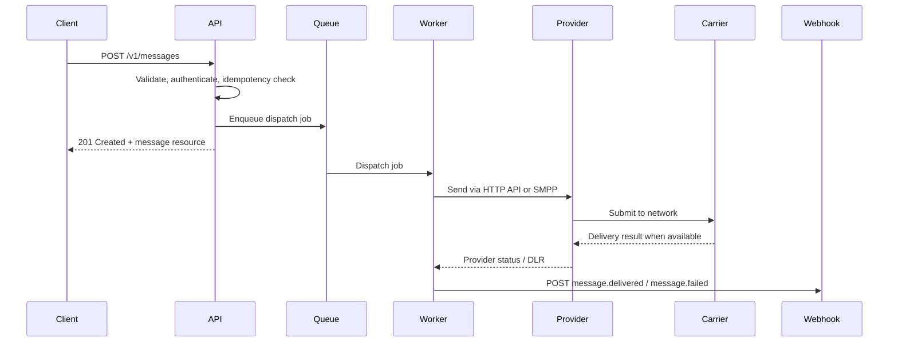
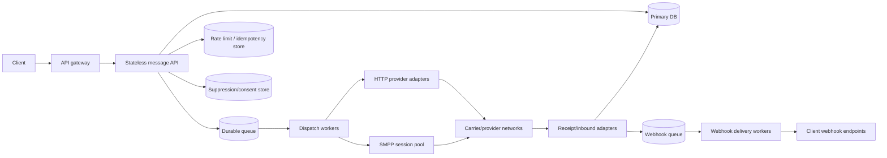

# Designing an SMS Delivery API

## Executive summary

A well-designed SMS delivery API should be built around **resource creation, asynchronous processing, and normalized delivery state**, not around a blocking “send and wait” RPC. In HTTP terms, that means `POST` creates a message resource, `GET` retrieves it, and the API returns `201 Created` with a `Location` header when the message record is durably created; `202 Accepted` should be reserved for cases where the server has only accepted work for later processing and the final outcome is not yet known. Error bodies should use `application/problem+json` so clients get machine-readable `type`, `title`, `status`, `detail`, and `instance` fields. OpenAPI **3.1** is the right contract format because it standardizes HTTP API descriptions and supports top-level `webhooks`, while aligning with JSON Schema Draft 2020-12. citeturn38view0turn40view1turn42view0turn42view1turn42view2turn42view3turn42view4turn36view0turn37view0

Functionally, the baseline product should support **single send, bulk send, templates, scheduling, personalization, delivery receipts, concatenation, Unicode, inbound replies, and optional MMS where supported**. Primary provider documentation points in the same direction: Twilio’s Message resource supports scheduling, templates via `contentSid`/`contentVariables`, MMS media, and status callbacks; Vonage’s SMS API explicitly documents Unicode, concatenation, delivery receipts, and inbound webhooks; AWS now separates direct SMS/MMS delivery into its End User Messaging SMS and Voice v2 APIs while SNS still exposes useful account-level SMS controls such as message type and price/spend controls. citeturn17view4turn35view0turn35view1turn35view3turn35view4turn19view1turn21view3turn23view0turn21view4turn25view6turn25view0turn25view1

For authentication, the most practical default for server-to-server customers is **restricted API keys**, with **OAuth 2.0 client credentials** as the enterprise option and **JWTs** as a token format rather than a complete authorization model by themselves. Twilio explicitly recommends API keys for its REST APIs, while Vonage recommends JWT authentication for advanced messaging features such as webhooks and ACL-backed access. OAuth 2.0 client credentials are standardized for confidential machine clients, bearer tokens must be protected in storage and transport, and JWTs provide compact signed and/or encrypted claims. citeturn15search0turn15search11turn21view5turn43view2turn43view0turn43view1turn43view3turn43view4

From a reliability standpoint, the correct external contract is **at-least-once API acceptance plus idempotent writes and at-least-once webhooks**. End-to-end “exactly once to the handset” is not realistic across carrier networks: SMS is store-and-forward, SMPP delivery receipts are advisory protocol messages, and even provider documentation says delivery receipts are useful but not an absolute guarantee that the user actually received or read the content. That reality should shape both the public contract and the internal architecture. citeturn8view0turn7view4turn21view3

Operationally, the service should be **stateless at the API tier, queue-backed, and worker-driven**, with clear separation between message acceptance, provider routing, webhook dispatch, inbound handling, and compliance enforcement. SMS cost and throughput are fundamentally governed by **segments/message parts**, so the API should expose segment estimation and post-send segment counts, because Unicode and concatenation directly affect both billing and throughput. Twilio, Vonage, and AWS all document this explicitly. citeturn18view0turn18view1turn17view6turn23view0turn25view2

## Core requirements and product boundaries

The minimum viable product for a general-purpose SMS delivery API should include these behaviors as **first-class resources**, not bolt-ons: sending one message, sending large batches, rendering templates with per-recipient variables, scheduling sends, collecting delivery receipts, accepting inbound replies, computing segment counts, auto-detecting GSM-7 versus UCS-2, and optionally sending MMS when the country/provider route supports it. Twilio’s Message resource combines text, templates, scheduling, status callbacks, and media; Vonage documents SMS-specific Unicode, concatenation, inbound SMS, and delivery receipt workflows; AWS End User Messaging SMS explicitly supports SMS and MMS delivery in direct-send APIs. citeturn17view6turn17view4turn35view0turn35view1turn35view3turn21view3turn23view0turn21view4turn25view6

That feature set is best modeled with a **canonical internal message lifecycle** rather than provider-native statuses. A good normalized state machine is: `accepted` → `scheduled` or `queued` → `submitted_to_provider` → `sent_to_carrier` → terminal state (`delivered`, `undelivered`, `failed`, `expired`, `rejected`, `canceled`). Twilio exposes statuses such as `accepted`, `scheduled`, `queued`, `sending`, `sent`, `delivered`, `undelivered`, and `failed`; Vonage exposes DLR states such as `accepted`, `delivered`, `buffered`, `expired`, `failed`, `rejected`, and `unknown`; SMPP v3.4 defines message states including `ENROUTE`, `DELIVERED`, `EXPIRED`, `UNDELIVERABLE`, `ACCEPTED`, `UNKNOWN`, and `REJECTED`. Normalization is therefore mandatory if you want a stable customer-facing contract. citeturn20view0turn20view2turn20view3turn20view4turn21view3turn6view0

A core design implication is that **delivery receipts are valuable, but they are not truth in the absolute sense**. Vonage explicitly states that DLRs are reliable in most situations but are not an absolute guarantee, because some receipts only confirm an intermediate handoff and some can be inaccurate. SMPP’s architecture is also store-and-forward, with delivery receipts requested separately from submission. Therefore the API should document an SLA around **message acceptance and callback dispatch**, but not promise a handset-delivery SLA unless you have country- and route-specific commercial backing for it. citeturn21view3turn8view0turn7view0

The service should also separate **channel capability** from **message intent**. SMS should be the default channel; MMS should be optional and guarded by route capability, because Twilio documents file type and size limits and warns that international and carrier limits apply, while AWS documents MMS as available within its end-user messaging stack rather than as a universal global assumption. In practice, that means your API should model MMS as an explicit capability and never silently assume it is available everywhere. citeturn19view1turn22search18turn25view6



A final product-boundary recommendation is to make **suppression and opt-out** part of the core send path, not an optional add-on. In the U.S., opt-out handling is a TCPA/FCC issue, not just a UX feature. The FCC says consumers may revoke consent for robotexts at any time and in any reasonable manner, and the agency’s 2024 order requires callers to honor revocation requests within a reasonable time not to exceed 10 business days. That means the platform needs a durable suppression list, deterministic pre-send suppression checks, and auditable consent/opt-out events. citeturn29search0turn29search4

## API design and JSON contracts

The most robust public contract is a **versioned, REST-shaped JSON API** under a stable prefix such as `/v1`. Use `POST` for creation, `GET` for retrieval and listing, and `PATCH` for limited mutable fields such as canceling a scheduled message or updating template metadata. `GET` should remain read-only and cache-friendly, while `POST` remains the correct method for creating message resources and template resources. In OpenAPI 3.1, document both `paths` and `webhooks`, and use JSON Schema Draft 2020-12 for request/response validation. citeturn38view1turn38view0turn36view0turn37view0

A particularly important HTTP semantic choice is **when to return 201 versus 202**. If the service validates the request, persists a message or batch resource, and can immediately return its identifier, use `201 Created` with `Location: /v1/messages/{id}` or `Location: /v1/batches/{id}`. If the service merely accepts a file import or deferred validation job and cannot yet guarantee creation of the final resource, use `202 Accepted`. This distinction matters because HTTP explicitly differentiates created resources from not-yet-completed asynchronous work. citeturn40view1turn40view2

### Sample OpenAPI paths table

The table below is a recommended baseline for a provider-neutral SMS API. It is intentionally small enough to be learnable, but broad enough to cover the required feature set.

| Method | Path | Purpose | Key query params or notes | Typical success |
|---|---|---|---|---|
| `POST` | `/v1/messages` | Create and submit one SMS/MMS message, immediate or scheduled | Optional `send_at`, `template_id`, `media`, `callback_url` | `201 Created` |
| `GET` | `/v1/messages/{messageId}` | Fetch one message resource and normalized delivery state | Path ID is opaque and stable | `200 OK` |
| `GET` | `/v1/messages` | List messages | `status`, `to`, `created_after`, `created_before`, `client_reference`, `cursor`, `limit` | `200 OK` |
| `PATCH` | `/v1/messages/{messageId}` | Cancel a scheduled message or redact mutable fields | Only allow safe partial mutations | `200 OK` |
| `POST` | `/v1/batches` | Submit a batch with shared body/template and recipient rows | Async fan-out under one batch resource | `201 Created` |
| `GET` | `/v1/batches/{batchId}` | Fetch batch summary | Include counts by status | `200 OK` |
| `GET` | `/v1/batches/{batchId}/messages` | List child messages in a batch | Cursor pagination | `200 OK` |
| `POST` | `/v1/templates` | Create a template | Consider immutable versions | `201 Created` |
| `GET` | `/v1/templates/{templateId}` | Fetch a template version | Include placeholder schema | `200 OK` |
| `PATCH` | `/v1/templates/{templateId}` | Update mutable metadata or publish/unpublish | Prefer versioned content | `200 OK` |
| `GET` | `/v1/suppressions/{phoneNumber}` | Check suppression/opt-out state | Normalize to E.164 | `200 OK` |

A few shape decisions are worth making explicit. Use **cursor pagination**, not offset pagination, because message histories grow quickly. Make resource IDs opaque. Accept **E.164** phone numbers on the wire because that is how major providers document destination numbers. And do not force clients to learn provider-specific fields for ordinary operations; keep provider detail under a nested `provider` or `provider_raw` object so the user-facing schema can remain stable even as route providers change. Twilio and Vonage both document phone addressing and callback payloads in ways that reinforce this need for normalization. citeturn17view6turn22search4turn17view2turn21view2

### Request schema for single send

The schema below is a practical Draft 2020-12 model for `POST /v1/messages`.

```json
{
  "$schema": "https://json-schema.org/draft/2020-12/schema",
  "$id": "https://api.example.com/schemas/message-create-request.json",
  "title": "MessageCreateRequest",
  "type": "object",
  "additionalProperties": false,
  "required": ["to", "channel"],
  "properties": {
    "to": {
      "type": "string",
      "pattern": "^\\+[1-9]\\d{6,14}$",
      "description": "Destination phone number in E.164 format."
    },
    "channel": {
      "type": "string",
      "enum": ["sms", "mms"]
    },
    "from": {
      "type": "string",
      "minLength": 1,
      "maxLength": 32,
      "description": "Sender ID, long code, short code, or origination pool alias."
    },
    "body": {
      "type": "string",
      "minLength": 1,
      "maxLength": 1600
    },
    "template_id": {
      "type": "string",
      "pattern": "^tpl_[A-Za-z0-9_\\-]+$"
    },
    "template_variables": {
      "type": "object",
      "additionalProperties": {
        "type": ["string", "number", "integer", "boolean", "null"]
      }
    },
    "send_at": {
      "type": "string",
      "format": "date-time"
    },
    "validity_period_seconds": {
      "type": "integer",
      "minimum": 1,
      "maximum": 86400
    },
    "delivery_receipt_level": {
      "type": "string",
      "enum": ["none", "final", "all"],
      "default": "final"
    },
    "callback_url": {
      "type": "string",
      "format": "uri"
    },
    "client_reference": {
      "type": "string",
      "maxLength": 128
    },
    "encoding": {
      "type": "string",
      "enum": ["auto", "gsm7", "ucs2"],
      "default": "auto"
    },
    "media": {
      "type": "array",
      "maxItems": 10,
      "items": {
        "type": "object",
        "additionalProperties": false,
        "required": ["url"],
        "properties": {
          "url": {
            "type": "string",
            "format": "uri"
          },
          "content_type": {
            "type": "string"
          }
        }
      }
    },
    "tags": {
      "type": "object",
      "additionalProperties": {
        "type": "string"
      }
    }
  },
  "oneOf": [
    { "required": ["body"] },
    { "required": ["template_id"] }
  ]
}
```

This schema mirrors the functional surface used by major providers: body or template content, scheduling, callback URLs, media, and content variables. Twilio’s Message resource, for example, supports body media, `contentSid`, `contentVariables`, `sendAt`, `scheduleType`, and `sendAsMms`; Twilio also exposes `validityPeriod` and `attempt`. Those precedents are useful, but the public schema above is cleaner because it is provider-neutral. citeturn35view0turn35view1turn35view3turn35view4turn19view2

### Example single-send request

```json
{
  "to": "+14155550123",
  "channel": "sms",
  "from": "ACME",
  "template_id": "tpl_order_ready_v3",
  "template_variables": {
    "first_name": "Ada",
    "order_id": "A12345"
  },
  "send_at": "2026-05-22T09:30:00Z",
  "validity_period_seconds": 14400,
  "delivery_receipt_level": "final",
  "callback_url": "https://client.example.com/webhooks/sms",
  "client_reference": "order-A12345",
  "encoding": "auto",
  "tags": {
    "campaign": "pickup-reminders",
    "tenant": "retail-us"
  }
}
```

### Response schema for a message resource

```json
{
  "$schema": "https://json-schema.org/draft/2020-12/schema",
  "$id": "https://api.example.com/schemas/message.json",
  "title": "Message",
  "type": "object",
  "additionalProperties": false,
  "required": ["id", "status", "channel", "to", "created_at"],
  "properties": {
    "id": {
      "type": "string",
      "pattern": "^msg_[A-Za-z0-9]+$"
    },
    "status": {
      "type": "string",
      "enum": [
        "accepted",
        "scheduled",
        "queued",
        "submitted_to_provider",
        "sent_to_carrier",
        "delivered",
        "undelivered",
        "failed",
        "expired",
        "rejected",
        "canceled"
      ]
    },
    "channel": {
      "type": "string",
      "enum": ["sms", "mms"]
    },
    "to": {
      "type": "string",
      "pattern": "^\\+[1-9]\\d{6,14}$"
    },
    "from": {
      "type": "string"
    },
    "body": {
      "type": "string"
    },
    "template_id": {
      "type": "string"
    },
    "segments": {
      "type": "integer",
      "minimum": 1
    },
    "encoding": {
      "type": "string",
      "enum": ["gsm7", "ucs2"]
    },
    "provider": {
      "type": "object",
      "additionalProperties": true
    },
    "client_reference": {
      "type": "string"
    },
    "created_at": {
      "type": "string",
      "format": "date-time"
    },
    "updated_at": {
      "type": "string",
      "format": "date-time"
    }
  }
}
```

### Example `201 Created` response

```json
{
  "id": "msg_01JY3M4HX9A9F6QW2ZTX3B7P7S",
  "status": "scheduled",
  "channel": "sms",
  "to": "+14155550123",
  "from": "ACME",
  "template_id": "tpl_order_ready_v3",
  "segments": 1,
  "encoding": "gsm7",
  "client_reference": "order-A12345",
  "provider": {
    "route_status": "pending",
    "provider_message_id": null
  },
  "created_at": "2026-05-21T10:00:01Z",
  "updated_at": "2026-05-21T10:00:01Z"
}
```

### Request schema for bulk send

For bulk sends, prefer a **shared envelope plus recipient rows** instead of sending thousands of fully expanded message objects. That reduces payload size, simplifies template rendering, and makes deduplication easier.

```json
{
  "$schema": "https://json-schema.org/draft/2020-12/schema",
  "$id": "https://api.example.com/schemas/batch-create-request.json",
  "title": "BatchCreateRequest",
  "type": "object",
  "additionalProperties": false,
  "required": ["message", "recipients"],
  "properties": {
    "message": {
      "type": "object",
      "required": ["channel"],
      "properties": {
        "channel": { "type": "string", "enum": ["sms", "mms"] },
        "from": { "type": "string" },
        "body": { "type": "string" },
        "template_id": { "type": "string" },
        "send_at": { "type": "string", "format": "date-time" },
        "callback_url": { "type": "string", "format": "uri" },
        "validity_period_seconds": { "type": "integer", "minimum": 1, "maximum": 86400 }
      }
    },
    "recipients": {
      "type": "array",
      "minItems": 1,
      "maxItems": 100000,
      "items": {
        "type": "object",
        "additionalProperties": false,
        "required": ["to"],
        "properties": {
          "to": {
            "type": "string",
            "pattern": "^\\+[1-9]\\d{6,14}$"
          },
          "template_variables": {
            "type": "object",
            "additionalProperties": {
              "type": ["string", "number", "integer", "boolean", "null"]
            }
          },
          "client_reference": {
            "type": "string",
            "maxLength": 128
          }
        }
      }
    }
  }
}
```

### Example batch request

```json
{
  "message": {
    "channel": "sms",
    "from": "ACME",
    "template_id": "tpl_flash_sale_v2",
    "send_at": "2026-05-22T14:00:00Z",
    "callback_url": "https://client.example.com/webhooks/sms",
    "validity_period_seconds": 21600
  },
  "recipients": [
    {
      "to": "+14155550123",
      "template_variables": { "first_name": "Ada", "discount": "15%" },
      "client_reference": "cust_1001"
    },
    {
      "to": "+14155550124",
      "template_variables": { "first_name": "Grace", "discount": "20%" },
      "client_reference": "cust_1002"
    }
  ]
}
```

### Template resource design

Templates should be **versioned and renderable without ambiguity**. Twilio’s content system uses a `ContentSid` plus `contentVariables`; that model is directionally correct, but your public API should also declare variable names and defaults so clients can validate payloads before send time. citeturn35view1turn35view4

```json
{
  "id": "tpl_order_ready_v3",
  "name": "order_ready",
  "version": 3,
  "channel": "sms",
  "locale": "en-US",
  "body": "Hi {{first_name}}, your order {{order_id}} is ready for pickup.",
  "variables": {
    "first_name": { "type": "string", "required": true },
    "order_id": { "type": "string", "required": true }
  },
  "status": "published",
  "created_at": "2026-05-21T09:00:00Z"
}
```

## Authentication, authorization, and security

The authentication choice should follow the customer type rather than ideology. **Static API keys** are usually the best default for direct server-to-server integrations because they are simple, revocable, and fit well with per-tenant quotas. Twilio explicitly calls API keys the preferred way to authenticate its REST APIs, and it supports multiple keys so customers can isolate systems and rotate credentials. For more complex partnerships, **OAuth 2.0 client credentials** is the strongest general-purpose option; RFC 6749 standardizes this grant for confidential clients, and RFC 6750 standardizes bearer-token transport rules. **JWT** is best thought of as a token format that can carry signed claims, not as a replacement for authorization policy by itself. Vonage’s docs are instructive here: it supports both basic auth and JWT for some APIs, but recommends JWT for advanced messaging features such as webhooks and ACLs. citeturn15search0turn15search11turn43view2turn43view0turn43view1turn43view3turn21view5

### Authentication method comparison

| Method | Where it fits best | Strengths | Weaknesses | Recommendation |
|---|---|---|---|---|
| API key | Direct server-to-server customers, internal systems | Easy to issue, rotate, and scope; low latency; aligns with Twilio’s preferred REST approach. citeturn15search0turn15search11 | Secret distribution can be sloppy; fewer built-in delegation patterns than OAuth | **Default** for most tenants |
| OAuth 2.0 client credentials | Enterprise partners, delegated machine access, centralized IAM | Standardized grant for confidential clients; bearer tokens fit HTTP auth naturally. citeturn43view2turn43view0 | More moving parts: auth server, token TTLs, introspection/revocation strategy | **Best enterprise option** |
| JWT-signed service token | Platform-to-platform integrations where the caller can mint signed assertions | Compact signed claims; can encode tenant, scopes, and expiry. citeturn43view3turn43view4 | Token verification and key distribution are more complex; easy to overstuff claims | Good when paired with clear trust boundaries |

The safest public interface is to support **one mandatory primary method** and make the others additive. A good default is: API keys for most tenants, OAuth 2.0 client credentials for enterprise, and internal JWT-backed service identities between microservices. Keep scopes coarse but meaningful: `messages.write`, `messages.read`, `batches.write`, `templates.read`, `templates.write`, `webhooks.read`, `suppressions.read`, and `suppressions.write`.

Transport security should be non-negotiable. TLS 1.3 is the modern baseline from a standards perspective, and the protocol exists specifically to prevent eavesdropping, tampering, and message forgery in client/server communication. Twilio also states that it serves its messaging APIs over HTTPS. For SMPP connectors, it is important to remember that the base SMPP protocol is not an IETF RFC and is historically a clear-text binary protocol; some providers explicitly require or support SMPP over TLS, and in practice that may require a TLS-aware client or a tunnel/stunnel layer. citeturn14search1turn14search5turn16search4turn5search1turn5search7

Input security should include **strict JSON Schema validation, phone-number normalization, template-variable validation, media URL allow/deny rules, body-size and segment limits, path-safe identifiers, SSRF defenses for media fetches, and constant-time signature verification**. On the perimeter, combine an account-level request rate limit with **secondary message-throughput throttles** keyed by tenant, sender, country, and provider route. When you reject traffic, use `429 Too Many Requests` and send `Retry-After`; HTTP defines both the status code and the header semantics. citeturn37view0turn39view0turn39view1

### Webhook security method comparison

| Method | How it works | Strengths | Weaknesses | Recommendation |
|---|---|---|---|---|
| HMAC signature | Sign timestamp + request target + raw body with shared secret | Simple and fast; grounded in HMAC (RFC 2104); similar to Twilio’s webhook approach. citeturn3search0turn12search2 | Shared-secret distribution and rotation must be solved cleanly | **Best default** |
| Signed JWT | Webhook includes a JWT, often in `Authorization` | Strong, self-describing claims; proven in Vonage signed webhooks. citeturn21view1turn43view3 | More complex verification and key management; larger payload overhead | Good for enterprise or multi-event platforms |
| HTTP Message Signatures | Standardized signature over selected HTTP components | Standards-based and flexible; stronger canonicalization story. citeturn2search1turn2search4 | Higher implementation complexity and less common tooling | Good advanced option |
| IP allowlist | Restrict accepted source IPs | Useful defense in depth | Weak by itself; brittle behind NAT, proxies, and provider changes | **Never use as sole control** |

For outbound webhooks, the strongest practical default is **HMAC-SHA-256 with a timestamp and replay window**. Use headers such as `Webhook-Id`, `Webhook-Timestamp`, `Webhook-Signature`, and `Webhook-Key-Id`, sign the exact raw bytes of the request body, reject replays older than five minutes, and allow multiple active secrets for rotation. Provider precedent supports this general model, even though exact algorithms differ. Twilio signs requests and warns developers to use SDK validation rather than homegrown parsing; Vonage signs certain webhook requests with JWTs in the `Authorization` header. citeturn12search2turn17view2turn19view3turn21view1

## Delivery semantics, retries, errors, and webhooks

For the core send API, the recommended contract is **at-least-once acceptance with idempotent resource creation**. The message may be submitted to a provider more than once during internal retries unless you explicitly prevent that; therefore the API itself must give clients a way to say “this write is the same logical operation as before.” HTTP defines idempotent methods in terms of intended server effect, but `POST` is not idempotent by default. The active IETF `Idempotency-Key` draft exists specifically to make non-idempotent methods like `POST` fault-tolerant, so it is reasonable to adopt that header name while documenting your own exact semantics because the work remains an Internet-Draft rather than a finished RFC. citeturn38view3turn26search13turn26search16

### Delivery semantics comparison

| Semantic target | What it means in practice | Achievability for SMS | Recommended use |
|---|---|---|---|
| At-most-once | Never retry after ambiguity; duplicates avoided by dropping ambiguous work | Easy internally, poor reliability under network failure | Too weak for production messaging |
| At-least-once with idempotency | Retry on ambiguity; deduplicate logically identical writes and events | **Realistic and robust** | **Best overall design** |
| Exactly-once end to end | One and only one handset delivery | Not realistic across store-and-forward SMS networks and non-absolute DLRs | Do not claim this publicly |

The engineering pattern for write-side idempotency is straightforward. Require an `Idempotency-Key` header on every `POST /v1/messages` and `POST /v1/batches`. Store `(tenant_id, idempotency_key) → request_fingerprint, resource_id, response_status, response_body_hash, expires_at)` in a transactional store. If the same key arrives with the same normalized request, return the original success response. If the same key arrives with a different request fingerprint, return `409 Conflict`. Keep the key for at least the longest realistic client retry horizon; twenty-four hours is a sensible default, while seventy-two hours is safer for batch imports. The `409 Conflict` semantics fit RFC 9110 well because the server is rejecting a request due to state conflict. citeturn41view1

A second deduplication layer should exist on the **provider-dispatch side**. Some routes are HTTP APIs, some are SMPP sessions, and provider timeouts can leave you uncertain whether the upstream accepted the submission. To avoid duplicate downstream traffic, create a durable `dispatch_attempt` table keyed by `(message_id, route_id, provider_submission_fingerprint)` and put a uniqueness constraint on “successful provider acceptance.” That gives you “effectively once per route attempt” even though you still cannot promise exactly-once end-to-end.

### Error handling and standardized error codes

The error envelope should be RFC 9457 `application/problem+json`, with **stable application error codes in an extension field**. That matters because provider-native codes are unstable or provider-specific. Twilio explicitly says its `error_code` and `error_message` fields for message failures are subject to change and should not be used programmatically. Your API should therefore publish its own durable taxonomy such as `invalid_argument`, `template_render_error`, `suppressed_recipient`, `idempotency_conflict`, `rate_limited`, `provider_unavailable`, and `internal_error`. citeturn42view0turn42view1turn42view2turn42view3turn42view4turn18view2

A sensible mapping is:

| HTTP status | Application code | When to use |
|---|---|---|
| `400` | `invalid_request` | Malformed JSON, missing header, invalid query syntax |
| `401` | `unauthorized` | Missing or invalid auth credentials |
| `403` | `forbidden` | Authenticated but scope/tenant mismatch |
| `404` | `not_found` | Resource ID unknown |
| `409` | `idempotency_conflict` | Same idempotency key, different request fingerprint |
| `409` | `state_conflict` | Cancel attempted on already-delivered message |
| `415` | `unsupported_media_type` | Wrong `Content-Type` |
| `422` | `validation_error` | Semantically valid JSON, invalid phone number, bad template variables, unsupported route/content combination |
| `429` | `rate_limited` | Public API quota exceeded |
| `503` | `provider_unavailable` | Temporary upstream/provider failure |
| `500` | `internal_error` | Unexpected server-side failure |

HTTP already supplies the core semantics for `400`, `401`, `403`, `404`, `409`, `415`, `422`, `429`, and `503`, and `Retry-After` is appropriate with `429` and, when relevant, `503`. citeturn38view4turn41view1turn41view2turn41view3turn39view0turn39view1

### Example problem-details response

```json
{
  "type": "https://api.example.com/problems/validation-error",
  "title": "Request validation failed",
  "status": 422,
  "detail": "One or more fields are invalid.",
  "instance": "https://api.example.com/problems/instances/prb_01JY3P5Y5W3",
  "code": "validation_error",
  "errors": [
    {
      "detail": "must be an E.164 phone number",
      "pointer": "#/to"
    },
    {
      "detail": "template variable 'order_id' is required",
      "pointer": "#/template_variables"
    }
  ]
}
```

### Retry and backoff policy

Retry behavior needs to exist at **three layers**:

**Client to API.** Clients may safely retry `POST` after timeouts, connection resets, and `5xx` if they use the same idempotency key. They should obey `Retry-After` on `429` and `503`. HTTP specifically says that clients should not automatically retry non-idempotent methods unless they have a way to know the request semantics are idempotent or to detect that the original request was never applied. Your idempotency layer provides that missing mechanism. citeturn38view3turn39view1turn38view4

**API to provider.** Retries should happen only for transient failures: connection reset, TLS handshake failure, HTTP `502/503/504`, provider throttle responses, or ambiguous SMPP transport failures. Use exponential backoff with full jitter, keep the retry budget route-aware, and stop retrying if the message’s validity period would be violated. Twilio’s own API models validity period and attempts; SMPP explicitly models message validity and store-and-forward behavior. citeturn19view2turn8view0turn6view0

**Webhook delivery.** Webhooks should be delivered **at least once** until a receiver returns a `2xx`. Retry with exponential backoff and a dead-letter queue; include `attempt` count and a unique `event_id` so receivers can deduplicate. This is the safest model because webhook receivers fail in the real world, and both Twilio and Vonage implement webhook-based status/inbound delivery patterns that inherently rely on asynchronous HTTP callbacks. citeturn17view3turn21view3turn21view4

### Webhook design for delivery receipts and inbound messages

Use **JSON webhooks** even though some providers use form-encoded or query-parameter callbacks. Twilio sends incoming-message and status-callback requests as `application/x-www-form-urlencoded`, and Vonage inbound SMS may arrive as `GET` or `POST`; that difference is precisely why your public webhook contract should stay normalized and JSON-native. citeturn17view2turn21view4

A good webhook contract should include:

| Header | Purpose |
|---|---|
| `Webhook-Id` | Globally unique event identifier |
| `Webhook-Timestamp` | RFC 3339 UTC timestamp used in signature verification |
| `Webhook-Signature` | HMAC or HTTP Message Signature |
| `Webhook-Key-Id` | Which active secret/public key was used |
| `Content-Type: application/json` | Stable payload format |

The payload should contain a stable envelope with `id`, `type`, `occurred_at`, `attempt`, and `data`. Unknown fields should be tolerated because providers frequently evolve callback payloads; Twilio explicitly warns that status callback parameters can change and new properties may be added without advance notice. citeturn19view3turn17view2

### Example delivery-receipt webhook

```json
{
  "id": "evt_01JY3R31KB8C7QZQ1M2N5N2QF4",
  "type": "message.delivered",
  "occurred_at": "2026-05-21T10:15:27Z",
  "attempt": 1,
  "data": {
    "message_id": "msg_01JY3M4HX9A9F6QW2ZTX3B7P7S",
    "client_reference": "order-A12345",
    "to": "+14155550123",
    "from": "ACME",
    "channel": "sms",
    "status": "delivered",
    "final": true,
    "segments": 1,
    "encoding": "gsm7",
    "provider": {
      "name": "twilio",
      "provider_message_id": "SMaaaaaaaaaaaaaaaaaaaaaaaaaaaaaaaa",
      "raw_status": "delivered",
      "raw_dlr_done_date": "2605211015"
    },
    "delivered_at": "2026-05-21T10:15:00Z"
  }
}
```

### Example inbound-message webhook

```json
{
  "id": "evt_01JY3R8NAN4Q8FQ3Q3F3X938WY",
  "type": "message.inbound.received",
  "occurred_at": "2026-05-21T10:18:03Z",
  "attempt": 1,
  "data": {
    "message_id": "inb_01JY3R8M5Q49M1QMNKGQ3GE2RX",
    "to": "+18885550123",
    "from": "+14155550123",
    "channel": "sms",
    "body": "STOP",
    "segments": 1,
    "encoding": "gsm7",
    "media": [],
    "provider": {
      "name": "vonage",
      "provider_message_id": "0B00000127FDBC63"
    }
  }
}
```

An important operational rule is that webhook receivers must return `2xx` quickly and perform heavy work asynchronously. The webhook is an **acknowledgment boundary**, not a business-transaction boundary.

## Encoding, batching, throughput, and provider integration

Segment handling is the single most important low-level behavior in an SMS API because it controls **cost, latency, and effective throughput**. Twilio documents the canonical thresholds clearly: single-segment SMS uses **160 GSM-7** characters or **70 UCS-2** characters; concatenated messages carry **153 GSM-7** or **67 UCS-2** characters per segment because of the User Data Header. Vonage’s documentation says the same thing in byte-oriented terms and also calls out that extended GSM characters require extra encoding space. citeturn18view0turn18view1turn23view0

### Recommended segmentation rules

| Encoding | Single-segment capacity | Multi-segment capacity | Notes |
|---|---|---|---|
| GSM-7 | 160 chars | 153 chars per segment | Extended GSM characters such as `^`, `{`, `}`, `\`, `[` and `]` consume extra space. citeturn18view0turn23view0 |
| UCS-2 | 70 chars | 67 chars per segment | Any non-GSM character can switch the whole message into UCS-2. citeturn18view1turn23view0 |
| MMS body where supported | Varies by provider/market | Usually treated differently from SMS segmentation | Can reduce message parts in some markets and providers. citeturn35view0turn25view2 |

From an API-design perspective, that means the service should expose both **predicted** and **actual** segment counts. Predicted segments come from rendering the final body before send. Actual segments come from the provider response or normalized provider state. Twilio exposes `NumSegments` on the Message resource after send, and Vonage exposes message-part-related fields such as `message-count` or webhook counters in different surfaces. citeturn17view6turn23view0

A strong design choice is to offer an explicit `encoding` field with values `auto`, `gsm7`, and `ucs2`, with **`auto` as the default**. If the client forces `gsm7` but the body contains characters outside the GSM set, return a `422 validation_error` rather than silently mangling content. If the client leaves `auto`, compute the rendered body, detect encoding, compute segments, and surface both values in the created resource.

MMS matters because it changes both **economics and throughput**. Twilio documents `sendAsMms`, which forces delivery as a single MMS even when only long text is present, and AWS explicitly notes that a 481-character GSM message would be four SMS parts but one MMS body part where supported, improving both cost and effective throughput. The safe design implication is to expose an explicit policy such as `delivery_mode: force_sms | prefer_mms | force_mms`, while also enforcing country- and route-specific capabilities. Do not make this automatic globally. citeturn35view3turn25view2turn25view6

### Batching and bulk-send strategy

Bulk traffic should be split conceptually into **API batching** and **carrier throttling**:

The API side exists to make ingestion efficient. A batch submission should create one batch resource, validate the common envelope once, then fan out recipient rows into child message resources asynchronously. That argues for `POST /v1/batches` rather than encouraging clients to fire tens of thousands of individual `POST /v1/messages` calls.

The carrier side exists to protect deliverability and stay within provider and sender limits. Twilio notes that messages above prescribed rate limits are queued and that Messaging Services are useful for large enqueues. Vonage markets queuing for high-volume traffic in accordance with carrier regulations. AWS exposes SMS throughput quotas and thinks in message parts per second. Therefore your internal dispatcher should throttle by **message parts**, not just by message count. citeturn18view4turn22search15turn25view3turn25view2

A good internal formula is:

```text
effective_messages_per_second = allowed_message_parts_per_second / average_segments_per_message
```

That formula makes the cost/throughput tradeoff visible. If a route supports 100 message parts per second and your campaign averages 2.3 segments per recipient, your practical ceiling is about 43 messages per second, not 100. This is exactly why the API should render templates **before** scheduling dispatch and why campaign operators should see segment histograms before launch. Twilio, Vonage, and AWS all document that billing and throughput track segments/parts rather than the business concept of “one message.” citeturn18view0turn18view1turn23view0turn25view2

### Provider integration patterns

The cleanest architecture is a **provider adapter layer** with a canonical internal contract:

| Internal action | HTTP provider adapter | SMPP adapter |
|---|---|---|
| Submit outbound | REST `POST` to provider API | `submit_sm` or `submit_multi` |
| Request DLR | Provider callback/status URL | `registered_delivery` in `submit_sm` |
| Receive DLR | HTTP webhook | `deliver_sm` or `data_sm` |
| Long payload | Provider-specific JSON/body | `message_payload` with `sm_length = 0` if needed |
| Concatenation | Provider auto-handles or route-specific | `sar_msg_ref_num`, `sar_total_segments`, `sar_segment_seqnum` TLVs |
| Keepalive | Standard HTTP/TLS health | `enquire_link` / `enquire_link_resp` |

SMPP deserves special treatment because it is the main non-HTTP integration pattern at wholesale SMS scale. The reference is **not an IETF RFC** but the SMPP v3.4 specification from the SMPP Developers Forum. That spec defines `submit_sm` for submission, `deliver_sm` for delivery receipts/inbound delivery, `registered_delivery` for receipt requests, `message_payload` for large payloads up to 64K octets, `sm_length` semantics, concatenation TLVs such as `sar_msg_ref_num`, `sar_total_segments`, and `sar_segment_seqnum`, and `enquire_link` for connection liveness. Some providers also support SMPP over TLS. citeturn5search1turn6view0turn7view2turn7view3turn7view4turn7view5turn10view0turn11view0turn5search7

A normalized provider-status mapping is also helpful:

| Internal status | Twilio | Vonage | SMPP |
|---|---|---|---|
| `accepted` | `accepted` | API `status=0` enqueue success | submission acknowledged |
| `queued` | `queued`, `scheduled` then `queued` | `accepted`, `buffered` | store-and-forward en route |
| `sent_to_carrier` | `sent` | carrier accepted / intermediate states | `ENROUTE` |
| `delivered` | `delivered` | `delivered` | `DELIVERED` |
| `undelivered` | `undelivered` | `failed`, `expired`, `rejected`, `unknown` depending context | `UNDELIVERABLE`, `EXPIRED`, `REJECTED`, `UNKNOWN` |

This table is intentionally approximate because provider semantics are not perfectly isomorphic. That is precisely why a provider adapter should preserve `provider_raw` alongside the normalized fields. citeturn20view0turn20view2turn20view3turn21view3turn6view0

## Operations, compliance, testing, and OpenAPI outline

The scalable deployment model is a **stateless edge plus durable queues plus specialized worker pools**. Keep request-path latency low by stopping synchronous work at validation, authentication, suppression check, idempotency, and durable enqueue/persist. Put provider routing, SMPP session handling, retries, and webhook fan-out in workers. That lets API replicas scale independently from route adapters and avoids coupling customer-facing latency to provider jitter.



Monitoring should center on **operational truth, not vanity counts**. Minimum metrics include request rate, `POST /messages` p50/p95 latency, auth failures, validation failures, idempotency replay rate, queue depth, worker lag, provider submission success rate, provider latency, final-status distribution, DLR latency distribution, segment distribution, delivery failures by country/network/provider, webhook success rate, webhook retry count, and suppression hits. AWS documents CloudWatch metrics/logging for SMS delivery monitoring and delivery-status logging, which is a good example of the kind of observability surface messaging systems need. citeturn25view4turn25view5

Logging should separate **business identifiers** from **PII-rich payloads**. Store stable resource metadata long-term, but keep phone numbers tokenized or hashed in most operational logs and redact message bodies by default. If customers require searchable body retention, make it opt-in, encrypted, and short-lived. Under GDPR, official European guidance emphasizes data minimization, the right to erasure when data is no longer needed or processing is unlawful, and security measures proportionate to risk. Those principles map cleanly to engineering controls: reduce retention, separate secrets and PII, encrypt data at rest, and implement deletion workflows keyed by tenant and subject. citeturn34search3turn34search7turn34search2turn34search12

On compliance, the most important engineering requirement for SMS marketing is **fast, durable opt-out enforcement with auditability**. The FCC says consumers may opt out of robotexts at any time and in any reasonable manner, and its order requires revocation requests to be honored within a reasonable time not to exceed 10 business days. Design for stricter internal targets than the regulatory maximum: update suppression lists within seconds, block future sends before enqueue, and emit auditable events such as `opt_out.received` and `suppression.applied`. Also accept common keywords such as `STOP`, `END`, `UNSUBSCRIBE`, and `CANCEL`, while remembering that the FCC’s “reasonable manner” standard means you should not rely on keywords as the exclusive revocation channel. citeturn29search0turn29search4

Testing should happen at **five layers**. Unit tests must cover template rendering, E.164 normalization, encoding detection, segment counting, suppression logic, and idempotency behavior. Integration tests should hit provider sandboxes or simulators where available; AWS, for example, documents an SMS simulator in End User Messaging SMS. Contract tests should validate request/response examples against the OpenAPI document and verify webhook signatures against real raw-body fixtures. Load tests should model realistic traffic mixes, especially long Unicode templates and batch fan-out. Chaos tests should simulate provider timeouts, SMPP session resets, webhook receiver failures, and queue backlogs. citeturn25view6

A realistic public SLA should cover **API availability, enqueue durability, and webhook dispatch timeliness**, not end-to-end handset delivery. A reasonable starting point is 99.95% availability for the public API, p95 synchronous acceptance under 300 ms, and p99 webhook first-attempt dispatch within 60 seconds of internal status change. Handset delivery should remain an observed metric and commercial best effort because provider and carrier docs do not support stronger universal guarantees. citeturn21view3

### Sample SDK snippets

#### curl

```bash
curl -X POST "https://api.example.com/v1/messages" \
  -H "Authorization: Bearer $SMS_API_TOKEN" \
  -H "Idempotency-Key: 018f9c6f-98d1-7cf1-b35b-9fd4a4f7b1f2" \
  -H "Content-Type: application/json" \
  -d '{
    "to": "+14155550123",
    "channel": "sms",
    "from": "ACME",
    "template_id": "tpl_order_ready_v3",
    "template_variables": {
      "first_name": "Ada",
      "order_id": "A12345"
    },
    "callback_url": "https://client.example.com/webhooks/sms",
    "client_reference": "order-A12345"
  }'
```

#### Python

```python
import requests

url = "https://api.example.com/v1/messages"
headers = {
    "Authorization": "Bearer YOUR_TOKEN",
    "Idempotency-Key": "018f9c6f-98d1-7cf1-b35b-9fd4a4f7b1f2",
    "Content-Type": "application/json",
}
payload = {
    "to": "+14155550123",
    "channel": "sms",
    "from": "ACME",
    "template_id": "tpl_order_ready_v3",
    "template_variables": {
        "first_name": "Ada",
        "order_id": "A12345",
    },
    "callback_url": "https://client.example.com/webhooks/sms",
    "client_reference": "order-A12345",
}

resp = requests.post(url, headers=headers, json=payload, timeout=10)
resp.raise_for_status()
print(resp.json())
```

### OpenAPI outline

OpenAPI 3.1 is especially appropriate here because the spec explicitly supports top-level `webhooks`, and an OpenAPI document may be built around `paths`, `components`, or `webhooks`. That makes it a natural fit for an API whose contract includes both request/response operations and event delivery. citeturn36view0

```yaml
openapi: 3.1.0
jsonSchemaDialect: https://json-schema.org/draft/2020-12/schema
info:
  title: SMS Delivery API
  version: 1.0.0
  summary: Provider-neutral API for sending SMS and MMS, tracking delivery, and receiving inbound messages
servers:
  - url: https://api.example.com
security:
  - bearerAuth: []
paths:
  /v1/messages:
    post:
      operationId: createMessage
      summary: Create and submit one message
    get:
      operationId: listMessages
      summary: List messages
  /v1/messages/{messageId}:
    get:
      operationId: getMessage
      summary: Get one message
    patch:
      operationId: patchMessage
      summary: Cancel a scheduled message or update mutable fields
  /v1/batches:
    post:
      operationId: createBatch
      summary: Create a bulk-send batch
  /v1/batches/{batchId}:
    get:
      operationId: getBatch
      summary: Get one batch
  /v1/batches/{batchId}/messages:
    get:
      operationId: listBatchMessages
      summary: List messages in a batch
  /v1/templates:
    post:
      operationId: createTemplate
      summary: Create a template
  /v1/templates/{templateId}:
    get:
      operationId: getTemplate
      summary: Get a template
    patch:
      operationId: patchTemplate
      summary: Update template metadata or publish state
webhooks:
  messageStatus:
    post:
      operationId: onMessageStatus
      summary: Delivery receipt webhook
  inboundMessage:
    post:
      operationId: onInboundMessage
      summary: Inbound SMS webhook
components:
  securitySchemes:
    apiKeyAuth:
      type: apiKey
      in: header
      name: X-API-Key
    bearerAuth:
      type: http
      scheme: bearer
      bearerFormat: JWT
  headers:
    Idempotency-Key:
      schema:
        type: string
    Webhook-Id:
      schema:
        type: string
    Webhook-Timestamp:
      schema:
        type: string
        format: date-time
    Webhook-Signature:
      schema:
        type: string
  schemas:
    MessageCreateRequest: {}
    BatchCreateRequest: {}
    Message: {}
    Batch: {}
    Template: {}
    Problem:
      type: object
      properties:
        type: { type: string, format: uri-reference }
        title: { type: string }
        status: { type: integer, minimum: 100, maximum: 599 }
        detail: { type: string }
        instance: { type: string, format: uri-reference }
```

The most important outline-level rule is not the YAML syntax; it is the **contract discipline** behind it. Keep the public API provider-neutral, publish explicit idempotency rules, use one normalized lifecycle, surface segment counts and suppression decisions, sign all outgoing webhooks, and preserve provider-native detail only as supplemental data. That combination is what makes an SMS API operationally credible rather than merely syntactically complete.