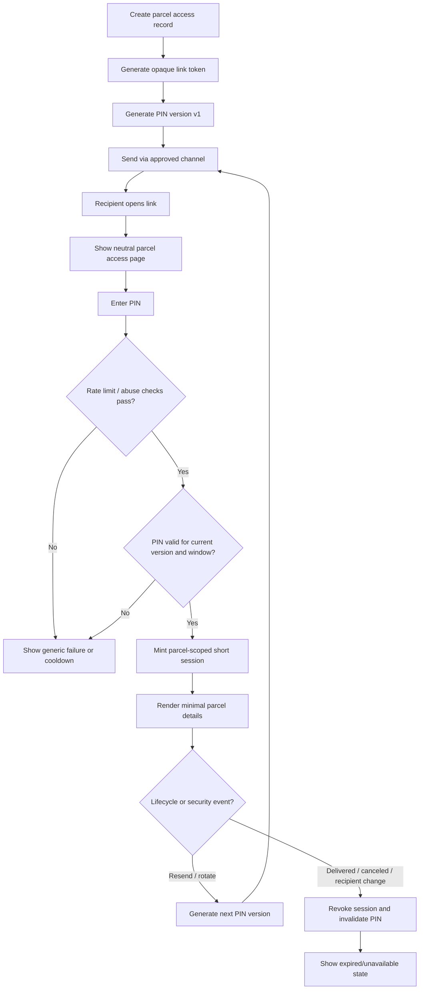
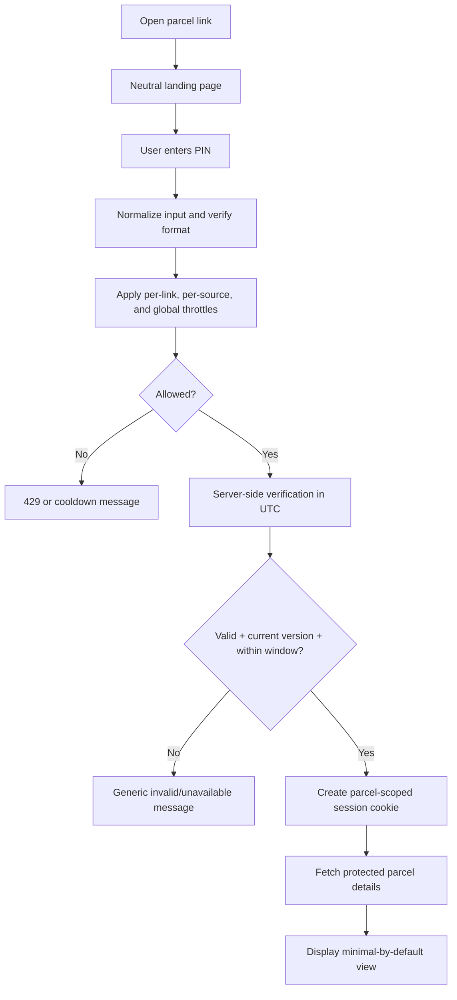
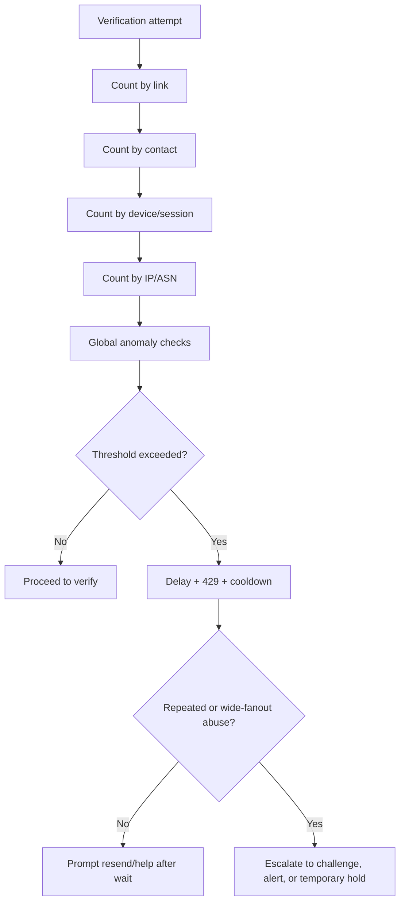
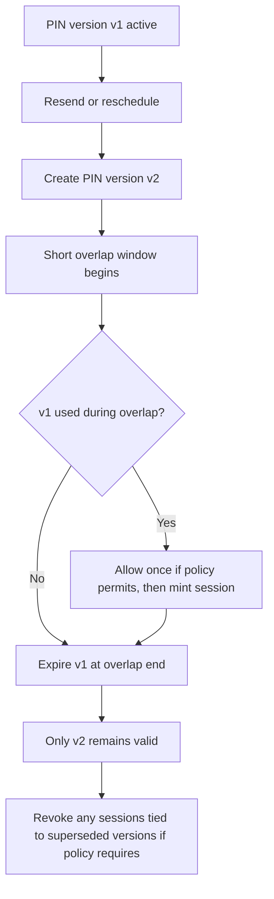

# Edge Cases for a Public Parcel Link and Expiring PIN in the ifinsta Tracking and Delivery API

## Executive summary

This report assumes **no specific throughput, retention, or regional deployment constraints were provided**, so all capacity, TTL, and retention recommendations below are framed as **recommended defaults**, not inferred facts. The feature in scope is a **public-access parcel link plus an access PIN** that reveals protected parcel details for a recipient, where the PIN expires within the delivery window.

The highest-leverage design choice is to treat the feature as a **short-lived public-link authorization mechanism**, not as account login and not as strong MFA unless the URL and PIN are delivered through **independent channels**. OWASP is explicit that multiple instances of the same factor are not true MFA, and its OTP guidance recommends short TTLs, single-use handling where possible, strict attempt limits, no OTP logging, and considering **8-digit or longer** codes when usability allows. NIST likewise requires random secrets of at least six decimal digits and mandates effective rate limiting whenever the secret is below 64 bits of entropy. For a public parcel-link flow, that points to **opaque high-entropy URL tokens + server-side verification + strong throttling + minimal post-verification session scope**. citeturn8view0turn4view0

The top risks are concentrated in six areas: **guessable or leaked URLs**, **weak PIN lifecycle controls**, **preview-bot and inbox-scanner side effects**, **session/cookie mis-scoping**, **privacy leakage through logs/caches/analytics**, and **lifecycle invalidation failures** when delivery status, recipient, or contact details change. OWASP guidance on authentication, session management, CSRF, XSS, logging, and HTTPS makes clear that generic error handling, full-session TLS, secure cookie attributes, state-changing CSRF defenses, and PII-safe logging are baseline controls rather than optional hardening. citeturn4view1turn4view8turn4view9turn4view10turn4view11turn4view2

The recommended default for ifinsta is: **a 128-bit opaque parcel-link token**, **an 8-digit numeric PIN grouped as 4-4**, **server-side UTC validity checks**, **parcel-scoped step-up sessions in Secure/HttpOnly/SameSite cookies**, **strict multi-dimensional rate limits**, **single active PIN version at a time with very short overlap only on resend/rotation**, **zero parcel details before successful PIN verification**, and **immediate invalidation on cancel, delivery completion, recipient/contact change, or security incident**. If link and PIN must travel in the same message, treat them as a **single combined secret** and shorten TTLs and tighten abuse defenses accordingly. citeturn8view0turn4view0turn4view9turn5view0

Communications-channel mechanics matter more than many teams expect. SMS messages can be segmented beyond 160 GSM-7 characters and shrink to 70 UCS-2 characters when Unicode is present; segmentation increases cost and can delay or split delivery. WhatsApp template URL parameters with special characters must be percent-encoded. URL construction must follow standard URI syntax, and host/origin construction must be allowlisted rather than derived from attacker-controlled headers. These are nontrivial sources of user-visible failure and security bugs in parcel-link systems. citeturn4view4turn1search23turn1search16turn4view3turn5view0

Privacy defaults should be conservative. EU GDPR principles require purpose limitation, data minimization, and storage limitation, and EU ePrivacy rules complement GDPR for confidentiality of electronic communications. In practice, public parcel-link pages should reveal only the minimum data necessary for the recipient task, avoid unnecessary precise geo exposure, redact phone/address fields aggressively, and propagate deletion/retention policy consistently into logs, caches, analytics, and backups. citeturn1search3turn7search1turn7search17

## Scope assumptions and design recommendations

A secure and workable reference design for this feature is:

| Aspect | Recommended default | Rationale |
|---|---|---|
| Public link token | 128-bit opaque random token, base64url/base58 style, never sequential, never semantic | Guess resistance and safe external exposure; URI-safe encoding and no dependency on internal IDs. citeturn4view3turn5view0 |
| PIN | 8 numeric digits, grouped `1234 5678`, generated with a CSPRNG | Better brute-force margin than 6 digits while still mobile-friendly; OWASP OTP guidance explicitly recommends considering 8-digit or longer codes where usability allows; NIST requires at least six decimal digits and rate limiting for secrets below 64 bits. citeturn8view0turn4view0 |
| Delivery of link and PIN | Prefer separate channels when available; if same channel is unavoidable, never place PIN in the link itself and treat the pair as one combined secret | OWASP notes that multiple credentials from the same factor do not become MFA; same-channel delivery mainly protects against casual forwarding mistakes, not full compromise of that channel. citeturn8view0 |
| Verification session | Parcel-scoped, least-privilege, Secure/HttpOnly/SameSite cookie, idle TTL 10–15 minutes, hard stop at access end | OWASP session guidance recommends HTTPS for the full session and strong cookie controls; parcel scoping prevents lateral access. citeturn4view9turn5view2turn4view11 |
| Access window | `access_start_at = max(issue_at, window_start - configurable lead)`; `access_end_at = min(window_end + grace, issue_at + absolute_max)` | Ties validity to delivery reality while bounding leakage from delayed channels and abandoned sessions. |
| PIN lifecycle | One active PIN version per parcel link; resend rotates by default; overlap only briefly for in-flight delivery and race safety | Aligns with OWASP OTP handling: short TTL, single-use tendencies, strict attempt limits, and invalidate-on-success/resend as product allows. citeturn8view0 |
| Page privacy | Pre-verification page shows only neutral branding and a generic “parcel access” label; full details require PIN | Minimizes data exposure if URLs leak or are previewed by third parties. citeturn1search3turn7search1 |
| Logging | Never log raw URL tokens or PINs; redact path/query/headers before shipping logs | OWASP recommends security logging, but OTP values should not be logged and logging should be PII-safe. citeturn4view2turn8view0 |
| Messaging body | Keep SMS bodies short enough to avoid avoidable segmentation; prefer GSM-7-safe copy where possible; percent-encode WhatsApp URL parameters | Segment splitting and Unicode shrink SMS payload budget; WhatsApp URL buttons require proper encoding of special characters. citeturn4view4turn1search23turn1search16 |
| Error model | Generic failure copy for invalid/expired/locked states where link existence could leak; stable machine-readable API errors | OWASP recommends generic authentication responses and uniform timing to reduce enumeration. RFC 9457 is the standard HTTP problem-details format. citeturn4view1turn5view0turn0search2 |

Two product-policy decisions deserve explicit treatment because they change many edge cases:

First, decide whether the PIN is **strictly single-use** or **reusable within the delivery window**. The safer default is to make each PIN version usable only to mint short-lived parcel-scoped sessions, with later cross-device access requiring a resend. That better matches OWASP OTP handling guidance, but it is less convenient for recipients who switch devices often. If product chooses reusable-within-window, then successful verifications must still be tightly rate-limited, versioned, auditable, and revocable on resend and lifecycle change. citeturn8view0

Second, decide whether the same parcel-link page should show **full destination details**, **masked details**, or **task-specific slices**. GDPR data-minimization and storage-limitation principles strongly favor a smallest-necessary default, especially if the recipient only needs ETA, status, and proof-of-delivery confirmation rather than exact address or courier live location. citeturn1search3turn7search1

## Dimensions and risk summary

The edge cases below are organized across these explicit dimensions: **authentication and authorization; link generation and distribution; PIN UX and validation; expiry semantics; concurrency and race conditions; security threats; privacy and PII; device and platform specifics; network failures and offline access; webhook and SDK interactions; storage and retention; logging and observability; rate limiting and abuse; error handling and user messaging; accessibility and localization; legal and compliance; testing and monitoring; operational recovery; analytics and metrics; and integration with the delivery lifecycle**. The categorization is anchored in NIST guidance for short secrets and throttling, OWASP guidance for authentication, OTP handling, session management, logging, CSRF, XSS, and transport security, RFC URI and HTTP practices, privacy-law minimization/storage principles, and WCAG accessibility requirements. citeturn4view0turn4view1turn8view0turn4view9turn4view10turn4view11turn4view3turn1search3turn7search1turn4view13

All probability ratings below are qualitative design-stage judgments:
**H = high, M = medium, L = low, U = unspecified**.

| Category | Count |
|---|---:|
| Authentication and authorization | 75 |
| Link generation and distribution | 65 |
| PIN UX and validation | 55 |
| Expiry semantics | 50 |
| Concurrency and race conditions | 50 |
| Security threats | 110 |
| Privacy and PII | 70 |
| Device and platform specifics | 65 |
| Network failures and offline access | 50 |
| Webhook and SDK interactions | 45 |
| Storage and retention | 40 |
| Logging and observability | 45 |
| Rate limiting and abuse | 60 |
| Error handling and user messaging | 35 |
| Accessibility and localization | 35 |
| Legal and compliance | 35 |
| Testing and monitoring | 30 |
| Operational recovery | 25 |
| Analytics and metrics | 15 |
| Delivery lifecycle integration | 45 |
| **Total** | **1000** |

The distribution is intentionally skewed toward **security, privacy, session integrity, and lifecycle invalidation** because those are the areas where public parcel-link systems most often fail in ways that are both exploitable and brand-damaging. The highest-risk cluster is not just “PIN brute force”; it is the combination of **link leakage, same-channel delivery, preview-bot behavior, weak session scope, privacy overexposure, and event-driven invalidation gaps**. citeturn8view0turn5view0turn4view9turn4view2

## Top 50 highest-risk edge cases

The fifty scenarios below are the highest-priority engineering and security items because they create either direct unauthorized access, material privacy harm, or large operational blast radius.

**T1 — Edge case #1: Predictable link token.**  
Mitigation plan: generate opaque 128-bit CSPRNG tokens; enforce uniqueness; never expose sequential IDs. Monitoring and alerts: alert on adjacent-path 401/404 probes, high open-without-verify ratios, and spikes in unknown-link traffic from single ASNs. Tests: RNG uniqueness tests, parser fuzzing, enumeration load tests. citeturn5view0turn4view3

**T2 — Edge case #2: Insufficient link entropy.**  
Mitigation plan: define a minimum entropy budget in code review and CI; reject short token formats and migration shortcuts. Monitoring and alerts: monitor collision risk, token-length distribution, and success on malformed tokens. Tests: entropy-budget unit tests and offline guessing simulations. citeturn5view0turn4view0

**T3 — Edge case #6: Link token not bound to parcel and tenant.**  
Mitigation plan: bind every token record to parcel, tenant, and current recipient/contact version; check that binding on every page and API call. Monitoring and alerts: alert on cross-tenant or cross-parcel authorization denials from valid-looking sessions. Tests: BOLA and tenant-isolation tests. citeturn5view2

**T4 — Edge case #11: PIN stored in plaintext.**  
Mitigation plan: store only a short-secret-safe hash or HMAC with server-side pepper; never return the raw PIN after generation. Monitoring and alerts: secret scanners over DB dumps, logs, support tools, and backups. Tests: schema inspections, migration tests, secret-scanning CI. citeturn8view0turn4view2

**T5 — Edge case #13: Old PINs not invalidated on rotation.**  
Mitigation plan: maintain a single active PIN version with an explicit superseded state; if overlap is needed, cap it tightly and store `supersedes_version`. Monitoring and alerts: any verification of superseded versions after overlap expiry should page the team. Tests: resend/rotate/verify race tests. citeturn8view0

**T6 — Edge case #21: Successful PIN verification grants a broad account session.**  
Mitigation plan: issue only a parcel-scoped, least-privilege step-up session with hard expiry and no access to unrelated resources. Monitoring and alerts: alert on any session that pivots to another parcel or account surface after parcel verification. Tests: authorization-matrix tests across all endpoints. citeturn4view9turn5view2

**T7 — Edge case #28: Verification endpoint reveals whether the link exists.**  
Mitigation plan: use generic messages, uniform timing, and stable response sizes for invalid/expired/nonexistent states. Monitoring and alerts: differential latency and body-length monitoring across failure classes. Tests: black-box enumeration testing and latency-delta assertions. citeturn4view1turn5view0

**T8 — Edge case #29: Auth checked on page load but not on JSON/API endpoints.**  
Mitigation plan: enforce parcel authorization at every API endpoint and service layer, not only in the front-end route. Monitoring and alerts: watch for protected API 2xx responses without preexisting verified session. Tests: direct API IDOR/BOLA regression suite. citeturn5view2

**T9 — Edge case #39: Session cookie missing `Secure`.**  
Mitigation plan: HTTPS-only deployment, `Secure` cookie everywhere, and HSTS once the domain is stable. Monitoring and alerts: config scanner on response headers; alert on any cookie without `Secure`. Tests: browser and edge integration tests. citeturn4view9turn4view11turn5view3

**T10 — Edge case #40: Session cookie missing `HttpOnly`.**  
Mitigation plan: keep auth material out of JavaScript storage and mark cookies `HttpOnly`. Monitoring and alerts: code scanning for token access through `document.cookie` or localStorage. Tests: CSP/XSS regression tests and browser assertions. citeturn4view9

**T11 — Edge case #41: Session cookie missing `SameSite`.**  
Mitigation plan: use `SameSite=Lax` or `Strict` for parcel sessions, except for narrowly justified cross-site flows. Monitoring and alerts: watch cross-site request patterns to state-changing endpoints. Tests: browser-matrix CSRF tests. citeturn4view8turn4view9

**T12 — Edge case #43: Session fixation after PIN entry.**  
Mitigation plan: rotate session IDs immediately after successful verification and invalidate pre-verification state tokens. Monitoring and alerts: identical session identifiers before and after PIN success should alert. Tests: pre-seeded cookie fixation tests. citeturn4view9

**T13 — Edge case #57: Session survives PIN rotation.**  
Mitigation plan: version sessions to the active PIN generation and revoke or downgrade them upon rotation/resend depending on policy. Monitoring and alerts: any session operating on a superseded version after rotation should alert. Tests: active-session rotation tests. citeturn8view0

**T14 — Edge case #58: Session survives parcel cancellation.**  
Mitigation plan: treat cancel, return, manual hold, and delivered states as security events that trigger session reevaluation and cache purge. Monitoring and alerts: accesses after lifecycle terminal states. Tests: status-transition invalidation tests. |

**T15 — Edge case #99: Email preview bots fetch the page and create a session.**  
Mitigation plan: make GET side-effect-free; only a deliberate human POSTed PIN can mint a session; recognize preview agents where possible. Monitoring and alerts: first opens from known security scanners and data-center ASNs. Tests: mail-scanner simulations. citeturn5view0

**T16 — Edge case #100: Rich-link preview exposes parcel title or address.**  
Mitigation plan: protected pages should return generic Open Graph metadata or none at all. Monitoring and alerts: crawler traffic to protected URLs and OG fetches. Tests: preview-bot runs for email, chat, and social tools. |

**T17 — Edge case #123: Phone number recycling sends link/PIN to the wrong owner.**  
Mitigation plan: rotate on resend after long dormancy, support contact-change invalidation, and offer sender-side correction workflows. Monitoring and alerts: complaints from “wrong recipient” and rises in never-before-seen-device opens after long silence. Tests: recycled-number lifecycle tests. |

**T18 — Edge case #131: Mailbox security scanner follows the link.**  
Mitigation plan: no authentication side effects on GET; require explicit user action after landing. Monitoring and alerts: enterprise scanner user agents preceding real user traffic. Tests: corporate secure-email sandbox behavior. citeturn5view0

**T19 — Edge case #190: UI shows parcel details before PIN verification.**  
Mitigation plan: serve a neutral shell only; fetch sensitive data only after verified parcel session. Monitoring and alerts: DLP and DOM snapshot checks on unauthenticated renders. Tests: browser snapshots and API contract tests. |

**T20 — Edge case #196: Expiry computed in device local time.**  
Mitigation plan: server-side UTC enforcement only; clients render human-friendly time but never authorize from device clocks. Monitoring and alerts: client countdown / server decision mismatches. Tests: timezone, DST, skew matrix tests. |

**T21 — Edge case #203: Cache holds “valid” state past expiry.**  
Mitigation plan: `Cache-Control: no-store, private`, versioned cache keys, short TTLs below session TTL, explicit purge on revoke. Monitoring and alerts: cache hits after expiry or revoke. Tests: CDN/browser cache integration runs. citeturn5view0turn5view3

**T22 — Edge case #219: Recipient reassignment does not invalidate old access.**  
Mitigation plan: recipient/contact updates must rotate tokens and PINs, revoke sessions, and cancel queued sends. Monitoring and alerts: verifications tied to superseded recipient version. Tests: mutate-recipient-while-active workflow tests. |

**T23 — Edge case #223: Session remains valid after PIN expiry.**  
Mitigation plan: idle session TTL should be shorter than the delivery window, and absolute session end must never exceed `access_end_at`. Monitoring and alerts: successful views after `access_end_at`. Tests: session boundary tests around window close. |

**T24 — Edge case #262: Attempt counter increment is not atomic.**  
Mitigation plan: use atomic increments in a durable shared store with compare-and-set semantics where needed. Monitoring and alerts: impossible attempt counts or mismatches between logs and counters. Tests: high-concurrency verification storms. citeturn4view0turn8view0

**T25 — Edge case #296: Brute-force guessing against a single link.**  
Mitigation plan: per-link, per-device, per-contact, and per-IP/ASN throttles with jitter and suspicion scoring. Monitoring and alerts: rapid repeated failures against one token. Tests: adversarial rate-limit load tests. citeturn4view0turn5view1turn8view0

**T26 — Edge case #297: Spray attack using one PIN across many links.**  
Mitigation plan: add global anomaly detection for low-and-slow fanout and shared wrong-code patterns. Monitoring and alerts: same entered code failing across many links. Tests: spray simulators across a large token corpus. citeturn5view1

**T27 — Edge case #299: Enumeration through timing differences.**  
Mitigation plan: equalize verification paths and response timing; avoid fast-fail branches on nonexistent links. Monitoring and alerts: statistically significant latency deltas by failure class. Tests: differential timing probes. citeturn4view1turn5view0

**T28 — Edge case #303: Replay of captured link and PIN from another device.**  
Mitigation plan: bind the resulting session to parcel scope and risk signals; step up or reissue when the device/location shifts materially. Monitoring and alerts: near-simultaneous use from distinct IP geographies. Tests: cross-device replay tests. |

**T29 — Edge case #306: SSL stripping without HSTS.**  
Mitigation plan: HTTPS-only, HSTS when operationally safe, and never issue auth cookies until after HTTPS redirect. Monitoring and alerts: HTTP hit counts, downgrade attempts, certificate errors. Tests: TLS downgrade probes. citeturn4view9turn4view11turn5view3

**T30 — Edge case #308: Phishing clone uses a lookalike parcel domain.**  
Mitigation plan: stable branded origin, email authentication, anti-phishing copy, and no dependence on shortened or lookalike URLs. Monitoring and alerts: lookalike-domain monitoring and abuse desk intake. Tests: brand-abuse tabletop and phishing-simulation reviews. |

**T31 — Edge case #309: Social engineering of support to resend or reveal the PIN.**  
Mitigation plan: support workflow must never disclose raw PINs and must use auditable, least-privilege resend tools with verification steps. Monitoring and alerts: unusual manual override volumes and after-hours resend spikes. Tests: red-team social-engineering exercises. citeturn8view0

**T32 — Edge case #319: Referrer leakage of token to third parties.**  
Mitigation plan: `Referrer-Policy: no-referrer` or strict equivalent; no third-party assets on protected pages. Monitoring and alerts: outbound requests with token-like referrers. Tests: browser network-capture tests. citeturn5view0

**T33 — Edge case #320: Third-party analytics script captures token or PIN field.**  
Mitigation plan: do not run third-party analytics on authenticated parcel pages, or aggressively redact and isolate if absolutely necessary. Monitoring and alerts: DLP scanning of outbound analytics beacons. Tests: CSP plus network instrumentation tests. citeturn4view10turn5view3

**T34 — Edge case #321: XSS via delivery notes or address fields.**  
Mitigation plan: strict output encoding and HTML sanitization; avoid dangerous DOM sinks. Monitoring and alerts: CSP violations, suspicious script source loads, and client-side exception spikes. Tests: stored and reflected XSS payload corpora. citeturn4view10turn5view3

**T35 — Edge case #323: CSP absent or weak.**  
Mitigation plan: nonce/hash-based CSP, no `unsafe-inline` unless absolutely forced, and separate report-only rollout before enforcement. Monitoring and alerts: CSP report volume and new source origins. Tests: CSP regression tests in CI. citeturn2search1turn5view3

**T36 — Edge case #326: Host header injection in generated links.**  
Mitigation plan: build outbound links from configured trusted origins only; never use unvalidated `Host` or forwarded host headers. Monitoring and alerts: mismatched host-header patterns. Tests: poisoned-host integration tests. citeturn5view0

**T37 — Edge case #328: CDN caches authenticated HTML.**  
Mitigation plan: no shared-edge caching for personalized parcel pages; explicit `no-store, private`. Monitoring and alerts: any cache hit on protected HTML paths. Tests: CDN behavior verification. citeturn5view3

**T38 — Edge case #331: CSRF on resend endpoint.**  
Mitigation plan: CSRF tokens for browser state-changing actions plus SameSite cookies and origin checks. Monitoring and alerts: cross-site resend attempts and invalid origin header volumes. Tests: CSRF proof-of-concept tests. citeturn4view8turn4view9

**T39 — Edge case #333: Over-permissive CORS allows token theft.**  
Mitigation plan: origin allowlist, never wildcard with credentials, and keep protected JSON on same-origin flows where possible. Monitoring and alerts: unexpected origins and preflight failures. Tests: browser CORS matrix. citeturn5view3

**T40 — Edge case #345: Session stored in localStorage.**  
Mitigation plan: web auth state belongs in secure cookies; native apps use OS-secure storage, never plaintext settings. Monitoring and alerts: static analysis and runtime checks for token writes to web storage. Tests: browser and mobile storage tests. citeturn4view9

**T41 — Edge case #350: Search engine indexing of public parcel pages.**  
Mitigation plan: pre-auth gate before any sensitive content, `noindex`, and no accidental sitemap/robots exposure. Monitoring and alerts: crawler and search-console monitoring. Tests: crawler scans and unauthenticated render checks. |

**T42 — Edge case #359: Broken object-level authorization on parcel APIs.**  
Mitigation plan: parcel-scoped authorization in every detail, status, proof-of-delivery, and resend endpoint. Monitoring and alerts: cross-object authorization denials. Tests: IDOR/BOLA automation. citeturn5view2

**T43 — Edge case #366: Image EXIF metadata leaks exact geo/device info.**  
Mitigation plan: strip EXIF on upload or before public delivery, and generate redacted derivatives for recipient views. Monitoring and alerts: EXIF scanners over stored objects. Tests: media-pipeline tests with seeded metadata. |

**T44 — Edge case #375: Support transcript or chatbot stores raw link/PIN.**  
Mitigation plan: detect and mask token and PIN patterns in CRM, chat, and telephony transcripts. Monitoring and alerts: secret-detection matches in support systems. Tests: transcript redaction tests. citeturn4view2turn8view0

**T45 — Edge case #380: Fail-open when rate-limit backend is unavailable.**  
Mitigation plan: fail closed or degrade to a coarse emergency limiter; never bypass verification controls on backend outage. Monitoring and alerts: limiter health plus auth-success spikes during impairment. Tests: chaos tests that kill the limiter. citeturn4view0turn8view0

**T46 — Edge case #406: Full address shown before verification.**  
Mitigation plan: pre-verify page shows only neutral parcel branding; reveal exact address only if necessary after verification. Monitoring and alerts: DLP scans on public responses and screenshots from synthetic monitors. Tests: pre-auth DOM/API snapshot checks. citeturn1search3turn7search1

**T47 — Edge case #421: Access logs capture the full tokenized URL.**  
Mitigation plan: edge and app logging must normalize and redact path/query secrets before persistence or export. Monitoring and alerts: secret-regex scans over live log sinks. Tests: golden log tests and SIEM ingestion tests. citeturn4view2turn8view0

**T48 — Edge case #549: Offline cached page visible after expiry.**  
Mitigation plan: service workers must never cache sensitive parcel data; offline mode may show a generic shell only and require re-fetch for protected data. Monitoring and alerts: client-side telemetry on offline open after expiry. Tests: browser offline automation and app-process-restoration tests. |

**T49 — Edge case #721: No rate limit on PIN verification.**  
Mitigation plan: rate limiting is mandatory: per-link, per-device, per-recipient/contact, per-IP/ASN, and global anomaly layers with Retry-After headers. Monitoring and alerts: 429 rates, failure fanout, distributed-source patterns, and verification success after many failures. Tests: adversarial load tests and retry-behavior tests. citeturn4view0turn5view1turn8view0

**T50 — Edge case #960: Recipient changed but old contact still holds a working link/PIN.**  
Mitigation plan: make contact and recipient changes security events that rotate token and PIN, revoke sessions, cancel queued messages, and re-notify only the new contact. Monitoring and alerts: post-change verifications against old-version records. Tests: full contact-change lifecycle tests. |

## Enumerated edge cases

The 1000 edge cases below are shortened for operational use. Format: **Title — short description. Impact: H/M/L. Probability: H/M/L/U. Mitigation: short handling strategy. Notes: short tradeoff or system-change note.**

**Authentication, authorization, PIN lifecycle, and session scope (1–75)**

1. Predictable link token — Guessable URLs expose parcel pages. Impact: H. Probability: M. Mitigation: 128-bit opaque CSPRNG tokens. Notes: loses human-readable links.
2. Low-entropy token — Short tokens enable feasible guessing. Impact: H. Probability: M. Mitigation: enforce entropy budget in CI. Notes: longer URLs.
3. Sequential DB IDs in public URLs — Enumeration reveals parcel existence. Impact: H. Probability: M. Mitigation: separate external token from internal ID. Notes: needs mapping table.
4. Token embeds delivery ID — Semantic URLs leak internal structure. Impact: H. Probability: M. Mitigation: opaque indirection layer. Notes: harder debugging.
5. Token not tied to tenant — Cross-tenant leakage becomes possible. Impact: H. Probability: L. Mitigation: tenant bind every lookup. Notes: stricter auth checks.
6. Token not tied to parcel — One token may unlock wrong resource. Impact: H. Probability: L. Mitigation: bind token to parcel and recipient version. Notes: schema change.
7. Token reused across multiple parcels — Leakage blast radius expands. Impact: H. Probability: L. Mitigation: one token per parcel link. Notes: more records.
8. Token remains valid after recipient change — Old recipient keeps access. Impact: H. Probability: M. Mitigation: rotate on recipient change. Notes: resend needed.
9. Token remains valid after contact change — Old phone/email holder can open. Impact: H. Probability: M. Mitigation: invalidate and reissue. Notes: support workflow.
10. Token accepted over HTTP — MITM can steal session. Impact: H. Probability: M. Mitigation: HTTPS-only plus HSTS. Notes: cert discipline required.
11. PIN stored plaintext — DB or support leak exposes active codes. Impact: H. Probability: M. Mitigation: hash/HMAC with pepper. Notes: needs secure compare.
12. PIN hashed with weak fast hash — Offline brute force becomes trivial. Impact: H. Probability: M. Mitigation: use strong secret-handling pattern. Notes: small keyspace remains.
13. Old PINs not invalidated on rotation — Resend leaves multiple valid codes. Impact: H. Probability: M. Mitigation: single active version, tiny overlap only. Notes: race handling.
14. Previous and new PIN overlap too long — Attack surface doubles. Impact: H. Probability: M. Mitigation: cap overlap to minutes. Notes: may affect delayed SMS.
15. PIN retries not scoped per link — Attackers spread guesses cheaply. Impact: H. Probability: M. Mitigation: per-link counters. Notes: more state.
16. PIN retries not scoped per device/session — Shared devices create blind spots. Impact: M. Probability: M. Mitigation: supplement with device/session counters. Notes: privacy tradeoff.
17. Same PIN reused across recipients — One guessed code helps many attacks. Impact: H. Probability: L. Mitigation: random per-link PINs. Notes: more generation load.
18. PIN derived from phone/order digits — Predictable code space. Impact: H. Probability: L. Mitigation: pure CSPRNG generation. Notes: none.
19. Admin can view raw PIN — Insider misuse risk. Impact: H. Probability: M. Mitigation: never reveal raw PIN after send. Notes: support process changes.
20. Support tooling can regenerate PIN without audit — Abuse hard to trace. Impact: H. Probability: M. Mitigation: audited resend-only tool. Notes: higher support friction.
21. Successful PIN grants broad account session — Parcel access becomes account takeover path. Impact: H. Probability: M. Mitigation: parcel-scoped short session only. Notes: more auth code.
22. Successful PIN grants unrelated parcel access — Scope error leaks other shipments. Impact: H. Probability: L. Mitigation: object-level authorization everywhere. Notes: extensive tests.
23. Auth session not bound to link — Session reuse across links. Impact: H. Probability: M. Mitigation: bind session to parcel token/version. Notes: session store fields.
24. Step-up session not time-limited — Public access persists too long. Impact: H. Probability: M. Mitigation: idle and absolute TTLs. Notes: more reauths.
25. Step-up session not revoked on logout — Shared devices remain exposed. Impact: H. Probability: M. Mitigation: server-side revocation. Notes: cache purge.
26. Resend endpoint callable without possession proof — Attackers can spam recipients. Impact: H. Probability: M. Mitigation: require valid link context and throttle. Notes: UX slightly slower.
27. Resend accepts forged recipient contact — Attacker redirects codes. Impact: H. Probability: L. Mitigation: never accept arbitrary new contact here. Notes: separate correction flow.
28. Verification endpoint reveals valid link existence — Enumeration by response behavior. Impact: H. Probability: M. Mitigation: generic copy and uniform timing. Notes: UX tradeoff.
29. Page enforces auth but JSON endpoint does not — Direct API exfiltration. Impact: H. Probability: M. Mitigation: auth/authorization on every endpoint. Notes: API review needed.
30. Cached auth decision reused after status change — Canceled access still works. Impact: H. Probability: M. Mitigation: version decision with lifecycle state. Notes: invalidation complexity.
31. Role confusion between recipient and operator — Wrong rights attached to same surface. Impact: H. Probability: L. Mitigation: explicit actor types. Notes: RBAC refactor.
32. Delegated access unsupported — Users share PIN informally. Impact: M. Probability: M. Mitigation: optional delegate model. Notes: product complexity.
33. Household sharing not modeled — Legitimate viewers blocked or overexposed. Impact: M. Probability: M. Mitigation: controlled household/share policy. Notes: privacy implications.
34. Public token usable by anonymous and signed-in flows differently — Inconsistent security. Impact: H. Probability: M. Mitigation: harmonize authorization checks. Notes: edge-case cleanup.
35. Signed-in customer can bypass PIN using account session — Public-link secrecy diluted. Impact: M. Probability: M. Mitigation: explicit policy; same or stronger checks. Notes: UX decision.
36. Internal service token accepted on public endpoint — Privileged misuse possible. Impact: H. Probability: L. Mitigation: audience/scope checks. Notes: gateway config.
37. Public token accepted on admin/internal endpoint — Privilege escalation route. Impact: H. Probability: L. Mitigation: endpoint-class separation. Notes: routing changes.
38. Bearer session token put in URL — Logs and referrers leak it. Impact: H. Probability: L. Mitigation: cookies or Authorization header only. Notes: web/native split.
39. Session cookie missing Secure — Network leakage risk. Impact: H. Probability: M. Mitigation: set Secure everywhere. Notes: HTTPS-only.
40. Session cookie missing HttpOnly — XSS can steal session. Impact: H. Probability: M. Mitigation: HttpOnly cookies. Notes: JS cannot inspect cookie.
41. Session cookie missing SameSite — CSRF easier. Impact: H. Probability: M. Mitigation: SameSite=Lax/Strict. Notes: cross-site flows limited.
42. Session ID accepted from URL parameter — Token leaks to logs/history. Impact: H. Probability: L. Mitigation: cookies only. Notes: legacy client support removed.
43. Session fixation on PIN verification — Attacker seeds victim session. Impact: H. Probability: M. Mitigation: rotate session on success. Notes: extra session writes.
44. Login CSRF on PIN verification — Victim forced into attacker context. Impact: H. Probability: L. Mitigation: anti-CSRF and session rotation. Notes: browser-specific tests.
45. Reauth absent for sensitive actions in parcel scope — Some actions need more assurance. Impact: M. Probability: M. Mitigation: step-up for high-risk actions. Notes: product policy.
46. “Remember device” extends access beyond window — Public access lingers. Impact: H. Probability: M. Mitigation: disallow or cap. Notes: convenience loss.
47. Auth context not rotated after PIN success — Pre-auth state persists. Impact: H. Probability: M. Mitigation: full post-verify regeneration. Notes: cookie churn.
48. Stale device fingerprint blocks legitimate device change — False lockouts. Impact: M. Probability: M. Mitigation: risk signal, not hard bind. Notes: weaker anti-replay.
49. Too-strict device binding breaks multi-device use — Legit recipients cannot switch devices. Impact: M. Probability: M. Mitigation: allow resend-based handoff. Notes: support burden.
50. Brute-force counter reset by cookie clearing — Browser resets circumvent controls. Impact: H. Probability: M. Mitigation: server-side counters. Notes: storage cost.
51. Brute-force counter reset by app reinstall — Mobile attacker evasion. Impact: M. Probability: M. Mitigation: server-side device/contact/link counters. Notes: privacy tradeoff.
52. Brute-force counter reset by IP change — Proxy rotation bypass. Impact: H. Probability: H. Mitigation: multidimensional limits. Notes: more tuning.
53. Brute-force counter reset by switching channels — Email/SMS hopping evades guardrail. Impact: M. Probability: M. Mitigation: shared abuse ledger. Notes: cross-channel state.
54. Counter keyed only to recipient — Attacker can DoS by locking recipient. Impact: M. Probability: M. Mitigation: combine per-link/per-source logic. Notes: nuanced policy.
55. Counter keyed only to link — Distributed guessing still easy. Impact: H. Probability: M. Mitigation: add network/global heuristics. Notes: anomaly engine.
56. Resend changes PIN without invalidating active session — New policy not enforced. Impact: H. Probability: M. Mitigation: session version binding. Notes: active-page refresh.
57. Session survives PIN rotation — Stolen session remains useful. Impact: H. Probability: M. Mitigation: revoke or downgrade on rotation. Notes: more invalidation traffic.
58. Session survives parcel cancellation — Invalid access after business state ends. Impact: H. Probability: M. Mitigation: lifecycle-driven revoke. Notes: event wiring.
59. Session survives proof-of-delivery completion when policy requires revoke — Data accessible too long. Impact: M. Probability: M. Mitigation: post-delivery reevaluation. Notes: UX decision.
60. Authorization cache ignores tenant isolation — Cross-tenant leakage. Impact: H. Probability: L. Mitigation: include tenant in cache keys. Notes: cache cardinality.
61. Privileged support override lacks dual control — Insider misuse. Impact: H. Probability: L. Mitigation: two-person or audited approvals. Notes: operational cost.
62. Audit record missing actor identity for PIN ops — Forensics weakened. Impact: H. Probability: M. Mitigation: actor+channel+reason fields required. Notes: schema update.
63. PIN verification allowed for archived/deleted parcel — Ghost access state. Impact: H. Probability: L. Mitigation: deny archived states. Notes: replicated checks.
64. PIN accepted after hard delete due replica lag — Consistency gap. Impact: H. Probability: L. Mitigation: primary read on auth. Notes: slight latency.
65. Expired session can refresh indefinitely — Window bypass. Impact: H. Probability: M. Mitigation: absolute hard stop. Notes: more reauth.
66. Concurrent refresh issues duplicate sessions — Revocation complexity rises. Impact: M. Probability: M. Mitigation: single refresh chain. Notes: session versioning.
67. Browser back-button reveals authenticated page after logout — Shared-device exposure. Impact: M. Probability: H. Mitigation: no-store plus sensitive DOM clearing. Notes: browser quirks.
68. Session revocation not propagated to CDN/edge — Stale access survives. Impact: H. Probability: M. Mitigation: purge and version responses. Notes: infrastructure dependency.
69. Revocation list eviction re-enables stolen session — Security regression. Impact: H. Probability: L. Mitigation: bounded lifetime plus durable denylist. Notes: more memory.
70. Verification success leaks internal recipient ID — Correlation aid for attackers. Impact: M. Probability: M. Mitigation: opaque public identifiers only. Notes: API cleanup.
71. Token normalized case-insensitively — Effective entropy shrinks. Impact: M. Probability: M. Mitigation: canonical encoding rules. Notes: client confusion possible.
72. Unicode normalization changes token meaning — Some clients alter tokens. Impact: M. Probability: L. Mitigation: ASCII-safe token alphabet. Notes: longer strings.
73. Auth middleware skips HEAD/OPTIONS — Side-channel or bypass path. Impact: M. Probability: M. Mitigation: protect all methods. Notes: CORS complexity.
74. Gateway and app disagree on auth decision — Inconsistent exposure. Impact: H. Probability: M. Mitigation: single source of truth or shared policy. Notes: architecture work.
75. Emergency bypass becomes permanent path — Temporary control becomes vulnerability. Impact: H. Probability: M. Mitigation: expiring feature flags and audits. Notes: operational discipline.

**Link generation, encoding, and distribution (76–140)**

76. URL contains unescaped reserved characters — Some clients break the link. Impact: M. Probability: M. Mitigation: RFC-compliant encoding. Notes: strict builders.
77. Percent-decoding performed twice — Token corruption or bypass. Impact: H. Probability: M. Mitigation: decode exactly once. Notes: proxy/app alignment.
78. Plus sign treated as space — Link token changes in transit. Impact: M. Probability: M. Mitigation: base64url/base58, not `+`. Notes: token alphabet choice.
79. Trailing punctuation becomes part of link — Clicked URL fails. Impact: L. Probability: H. Mitigation: short clean links. Notes: copywriting change.
80. Email/SMS line wrapping inserts breaks — Link copy fails. Impact: M. Probability: H. Mitigation: shorten links and test clients. Notes: branded short domain.
81. Shortener strips path or query — Link becomes invalid. Impact: M. Probability: M. Mitigation: compatibility testing or avoid third-party shorteners. Notes: less analytics.
82. Shortener domain reputation triggers carrier filtering — Messages silently fail. Impact: H. Probability: M. Mitigation: trusted branded domain. Notes: setup overhead.
83. Shortener analytics expose parcel metadata — Privacy leakage. Impact: H. Probability: M. Mitigation: self-host or minimize analytics. Notes: less marketing insight.
84. Branded domain expires or DNS misconfigures — Links die or hijack. Impact: H. Probability: L. Mitigation: domain governance and alerts. Notes: ops burden.
85. QR code encodes stale link version — Printed code invalid after update. Impact: M. Probability: M. Mitigation: late-bind or short-lived redirect. Notes: more backend logic.
86. Link copied without PIN context — Recipient opens page but cannot proceed. Impact: L. Probability: H. Mitigation: landing page explains next step. Notes: UX copy.
87. PIN copied without link context — Recipient has code but nowhere to use it. Impact: L. Probability: H. Mitigation: messages keep both nearby. Notes: message design.
88. Email client trims whitespace incorrectly — Token mismatch. Impact: L. Probability: M. Mitigation: strict templating and tests. Notes: client matrix.
89. Email auto-linking stops at ampersand — Truncated URL. Impact: M. Probability: M. Mitigation: path-based tokens or encoded params. Notes: URL design.
90. Markdown/HTML escaping corrupts URL — Broken links in rich clients. Impact: M. Probability: M. Mitigation: template render tests. Notes: CI add-ons.
91. WhatsApp variable not percent-encoded — Broken destination on click. Impact: M. Probability: M. Mitigation: percent-encode template vars. Notes: Meta-specific handling.
92. Template engine escapes URL twice — Token changes. Impact: M. Probability: M. Mitigation: one canonical encoding layer. Notes: integration cleanup.
93. Unsupported characters trigger UCS-2 SMS encoding — Messages segment unexpectedly. Impact: M. Probability: H. Mitigation: GSM-7-safe copy where possible. Notes: localization tradeoff.
94. Unicode glyphs reduce SMS budget — Link/PIN split across segments. Impact: M. Probability: H. Mitigation: short message templates. Notes: shorter branding text.
95. SMS longer than one segment separates link and PIN — Recipient sees pieces or delay. Impact: M. Probability: H. Mitigation: keep under one segment if possible. Notes: content budget.
96. Carrier silently drops later segments — PIN or link missing. Impact: H. Probability: M. Mitigation: concise body; delivery analytics. Notes: provider diversity.
97. Carrier click-tracking rewrites URLs — Domain trust and token handling break. Impact: M. Probability: M. Mitigation: trusted gateways and signed redirects. Notes: more complexity.
98. Anti-phishing gateway detonates link before user — Single-use side effects occur. Impact: H. Probability: M. Mitigation: GET must be side-effect free. Notes: product design.
99. Email preview bots fetch page and create session — Bot consumes access unexpectedly. Impact: H. Probability: H. Mitigation: no side effects on GET. Notes: nuisance with corporate mail.
100. Rich-link preview exposes parcel title/address — Forwarded links leak details. Impact: H. Probability: M. Mitigation: generic OG metadata or none. Notes: less pretty previews.
101. Open Graph metadata leaks recipient name — Privacy breach before verify. Impact: H. Probability: M. Mitigation: generic titles only. Notes: lower click-through.
102. Message shortening hides true domain — Phishing risk rises. Impact: H. Probability: M. Mitigation: stable branded host. Notes: longer visible URL.
103. Same domain used for marketing links — Recipients distrust parcel message. Impact: M. Probability: M. Mitigation: dedicated transactional subdomain. Notes: extra domain ops.
104. Wrong locale template shows ambiguous dates — Window confusion. Impact: M. Probability: M. Mitigation: locale-aware formatting. Notes: template sprawl.
105. Wrong tenant branding in message — User may treat as phishing. Impact: M. Probability: M. Mitigation: tenant-aware sends. Notes: stricter QA.
106. Sender ID unrecognized in recipient country — Delivery/trust drop. Impact: M. Probability: M. Mitigation: country-specific messaging setup. Notes: provider complexity.
107. International E.164 normalization fails — Message goes to wrong number. Impact: H. Probability: M. Mitigation: strict phone normalization. Notes: validation service.
108. Local number formatting sends to wrong person — Privacy incident. Impact: H. Probability: M. Mitigation: E.164 storage/display split. Notes: UX work.
109. Stale phone/email snapshot used — Old contact gets link. Impact: H. Probability: M. Mitigation: send from freshest verified contact. Notes: cache freshness.
110. Resend sends to all historical contacts — Massive privacy leak. Impact: H. Probability: L. Mitigation: current contact only. Notes: data model cleanup.
111. Opted-out channel still used — Compliance and trust issue. Impact: M. Probability: M. Mitigation: channel preference checks. Notes: operational messaging exemptions.
112. Channel fallback violates recipient preference — Sensitive info takes weaker route. Impact: M. Probability: M. Mitigation: explicit fallback policy. Notes: possible lower deliverability.
113. Fallback sends PIN to lower-trust channel without warning — Security drops silently. Impact: H. Probability: M. Mitigation: require policy gates. Notes: extra conditions.
114. WhatsApp URL button truncates dynamic suffix — Broken token. Impact: M. Probability: M. Mitigation: template tests with max lengths. Notes: channel-specific limits.
115. Text and HTML email bodies contain different links — Support nightmare and risk. Impact: M. Probability: M. Mitigation: single source render pipeline. Notes: template refactor.
116. Copied link loses case — Some clients normalize text. Impact: L. Probability: M. Mitigation: case-safe alphabet. Notes: token format choice.
117. Token case handling inconsistent — Same string treated differently. Impact: M. Probability: M. Mitigation: canonicalization spec. Notes: migration risk.
118. Path normalization removes `%2F` or similar — Token mismatches. Impact: M. Probability: M. Mitigation: safe alphabet and proxy tests. Notes: infra coordination.
119. Proxy/CDN normalizes encoded slash — Some tokens die at edge. Impact: M. Probability: M. Mitigation: avoid slash-bearing tokens. Notes: format choice.
120. Partially encoded internationalized domain breaks — Link not resolvable. Impact: L. Probability: L. Mitigation: avoid IDNs for this flow. Notes: brand tradeoff.
121. Punycode lookalike branded domain fools users — Phishing confusion. Impact: H. Probability: L. Mitigation: stable ASCII brand domain. Notes: naming constraints.
122. Regional SMS gateway strips non-ASCII branding — Broken trust cues. Impact: M. Probability: M. Mitigation: per-country template QA. Notes: more templates.
123. Phone number recycling sends link to new owner — Wrong person gains access. Impact: H. Probability: M. Mitigation: rotate/revalidate on long dormancy and contact change. Notes: support path.
124. Shared family email exposes parcel data — Unintended household access. Impact: M. Probability: H. Mitigation: minimal data views and optional masking. Notes: user education.
125. Shared printer outputs parcel email visibly — Physical leakage. Impact: M. Probability: L. Mitigation: avoid full PII in email body. Notes: support expectations.
126. Voicemail transcription reads PIN incorrectly — Recovery friction. Impact: L. Probability: L. Mitigation: group digits and avoid voice-only critical flow. Notes: limited scope.
127. Read-aloud assistants pronounce grouped digits ambiguously — Input errors. Impact: L. Probability: M. Mitigation: speak digits individually. Notes: accessibility copy.
128. SMS concatenation billed per segment — Cost spikes during incidents. Impact: M. Probability: H. Mitigation: segment-budget monitoring. Notes: finance visibility.
129. Country sender-ID law blocks delivery — Recipient never receives access. Impact: M. Probability: M. Mitigation: market-specific provider setup. Notes: compliance overhead.
130. Carrier queue delays message past useful start — Code feels expired on arrival. Impact: M. Probability: M. Mitigation: bind validity to open/resend policy carefully. Notes: security/UX balance.
131. Mailbox scanner follows link from corporate email — Pre-open traffic skews state. Impact: H. Probability: H. Mitigation: bot-safe GET and explicit human action. Notes: frequent enterprise issue.
132. Rich inbox or RCS preview leaks metadata — Parcel existence exposed. Impact: M. Probability: M. Mitigation: generic preview fields. Notes: less contextual copy.
133. Browser sync shares copied link to other devices — Wider exposure than intended. Impact: M. Probability: M. Mitigation: short session TTL and resend model. Notes: limited prevention.
134. Enterprise link-wrapper rewrites domain and breaks verification — Opens fail. Impact: M. Probability: M. Mitigation: enterprise-safe allowlists/testing. Notes: B2B recipients affected.
135. QR compression makes code unreadable — Access flow breaks at door. Impact: L. Probability: M. Mitigation: print-size testing. Notes: layout constraints.
136. Short-link path collision after reuse — Wrong parcel opened. Impact: H. Probability: L. Mitigation: uniqueness constraints and no reuse. Notes: more storage.
137. Alias email expansion not preserved — Audit/recovery confusion. Impact: L. Probability: M. Mitigation: store canonical and raw email. Notes: schema growth.
138. Bounce handling not tied to parcel state — System keeps retrying dead address. Impact: M. Probability: M. Mitigation: event-based delivery suppression. Notes: messaging integration.
139. Delivery receipt says success but user never got it — Misleading resend logic. Impact: M. Probability: H. Mitigation: separate sent vs received assumptions. Notes: analytics nuance.
140. Conflicting notifications from app and carrier — User requests unnecessary resends. Impact: L. Probability: M. Mitigation: dedupe message UX. Notes: state coordination.

**PIN UX and validation (141–195)**

141. PIN length mismatch between message and UI — Valid code rejected. Impact: M. Probability: M. Mitigation: single config source. Notes: contract tests.
142. Leading zeros stripped — Correct code fails. Impact: M. Probability: H. Mitigation: treat PIN as string. Notes: common bug.
143. Arabic-Indic digits rejected — Legit localized input fails. Impact: M. Probability: M. Mitigation: normalize digit classes. Notes: possible ambiguity testing.
144. Pasted PIN with spaces rejected — User frustration. Impact: L. Probability: H. Mitigation: trim separators server-side. Notes: low-risk normalization.
145. Pasted PIN with hyphens rejected — Common formatting fails. Impact: L. Probability: H. Mitigation: accept grouping separators. Notes: parser work.
146. Newline at end of pasted PIN fails — Clipboard quirks hurt UX. Impact: L. Probability: H. Mitigation: trim whitespace. Notes: minimal risk.
147. Full-width digits accepted inconsistently — Client/server mismatch. Impact: L. Probability: M. Mitigation: canonical normalization. Notes: test unicode.
148. Ambiguous alphanumeric characters confuse users — `O/0`, `I/1/l` errors. Impact: M. Probability: M. Mitigation: numeric-only or Crockford alphabet. Notes: entropy/UX tradeoff.
149. Font makes characters indistinguishable — Input mistakes rise. Impact: L. Probability: M. Mitigation: choose accessible monospace-like PIN font. Notes: design update.
150. Keyboard auto-capitalization changes PIN — Hidden mutation. Impact: L. Probability: M. Mitigation: numeric keypad or disable autocap. Notes: mobile testing.
151. Password manager auto-fills wrong field — Stale code inserted. Impact: L. Probability: M. Mitigation: semantic field tuning. Notes: browser-specific quirks.
152. SMS autofill inserts stale previous PIN — Old code reused. Impact: L. Probability: M. Mitigation: version-stamped hints and clear resend UX. Notes: platform variance.
153. Multi-field widget drops digits — Fast typing fails. Impact: M. Probability: M. Mitigation: robust input component, paste support. Notes: component QA.
154. Backspace behavior traps cursor — Accessibility and frustration issue. Impact: L. Probability: M. Mitigation: standard input semantics. Notes: design change.
155. Auto-submit fires before last digit settles — False failures. Impact: M. Probability: M. Mitigation: explicit submit or debounce. Notes: slightly slower UX.
156. IME composition breaks non-Latin input — Localized entry fails. Impact: L. Probability: L. Mitigation: composition-aware handlers. Notes: test on IMEs.
157. Copy/paste disabled — Accessibility harmed. Impact: M. Probability: M. Mitigation: allow paste with sanitization. Notes: small shoulder-surfing tradeoff.
158. PIN masked too aggressively — User can’t verify entry. Impact: L. Probability: M. Mitigation: show/hide toggle. Notes: shared-screen caution.
159. PIN shown in clear on shared screens — Shoulder surfing risk. Impact: M. Probability: M. Mitigation: default mask with temporary reveal. Notes: balance UX.
160. “Show PIN” state persists — Later viewers see digits. Impact: L. Probability: M. Mitigation: reset on blur/navigation. Notes: minor code.
161. Form trims internal spaces unexpectedly — Grouped entry may break. Impact: L. Probability: M. Mitigation: tolerant parser. Notes: none.
162. Server accepts more chars than UI — Attack surface or weird mismatches. Impact: M. Probability: M. Mitigation: shared validation schema. Notes: contract tests.
163. Client stricter than server — Valid entries fail early. Impact: L. Probability: M. Mitigation: generate client validators from source schema. Notes: build tooling.
164. Server stricter than client — User sees server-only failures. Impact: L. Probability: M. Mitigation: parity tests. Notes: CI.
165. Retry countdown unsynced with server — User sees wrong wait. Impact: L. Probability: M. Mitigation: render server-authoritative timers. Notes: clock skew.
166. Attempts-left message reveals too much — Attackers tune guessing. Impact: M. Probability: M. Mitigation: coarse feedback only. Notes: UX tradeoff.
167. No attempts-left feedback — Legit user feels stuck. Impact: L. Probability: H. Mitigation: helpful but coarse messaging. Notes: careful wording.
168. Resend enabled before cooldown — Channel flood risk. Impact: M. Probability: M. Mitigation: server-enforced cooldown. Notes: UI alone insufficient.
169. Cooldown shown as local timestamp — Confusing. Impact: L. Probability: M. Mitigation: duration countdown preferred. Notes: easier localization.
170. Resend rotates PIN without warning — User enters old code later. Impact: M. Probability: H. Mitigation: explicit replacement copy. Notes: clarity needed.
171. Resend does not rotate when user expects it — Security assumption mismatch. Impact: M. Probability: M. Mitigation: policy visible in UX. Notes: product choice.
172. Lockout message blames user — Trust hit. Impact: L. Probability: M. Mitigation: neutral language. Notes: copy review.
173. Lockout timer resets visually on refresh only — Inconsistent experience. Impact: L. Probability: M. Mitigation: server-driven state. Notes: not security-critical.
174. Typed digits lost on transient network error — Re-entry burden. Impact: L. Probability: H. Mitigation: preserve local state carefully. Notes: mask secrets.
175. Wrong digit clears whole field set — High friction. Impact: L. Probability: M. Mitigation: inline correction. Notes: UX polish.
176. Whitespace-only input causes server 500 — Validation gap. Impact: M. Probability: M. Mitigation: input sanitization. Notes: test empty classes.
177. Empty submit indistinguishable from network failure — User confusion. Impact: L. Probability: M. Mitigation: precise client state messaging. Notes: copywork.
178. Page scrolls under mobile keypad — PIN field disappears. Impact: L. Probability: H. Mitigation: mobile-optimized layout. Notes: device QA.
179. Numeric keypad absent on desktop touchscreen — Slow entry. Impact: L. Probability: M. Mitigation: inputmode/pattern tuning. Notes: platform quirks.
180. Auto-translate alters instructions — Security meaning changes. Impact: L. Probability: M. Mitigation: translatable but precise copy. Notes: localization review.
181. No haptic feedback on mobile errors — Some users miss state. Impact: L. Probability: M. Mitigation: optional tactile feedback. Notes: low priority.
182. VoiceOver reads input boxes out of order — Accessibility failure. Impact: M. Probability: M. Mitigation: accessible component semantics. Notes: screen-reader tests.
183. Autofill competes with pasted value — Wrong code sticks. Impact: L. Probability: M. Mitigation: deterministic input priority. Notes: browser QA.
184. Submit button unreachable by keyboard — Accessibility block. Impact: M. Probability: M. Mitigation: full keyboard support. Notes: WCAG gating.
185. Entry timeout too short for disabilities — Genuine users fail more. Impact: M. Probability: M. Mitigation: generous TTL and session countdown. Notes: some risk increase.
186. Double-tap causes two attempts — Users self-throttle accidentally. Impact: L. Probability: H. Mitigation: disable after click and idempotency key. Notes: standard UX.
187. Spinner hangs with no explanation — Support tickets rise. Impact: L. Probability: M. Mitigation: explicit retry/help state. Notes: UX improvement.
188. Failure message says “expired” for format error — Misleads recovery choice. Impact: L. Probability: M. Mitigation: map errors correctly. Notes: analytics benefit.
189. Success page lacks parcel identity confirmation — Users unsure they reached right parcel. Impact: L. Probability: M. Mitigation: reveal minimal confirming info post-verify. Notes: privacy balance.
190. UI displays parcel details before PIN verification — Core privacy failure. Impact: H. Probability: M. Mitigation: neutral shell pre-verify. Notes: architecture boundary.
191. “Partially redacted” details still identify user — Masking insufficient. Impact: M. Probability: M. Mitigation: threat-model redaction. Notes: localization may leak.
192. Resend flow requires unavailable original channel — User stuck. Impact: M. Probability: M. Mitigation: limited safe alternatives. Notes: support playbook.
193. Recovery assumes one language only — Non-English users fail. Impact: M. Probability: M. Mitigation: localized recovery steps. Notes: template work.
194. Support/contact option hidden after failures — Locked users stranded. Impact: M. Probability: M. Mitigation: always-visible recovery help. Notes: operational cost.
195. Long recipient names/addresses break layout — Important context hidden. Impact: L. Probability: M. Mitigation: responsive truncation/expansion. Notes: UI component work.

**Expiry semantics and delivery-window binding (196–245)**

196. Expiry computed in device local time — Server/client disagreement. Impact: H. Probability: M. Mitigation: server-side UTC authority. Notes: client only displays.
197. Window stored without timezone offset — Ambiguous comparisons. Impact: H. Probability: M. Mitigation: store UTC plus source zone. Notes: schema requirement.
198. DST fallback duplicates an hour — PIN lives longer than intended. Impact: M. Probability: L. Mitigation: UTC comparisons only. Notes: localized display still needed.
199. DST spring-forward removes an hour — PIN expires too soon visually. Impact: M. Probability: L. Mitigation: UTC enforcement, clear display. Notes: UX message.
200. Timezone DB outdated — Wrong local window rendering. Impact: L. Probability: M. Mitigation: keep tzdata updated. Notes: operational maintenance.
201. Recipient device clock wrong — Countdown misleading. Impact: L. Probability: H. Mitigation: server-sourced remaining time. Notes: slight latency.
202. Courier handheld clock wrong — Operational confusion around reissue. Impact: L. Probability: M. Mitigation: centralized time source. Notes: mobile ops.
203. Cache holds valid state past expiry — Expired page still appears active. Impact: H. Probability: M. Mitigation: no-store and versioned auth state. Notes: CDN work.
204. Background tab sleeps countdown timer — User thinks code still valid. Impact: L. Probability: H. Mitigation: recheck on focus/submit. Notes: browser behavior.
205. PIN expires during form submit — Harsh boundary UX. Impact: M. Probability: M. Mitigation: tiny grace on in-flight submit or clear message. Notes: security/UX tradeoff.
206. PIN expires between verify and data fetch — Verified then denied experience. Impact: M. Probability: M. Mitigation: atomic session mint before fetch. Notes: transactional design.
207. Window start change not propagated — Access starts too early/late. Impact: M. Probability: M. Mitigation: event-driven sync. Notes: integration dependency.
208. Window end extension not propagated — Valid users rejected. Impact: M. Probability: M. Mitigation: shared source of truth. Notes: consistency concern.
209. Manual extension forgets to rotate PIN — Predictable longer exposure. Impact: M. Probability: M. Mitigation: extension workflow includes policy step. Notes: tool UX.
210. Rescheduled window shortens validity to zero — User gets unusable code. Impact: M. Probability: M. Mitigation: min useful TTL rules. Notes: reschedule policy.
211. Grace period applied twice — Codes remain active too long. Impact: M. Probability: M. Mitigation: single computation path. Notes: code cleanup.
212. Grace period applied nowhere — Sharp edge at exact boundary. Impact: L. Probability: M. Mitigation: configurable boundary behavior. Notes: product choice.
213. Early delivery before window start invalidates access wrongly — User can’t confirm parcel. Impact: M. Probability: M. Mitigation: delivered state policy override. Notes: lifecycle logic.
214. Delayed delivery after window end lacks extension path — Legit users locked out. Impact: M. Probability: M. Mitigation: controlled extension on delay. Notes: some risk added.
215. Overnight pause leaves PIN active — Longer leak exposure. Impact: H. Probability: M. Mitigation: pause-aware invalidation. Notes: operational complexity.
216. Cancellation does not immediately invalidate PIN — Ex-user retains access. Impact: H. Probability: M. Mitigation: terminal-state revoke. Notes: event fanout.
217. Return-to-sender does not invalidate PIN — Stale access continues. Impact: M. Probability: M. Mitigation: revoke on return init. Notes: lifecycle mapping.
218. Address correction does not invalidate old PIN — Old destination context exposed. Impact: H. Probability: M. Mitigation: rotate on address change. Notes: resend to new contact maybe.
219. Recipient reassignment does not invalidate old PIN — Old person still has access. Impact: H. Probability: M. Mitigation: rotate on recipient/contact version bump. Notes: critical workflow.
220. Split parcel windows share one expiry — Wrong package visibility. Impact: M. Probability: M. Mitigation: per-parcel or per-package policy. Notes: more objects.
221. Route change shifts window but not TTL — Window mismatch. Impact: M. Probability: M. Mitigation: TTL derived from live delivery window source. Notes: event integration.
222. Expired PIN can start session from cached page — Offline bypass feel. Impact: M. Probability: M. Mitigation: server check on every sensitive fetch. Notes: cache discipline.
223. Session remains valid after underlying PIN expiry — Hard-stop missing. Impact: H. Probability: M. Mitigation: session absolute max ≤ access end. Notes: more reauth.
224. Refresh token lifetime exceeds delivery window — Window binding defeated. Impact: H. Probability: L. Mitigation: no refresh or tightly bounded refresh. Notes: simpler sessions.
225. Token introspection cache stale after expiry — Access lingers. Impact: M. Probability: M. Mitigation: short introspection cache. Notes: more calls.
226. Clock skew between app and DB flickers validity — Random fail/accept. Impact: M. Probability: M. Mitigation: synchronized time and one authority. Notes: ops discipline.
227. Clock skew between regions — One region says valid, another expired. Impact: H. Probability: M. Mitigation: time sync and consistent UTC checks. Notes: multi-region concern.
228. Leap-second or smeared time edge — Off-by-one expiry behavior. Impact: L. Probability: L. Mitigation: rely on monotonic/internal libs. Notes: rare but testable.
229. Expiration rounded to minute only — Users gain or lose extra seconds. Impact: L. Probability: M. Mitigation: second-level precision internally. Notes: nicer UX may round display.
230. Expiration rounded differently by UI and API — “It said I had 1 minute.” Impact: L. Probability: M. Mitigation: shared countdown rules. Notes: client/server contract.
231. Validity begins immediately though message delivery is delayed — Practical TTL shrinks badly. Impact: M. Probability: H. Mitigation: lead-time policy or resend model. Notes: security vs usability.
232. Validity begins on first open only — Leaked links stay live indefinitely. Impact: H. Probability: M. Mitigation: absolute start/end bounds. Notes: avoid open-triggered auth.
233. Resent PIN inherits old expiry after extension — New code useless. Impact: M. Probability: M. Mitigation: recompute on resend. Notes: state complexity.
234. Old PIN remains valid during overlap without clear cutoff — User and attacker both can use it. Impact: M. Probability: M. Mitigation: explicit `valid_from/to` per version. Notes: easier auditing.
235. Overlap too short for message latency — Legit users enter dead code. Impact: L. Probability: M. Mitigation: channel-aware small overlap. Notes: risk increase.
236. Overlap too long — Security drift. Impact: M. Probability: M. Mitigation: cap by threat model. Notes: maybe different per channel.
237. Forced invalidation not visible on replicas — Verify succeeds briefly. Impact: H. Probability: L. Mitigation: primary reads on critical auth. Notes: extra latency.
238. Invalid-link page cached past next-day reschedule — Users think new link invalid. Impact: L. Probability: M. Mitigation: no-store on auth pages. Notes: CDN config.
239. Weekend/holiday calendar logic extends TTL unexpectedly — Codes live too long. Impact: M. Probability: L. Mitigation: simple explicit policy. Notes: avoid hidden rules.
240. Hold-at-location parcels need different expiry semantics — Same policy misfits. Impact: M. Probability: M. Mitigation: fulfillment-mode aware access policy. Notes: product branching.
241. Locker pickup windows cross midnight — Boundary bugs. Impact: M. Probability: M. Mitigation: UTC + local display. Notes: zone labels.
242. Recipient in one timezone, parcel in another — Confusing displayed expiry. Impact: M. Probability: M. Mitigation: show parcel-local timezone clearly. Notes: localization complexity.
243. Support manually reopens access indefinitely — Window binding lost. Impact: H. Probability: L. Mitigation: bounded reopen defaults. Notes: ops tool guardrails.
244. PIN still valid after proof-of-delivery upload — Post-delivery exposure. Impact: M. Probability: M. Mitigation: delivered-state policy. Notes: dispute handling may differ.
245. Absolute max TTL missing — Far-future schedules produce risky long-lived codes. Impact: H. Probability: L. Mitigation: hard upper bound. Notes: resends for long schedules.

**Concurrency and race conditions (246–295)**

246. Simultaneous correct PIN submissions both succeed — Duplicate sessions or audit weirdness. Impact: M. Probability: M. Mitigation: idempotent success path. Notes: CAS helpful.
247. Simultaneous incorrect submissions race counter — Fewer failures counted. Impact: H. Probability: M. Mitigation: atomic counters. Notes: shared store.
248. Success and failure requests commit out of order — State confusion. Impact: M. Probability: L. Mitigation: ordered writes and idempotency. Notes: event versioning.
249. Resend arrives while verify is in flight — User enters superseded code. Impact: M. Probability: H. Mitigation: version-aware verify messaging. Notes: overlap needed.
250. Rotation overlaps with active verify transaction — Inconsistent result. Impact: M. Probability: M. Mitigation: transactional version checks. Notes: DB semantics.
251. Two devices obtain sessions with different scopes — Surprising behavior and bugs. Impact: M. Probability: M. Mitigation: explicit multi-device policy. Notes: product decision.
252. One-device logout revokes all household viewers unexpectedly — Legit UX break. Impact: L. Probability: M. Mitigation: session granularity design. Notes: security tradeoff.
253. Independent device sessions persist when policy intended one-session — Security drift. Impact: M. Probability: M. Mitigation: configurable single/multi-session mode. Notes: more revocation logic.
254. Concurrent access from mobile and desktop creates conflicting read markers — Analytics distortion. Impact: L. Probability: M. Mitigation: idempotent markers. Notes: mostly telemetry.
255. Status changes to delivered during verification — Final view may be stale. Impact: M. Probability: M. Mitigation: check status on session mint. Notes: user messaging.
256. Status changes to canceled during verification — User sees impossible combo. Impact: M. Probability: M. Mitigation: lifecycle recheck before response. Notes: edge messaging.
257. Recipient contact changes during active session — Old viewer remains. Impact: H. Probability: M. Mitigation: session revoke on contact version. Notes: realtime push helpful.
258. Operator manually invalidates PIN while page open — UI/actions may still appear allowed. Impact: M. Probability: M. Mitigation: poll/push invalidation. Notes: eventing.
259. Cache update lags DB update on rotation — Old PIN accepted briefly. Impact: H. Probability: M. Mitigation: auth reads from strong source. Notes: cache aside risk.
260. Local countdown shows valid while server denies — Frustrating race. Impact: L. Probability: H. Mitigation: server-authoritative remaining time on submit. Notes: UX copy.
261. Session refresh races expiry check — Old session resurrected. Impact: H. Probability: L. Mitigation: hard expiry precedence. Notes: token design.
262. Attempt counter increment not atomic — Brute-force headroom appears. Impact: H. Probability: M. Mitigation: atomic increment primitives. Notes: foundational.
263. Resend counter increment not atomic — Channel spam bypass. Impact: M. Probability: M. Mitigation: atomic cooldown state. Notes: provider cost risk.
264. Distributed rate-limiter nodes disagree — Inconsistent throttling. Impact: H. Probability: M. Mitigation: shared datastore or sticky keying. Notes: scale tradeoff.
265. Regional replicas disagree on latest PIN version — One region accepts old code. Impact: H. Probability: M. Mitigation: primary write/read for auth or fast consensus. Notes: latency hit.
266. Webhook invalidation arrives before creation event — Subscriber state breaks. Impact: M. Probability: M. Mitigation: versioned idempotent consumers. Notes: event ordering.
267. Creation webhook arrives twice — Duplicate subscriber work or duplicate PIN views. Impact: M. Probability: M. Mitigation: idempotency keys. Notes: standard webhook handling.
268. SDK offline queue replays stale verify request — Old code consumes attempts. Impact: M. Probability: M. Mitigation: expiry-aware client queue. Notes: SDK complexity.
269. Browser double-click sends duplicate submits — Extra attempt or duplicate session. Impact: L. Probability: H. Mitigation: disable button/idempotency. Notes: trivial fix.
270. Back/forward cache restores old authenticated DOM — Stale data on shared device. Impact: M. Probability: H. Mitigation: pagehide handling and no-store. Notes: browser quirks.
271. Parallel tabs show inconsistent status — User confusion and wrong actions. Impact: L. Probability: H. Mitigation: per-tab sync. Notes: client code.
272. One tab rotates PIN while another prompts old code — False user error. Impact: L. Probability: M. Mitigation: broadcast channel updates. Notes: browser support.
273. Two support agents resend simultaneously — Multiple active messages confuse user. Impact: M. Probability: M. Mitigation: serialized admin action. Notes: tooling lock.
274. Auto-resend job collides with manual resend — Duplicate or superseded code chaos. Impact: M. Probability: M. Mitigation: unified resend scheduler. Notes: coordination.
275. PoD upload and invalidation not transactional — Access outlives delivery event. Impact: M. Probability: M. Mitigation: outbox/transaction sequencing. Notes: architecture.
276. Address edit and resend not transactional — Code goes to old address/phone. Impact: H. Probability: M. Mitigation: atomic contact update+send path. Notes: service boundary.
277. Package split duplicates public token — One token unlocks siblings wrongly. Impact: H. Probability: L. Mitigation: regenerate child tokens. Notes: lifecycle cost.
278. Merge leaves one child parcel accessible — Ghost access remains. Impact: M. Probability: L. Mitigation: revoke obsolete child links. Notes: state cleanup.
279. Same PIN requested repeatedly but cache serves wrong version — Confusing verify outcomes. Impact: M. Probability: M. Mitigation: versioned cache keys. Notes: cache cardinality.
280. Async delete lags visible invalidation — Deleted access still works briefly. Impact: M. Probability: M. Mitigation: synchronous deny path first. Notes: eventual cleanup okay.
281. Counter rollback on transaction failure loses failures — Abuse hiding. Impact: M. Probability: M. Mitigation: separate durable attempt log/counter. Notes: write amplification.
282. Verify success commits after cancel commit — User gets success on canceled parcel. Impact: M. Probability: L. Mitigation: lifecycle version compare at commit. Notes: complexity.
283. Fraud block races with user success — Suspicious access sneaks through. Impact: H. Probability: L. Mitigation: fraud hold checked late and centrally. Notes: latency.
284. Access-log write failure blocks auth success — Logging outage becomes auth outage. Impact: M. Probability: M. Mitigation: async resilient logging. Notes: partial observability.
285. Access log writes though auth fails — Phantom analytics. Impact: L. Probability: M. Mitigation: clear outcome markers. Notes: monitoring nuance.
286. CDN edge validates stale signed URL — Old token accepted by edge. Impact: H. Probability: L. Mitigation: central auth, not edge-only auth. Notes: simpler but slower.
287. Clock-skewed workers enqueue expiry jobs early — Premature invalidation. Impact: M. Probability: M. Mitigation: use DB/server time. Notes: worker discipline.
288. Shard rebalancing moves counters mid-attack — Limits reset or split. Impact: M. Probability: L. Mitigation: rebalance-safe key migration. Notes: scale concern.
289. Dead-letter replay reactivates prior session state — Old events come back alive. Impact: M. Probability: L. Mitigation: idempotent version checks. Notes: replay policy.
290. Retry storm after timeout multiplies attempts — Legit users self-throttle. Impact: L. Probability: H. Mitigation: idempotency and client retry discipline. Notes: docs/SDK.
291. Service worker serves old bundle incompatible with new PIN policy — Client-side chaos. Impact: M. Probability: M. Mitigation: version gate and hard refresh. Notes: web deployment.
292. Mobile app process death repeats resend action — Duplicate sends. Impact: M. Probability: M. Mitigation: unique work/idempotency keys. Notes: SDK native behavior.
293. Shared browser profile mixes two recipients — Session bleed. Impact: H. Probability: M. Mitigation: clear parcel-scoped sessions and link binding. Notes: public/shared device.
294. Same household opens two parcel links and context bleeds — Wrong parcel shown. Impact: M. Probability: M. Mitigation: key local cache by parcel token. Notes: UI state care.
295. Concurrency tests omit slow DB path — Race ships to prod. Impact: M. Probability: M. Mitigation: stress and failpoint tests. Notes: test investment.

**Security threats (296–405)**

296. Brute-force guessing against a single link — Low-entropy code is hammered. Impact: H. Probability: H. Mitigation: multilayer throttling with jitter. Notes: foundational control.
297. Spray attack using one PIN across many links — Distributed low-and-slow abuse. Impact: H. Probability: H. Mitigation: global fanout detection. Notes: anomaly engine.
298. Credential stuffing with leaked parcel URLs — Valid links reused at scale. Impact: H. Probability: M. Mitigation: short TTLs and version rotation. Notes: incident tooling.
299. Enumeration through timing differences — Link validity inferred passively. Impact: H. Probability: M. Mitigation: time-consistent failures. Notes: UX tradeoff.
300. Enumeration through status-code differences — Different codes leak state. Impact: H. Probability: M. Mitigation: normalize error contract. Notes: API clients adapt.
301. Enumeration through response-size differences — Different error pages leak existence. Impact: M. Probability: M. Mitigation: padded or normalized responses. Notes: not perfect.
302. Enumeration through asset-loading behavior — Favicon/images differ by state. Impact: M. Probability: M. Mitigation: same shell for failed states. Notes: frontend discipline.
303. Replay of captured link and PIN from another device — Same secret reused elsewhere. Impact: H. Probability: M. Mitigation: short sessions, anomaly checks, rotate on suspicion. Notes: some false positives.
304. Replay of authenticated session cookie — Stolen session bypasses PIN. Impact: H. Probability: M. Mitigation: secure cookies and revocation. Notes: tied to XSS/MITM.
305. MITM on non-HTTPS first hop — Redirect leak. Impact: H. Probability: M. Mitigation: HTTPS-only and HSTS. Notes: certificate management.
306. SSL stripping without HSTS — Downgrade exposure. Impact: H. Probability: M. Mitigation: HSTS after domain maturity. Notes: recovery risks if cert fails.
307. Hostile Wi-Fi captive portal phishes parcel page — User enters PIN into fake page. Impact: H. Probability: M. Mitigation: branding/domain education and TLS. Notes: limited prevention.
308. Phishing clone uses similar domain — Credential harvesting. Impact: H. Probability: M. Mitigation: branded domain, anti-phishing copy, DMARC/SPF/DKIM. Notes: continuous monitoring.
309. Social engineer convinces support to resend PIN — Human-layer bypass. Impact: H. Probability: M. Mitigation: strict support verification and audit. Notes: training needed.
310. Courier asks recipient to disclose PIN verbally — Operational phishing vector. Impact: M. Probability: M. Mitigation: train drivers; UI says “never share”. Notes: process dependency.
311. Malware reads SMS and clipboard — Shared secret stolen on device. Impact: H. Probability: M. Mitigation: short TTL and session revocation options. Notes: hard to fully prevent.
312. Browser extension harvests link or PIN — Data exfiltration. Impact: H. Probability: M. Mitigation: minimize data exposure and avoid JS-stored secrets. Notes: user environment risk.
313. Clipboard history stores PIN — Later leakage. Impact: M. Probability: M. Mitigation: optional copy warnings and avoid auto-copy. Notes: UX tradeoff.
314. Notification preview reveals PIN on lock screen — Device-side privacy leak. Impact: M. Probability: M. Mitigation: masked notification content. Notes: less convenient.
315. Password manager stores PIN as password — Persistence beyond TTL. Impact: M. Probability: M. Mitigation: semantic fields and no autocomplete. Notes: browser variance.
316. Shoulder surfing during entry — Nearby attacker sees code. Impact: M. Probability: M. Mitigation: masking and quick session. Notes: public-place risk.
317. Screen recording/remote assistance captures PIN — Exfiltration by support tools. Impact: M. Probability: M. Mitigation: redact entry and warn users. Notes: support process.
318. Screenshot sharing leaks parcel details — Users overshare. Impact: M. Probability: M. Mitigation: privacy-aware UI and masked defaults. Notes: limited control.
319. Referrer leakage to third-party assets — Tokens leave origin. Impact: H. Probability: M. Mitigation: referrer policy and no third-party assets. Notes: design constraint.
320. Analytics script captures token or PIN field — Third-party leak. Impact: H. Probability: M. Mitigation: remove third-party analytics from protected pages. Notes: less product telemetry.
321. XSS via parcel note/address/courier text — Secret theft and DOM compromise. Impact: H. Probability: M. Mitigation: output encoding and sanitization. Notes: CSP still needed.
322. DOM-based XSS in client-side routing — SPA logic leak. Impact: H. Probability: M. Mitigation: safe DOM APIs and route sanitization. Notes: frontend discipline.
323. CSP absent or weak — XSS exploitability increases. Impact: H. Probability: M. Mitigation: nonce/hash CSP. Notes: rollout complexity.
324. Template injection in email generation — Attacker controls message content. Impact: H. Probability: L. Mitigation: safe templating and escaping. Notes: backend review.
325. Open redirect after auth — Phishing and token leakage. Impact: M. Probability: M. Mitigation: allowlist redirect targets. Notes: UX issue.
326. Host header injection generates attacker-controlled links — Parcel message points to rogue domain. Impact: H. Probability: M. Mitigation: configured origin allowlist. Notes: infra headers.
327. Cache poisoning serves wrong recipient data — Cross-user exposure. Impact: H. Probability: L. Mitigation: private no-store and keyed caches. Notes: edge complexity.
328. CDN caches authenticated HTML — Shared edge leaks pages. Impact: H. Probability: M. Mitigation: no-store/private for protected HTML. Notes: performance tradeoff.
329. Mixed-content map/script loads — Session or data leak. Impact: H. Probability: L. Mitigation: HTTPS assets only. Notes: vendor selection.
330. Clickjacking overlays resend/confirm — User tricked into actions. Impact: M. Probability: M. Mitigation: frame-ancestors/X-Frame-Options. Notes: embed use limited.
331. CSRF on resend endpoint — Victim’s browser spams codes. Impact: H. Probability: M. Mitigation: CSRF tokens/origin checks/SameSite. Notes: browser-specific.
332. CSRF on logout/revoke endpoint — Availability nuisance or confusion. Impact: M. Probability: M. Mitigation: state-change protections. Notes: lower severity.
333. CORS allows arbitrary origins to read protected JSON — Cross-site data theft. Impact: H. Probability: M. Mitigation: strict origin allowlist. Notes: front-end deployment care.
334. Permissive postMessage leaks data — Embedded hostile page steals info. Impact: M. Probability: L. Mitigation: strict origin checks. Notes: embedded contexts.
335. Iframe embedding exposes data in hostile parent — UI redress/data leakage. Impact: M. Probability: M. Mitigation: deny framing. Notes: partner embed limits.
336. Service-worker takeover on related subdomain — Session/data manipulation. Impact: M. Probability: L. Mitigation: strict origin separation. Notes: subdomain hygiene.
337. Stolen DNS/CDN credentials redirect parcel domain — Massive compromise. Impact: H. Probability: L. Mitigation: MFA and change controls. Notes: ops security.
338. Misissued/expired cert with long HSTS blocks legit users — Availability hit. Impact: H. Probability: L. Mitigation: cert monitoring and staged HSTS. Notes: ops rigor.
339. JWT accepts `alg:none` or wrong key — Auth bypass if JWT used. Impact: H. Probability: L. Mitigation: strict JWT validation. Notes: library config.
340. Session-token signing key rotated unsafely — Old tokens remain or new fail. Impact: H. Probability: M. Mitigation: planned key overlap and revocation. Notes: ops complexity.
341. Token audience not checked — Wrong service accepts token. Impact: H. Probability: L. Mitigation: audience and issuer validation. Notes: if JWT used.
342. Token subject not bound to parcel link — Lateral access possible. Impact: H. Probability: L. Mitigation: include parcel scope claim. Notes: auth plumbing.
343. Token not revoked after suspected compromise — User cannot recover. Impact: H. Probability: M. Mitigation: revoke and rotate tooling. Notes: support response.
344. Refresh token leaked in browser storage — Long-lived compromise. Impact: H. Probability: L. Mitigation: avoid refresh tokens for public flow. Notes: simpler architecture.
345. Session stored in localStorage — XSS and extension exposure. Impact: H. Probability: M. Mitigation: HttpOnly cookies only. Notes: SPA adjustments.
346. Browser history contains full protected URL — Shared-device leak. Impact: M. Probability: H. Mitigation: minimize semantics in URL and use short sessions. Notes: can’t fully prevent.
347. Access token in query string logged by proxies — Secret everywhere. Impact: H. Probability: L. Mitigation: no tokens in URL. Notes: strong rule.
348. API docs publish realistic live-like tokens — Testing examples become attack hints. Impact: L. Probability: M. Mitigation: synthetic placeholders only. Notes: documentation hygiene.
349. robots.txt or sitemap lists parcel paths — Discoverability boost for crawlers. Impact: M. Probability: L. Mitigation: exclude public-link routes entirely. Notes: SEO irrelevant here.
350. Search engine indexes parcel pages — Public data becomes searchable. Impact: H. Probability: M. Mitigation: auth gate + noindex + no cache. Notes: monitor crawlers.
351. Open Graph crawler stores preview — Third parties retain metadata. Impact: M. Probability: M. Mitigation: generic preview or none. Notes: branding tradeoff.
352. Email scanner consumes single-use token — User arrives to “already used”. Impact: H. Probability: M. Mitigation: no single-use side effects on GET. Notes: frequent enterprise case.
353. SMS link scanner follows URL — First open may not be human. Impact: M. Probability: M. Mitigation: human confirmation after landing. Notes: channel-specific.
354. Excessive metadata in HTML source leaks parcel state — Data visible without API auth. Impact: M. Probability: M. Mitigation: keep source clean pre-verify. Notes: SPA hydration care.
355. Source maps expose hidden endpoints — Attack surface discovery. Impact: L. Probability: M. Mitigation: restrict prod source maps. Notes: developer convenience loss.
356. Error stack traces reveal secret handling internals — Attackers gain clues. Impact: M. Probability: M. Mitigation: safe error responses. Notes: better internal logging.
357. Verbose GraphQL introspection reveals parcel schema — Recon aid. Impact: M. Probability: L. Mitigation: limit/secure introspection if GraphQL exists. Notes: API design.
358. Mass assignment lets caller change recipient fields — Contact hijack. Impact: H. Probability: L. Mitigation: explicit writable fields. Notes: serializer review.
359. Broken object-level authorization on parcel APIs — Cross-object data access. Impact: H. Probability: M. Mitigation: per-object auth checks. Notes: test critical.
360. Hidden internal endpoints reachable publicly — Undocumented attack path. Impact: H. Probability: L. Mitigation: network segmentation and auth. Notes: inventory required.
361. SSRF via preview-generation or map-fetch params — Backend pivots outward. Impact: M. Probability: L. Mitigation: allowlist outbound targets. Notes: less flexibility.
362. Path traversal on PoD file URLs — File disclosure. Impact: H. Probability: L. Mitigation: object IDs not paths. Notes: storage adapter discipline.
363. IDOR on image/document download endpoints — Unverified PoD access. Impact: H. Probability: M. Mitigation: auth all media fetches. Notes: CDN/auth interplay.
364. PoD upload allows malware — Internal safety risk. Impact: M. Probability: L. Mitigation: file validation and scanning. Notes: ops cost.
365. SVG PoD executes script — XSS via uploaded file. Impact: H. Probability: L. Mitigation: rasterize or disallow SVG. Notes: feature limitation.
366. Image EXIF leaks exact geo/device info — Hidden PII leak. Impact: H. Probability: M. Mitigation: strip metadata. Notes: media pipeline change.
367. Autofill submits PIN to lookalike page — Phishing magnified. Impact: M. Probability: L. Mitigation: domain consistency and no password semantics. Notes: user agent variance.
368. SameSite misconfiguration weakens defenses or breaks flow — Either leak or UX fail. Impact: M. Probability: M. Mitigation: browser matrix tests. Notes: not one-size-fits-all.
369. Cookie domain too broad — Sibling subdomain can interfere. Impact: H. Probability: M. Mitigation: narrow cookie scope. Notes: subdomain planning.
370. Session fixation from sibling subdomain — Cookie injection path. Impact: H. Probability: L. Mitigation: host-only cookies and prefixing. Notes: domain hygiene.
371. Browser cache stores PIN entry POST response — Sensitive state visible later. Impact: M. Probability: M. Mitigation: no-store on forms and responses. Notes: browser behavior.
372. Intermediary proxy logs Authorization header — Secret exfiltration. Impact: H. Probability: M. Mitigation: minimize auth headers and encrypt transport. Notes: proxy trust.
373. Mobile app debug logs send secrets to crash reporters — Third-party spill. Impact: H. Probability: M. Mitigation: log scrubbing in release builds. Notes: SDK discipline.
374. Analytics session replay captures PII — Over-collection. Impact: H. Probability: M. Mitigation: disable replay on protected pages. Notes: weaker product analytics.
375. Support transcript/chatbot stores raw link/PIN — Internal breach vector. Impact: H. Probability: M. Mitigation: automatic masking/DLP. Notes: CRM integration.
376. Insider uses admin search to enumerate parcel links — Abuse of privileged tooling. Impact: H. Probability: L. Mitigation: least privilege and audit. Notes: trust but verify.
377. Insider exports recipient list with active links — High-value leak. Impact: H. Probability: L. Mitigation: export controls and token redaction. Notes: data governance.
378. Weak RBAC around resend/revoke — Unauthorized operational actions. Impact: H. Probability: M. Mitigation: fine-grained permissions. Notes: admin UX implications.
379. Missing step-up auth for support overrides — Stolen admin session risk. Impact: H. Probability: L. Mitigation: stronger admin auth. Notes: operator friction.
380. Fail-open when rate-limit backend unavailable — Attack path during outage. Impact: H. Probability: M. Mitigation: fail closed or coarse fallback. Notes: availability tradeoff.
381. Fail-open when auth service unavailable — Users bypass verification. Impact: H. Probability: L. Mitigation: fail closed. Notes: outage burden.
382. Fail-open when cache unavailable — Some stale decisions accept access. Impact: H. Probability: L. Mitigation: safe fallback to primary check. Notes: more latency.
383. WAF bypass via alternate encodings — Filters miss abuse traffic. Impact: M. Probability: M. Mitigation: normalize before inspection. Notes: tuning required.
384. Request smuggling/splitting at edge proxy — Security middlebox bypass. Impact: H. Probability: L. Mitigation: hardened proxy config. Notes: infrastructure specialist task.
385. CRLF injection in messages/headers — Header poisoning or log injection. Impact: M. Probability: L. Mitigation: sanitize line breaks. Notes: generally easy.
386. Unicode homograph in branded domain — User trust deception. Impact: H. Probability: L. Mitigation: ASCII-only domain. Notes: brand tradeoff.
387. Legacy endpoint bypasses newer protections — Old route used by attackers. Impact: H. Probability: M. Mitigation: retire/guard legacy paths. Notes: migration work.
388. Malicious app intercepts deep link — Token leakage on mobile. Impact: H. Probability: M. Mitigation: verified app links. Notes: platform setup.
389. Android WebView JS bridge exposes native methods — App compromise route. Impact: H. Probability: L. Mitigation: minimal/no JS bridge. Notes: app design.
390. Windows embedded browser disables security flags — Weaker web isolation. Impact: H. Probability: L. Mitigation: hardened WebView config. Notes: desktop app review.
391. QR code tampering on printed label/message — Victim opens attacker URL. Impact: H. Probability: L. Mitigation: visual domain cues and signed redirect. Notes: physical security.
392. Physical parcel label reveals too much identifying info — Enables social engineering. Impact: M. Probability: M. Mitigation: minimize printed PII. Notes: ops/training.
393. Public kiosk/shared PC leaves session behind — Next user sees parcel. Impact: H. Probability: M. Mitigation: short idle TTL and explicit logout. Notes: user education.
394. Kiosk browser auto-saves form data — Future leakage. Impact: M. Probability: L. Mitigation: autocomplete hints off. Notes: browser quirks.
395. Browser sync copies session across devices — Scope unintentionally expands. Impact: M. Probability: L. Mitigation: short server-side sessions. Notes: limited control.
396. NTP compromise shifts clocks — Validity policy breaks. Impact: H. Probability: L. Mitigation: protected time sync and monitoring. Notes: infrastructure issue.
397. Compromised mailbox or phone reveals both factors — Same-channel risk realized. Impact: H. Probability: M. Mitigation: separate channels when possible. Notes: core threat model.
398. Forced browsing to hidden APIs after partial access — Attackers pivot after verify. Impact: M. Probability: M. Mitigation: least privilege and endpoint auth. Notes: API surface map.
399. Race-assisted brute force between regions — Counters drift. Impact: H. Probability: L. Mitigation: global shared limiter. Notes: scale cost.
400. Public endpoint plus leaked telemetry deanonymizes users — Privacy harm via correlation. Impact: M. Probability: M. Mitigation: telemetry minimization. Notes: analytics tradeoff.
401. Automated tool rotates residential proxies — IP-only defenses fail. Impact: H. Probability: H. Mitigation: non-IP signals plus behavior analysis. Notes: sophistication needed.
402. Bot solves CAPTCHA cheaply — Challenge-only defense collapses. Impact: M. Probability: H. Mitigation: layered controls, not CAPTCHA alone. Notes: accessibility concerns.
403. Browser automation agents follow inbox links — Nonhuman opens grow. Impact: M. Probability: M. Mitigation: no side effects on GET. Notes: ecosystem trend.
404. Prompt injection in parcel note affects support copilots — AI tooling leaks or misacts. Impact: M. Probability: L. Mitigation: sanitize untrusted text in copilot contexts. Notes: emerging risk.
405. Deprecated endpoint remains exposed and weaker — Attackers choose old path. Impact: H. Probability: M. Mitigation: remove or fully harden deprecated APIs. Notes: version discipline.

**Privacy and PII exposure (406–475)**

406. Parcel page shows full street address before verification — Immediate privacy breach. Impact: H. Probability: M. Mitigation: neutral pre-verify shell. Notes: core requirement.
407. Full street address shown after verification when neighborhood-level suffices — Overexposure. Impact: M. Probability: M. Mitigation: task-based data minimization. Notes: product design.
408. Full phone number displayed instead of masked — Contact leak. Impact: M. Probability: M. Mitigation: strong masking by default. Notes: recovery flows may need ends-with hints.
409. Full recipient email displayed — Email privacy leak. Impact: M. Probability: M. Mitigation: partial masking. Notes: none.
410. Exact live courier coordinates shown unnecessarily — Stalking/privacy concern. Impact: H. Probability: M. Mitigation: coarse geo or no live driver map. Notes: ETA quality tradeoff.
411. Exact home coordinates exposed in API — High-sensitivity leakage. Impact: H. Probability: M. Mitigation: neighborhood or snapped location only. Notes: route UX impact.
412. Driver personal phone exposed — Staff privacy risk. Impact: M. Probability: M. Mitigation: call relay if needed. Notes: telephony cost.
413. Courier full legal name exposed — More PII than needed. Impact: M. Probability: M. Mitigation: alias/first name only. Notes: operational policy.
414. PoD image shows neighbor faces — Third-party privacy issue. Impact: H. Probability: M. Mitigation: review/redact derivatives. Notes: operations effort.
415. PoD image shows house number/license plate — Location inference. Impact: M. Probability: H. Mitigation: crop/blur. Notes: image pipeline.
416. Signature visible publicly — Biometric-like sensitivity concerns. Impact: H. Probability: M. Mitigation: hide or replace with confirmation text. Notes: dispute workflow changes.
417. Parcel contents description too revealing — Sensitive purchase inference. Impact: H. Probability: M. Mitigation: generic package label. Notes: merchant alignment.
418. Merchant note exposes sensitive category — Health/intimate purchase inference. Impact: H. Probability: M. Mitigation: redact recipient-facing notes. Notes: partner contracts.
419. Internal exception notes visible publicly — Ops comments leak. Impact: H. Probability: M. Mitigation: separate internal/public fields. Notes: schema split.
420. Failed-attempt log stores raw PIN — Sensitive secret in observability tier. Impact: H. Probability: M. Mitigation: never log PIN. Notes: DLP.
421. Access log stores full tokenized URL — Secret leaks across systems. Impact: H. Probability: H. Mitigation: redact URLs pre-ingest. Notes: edge and app both.
422. Analytics events send full address to third parties — Unnecessary exposure. Impact: H. Probability: M. Mitigation: local analytics or redaction. Notes: less product granularity.
423. Client telemetry includes clipboard contents — Severe privacy issue. Impact: H. Probability: L. Mitigation: never capture clipboard. Notes: SDK review.
424. Screen-capture support tool includes parcel data by default — Internal overexposure. Impact: M. Probability: M. Mitigation: protected-page capture masking. Notes: support friction.
425. Data minimization differs across channels — Email reveals more than web. Impact: M. Probability: M. Mitigation: channel data-classification matrix. Notes: policy work.
426. “Share link” button omits warning — Users forward sensitive page casually. Impact: M. Probability: M. Mitigation: share warning and minimal page. Notes: UX copy.
427. Search/autocomplete reveals other recipients by partial address — Privacy leak. Impact: H. Probability: L. Mitigation: restrict recipient search. Notes: internal tooling too.
428. Map tiles/geocoder get exact destination unnecessarily — Third-party exposure. Impact: H. Probability: M. Mitigation: proxy or coarse location. Notes: map accuracy tradeoff.
429. Imported carrier events include extra personal data — Overcollection by integration. Impact: M. Probability: M. Mitigation: field allowlist and suppression. Notes: adapter work.
430. Public data retained after window closes — Excess exposure time. Impact: M. Probability: M. Mitigation: purge or archive minimal metadata. Notes: retention policy.
431. Deleted parcels remain searchable in internal tools — “Deleted” not really deleted. Impact: M. Probability: M. Mitigation: delete propagation. Notes: search index purge.
432. Hard delete misses replicas/caches/backups — Data lingers. Impact: M. Probability: H. Mitigation: retention map and backup policy. Notes: unavoidable some backups.
433. Subject access request misses event-history copies — Incomplete privacy response. Impact: M. Probability: M. Mitigation: inventory all stores. Notes: process work.
434. Erasure conflicts with fraud-retention need — Policy inconsistency. Impact: M. Probability: M. Mitigation: explicit exception path. Notes: legal review.
435. Shared household email reveals one recipient’s parcel to others — Everyday privacy leak. Impact: M. Probability: H. Mitigation: minimal default view and masked details. Notes: usability balance.
436. Old branding persists on cached assets — User misattributes data controller. Impact: L. Probability: M. Mitigation: purge branded assets. Notes: multi-tenant cache.
437. Internal metrics dashboard identifies a recipient via rare route — Re-identification risk. Impact: M. Probability: L. Mitigation: aggregate thresholds. Notes: analytics design.
438. Small-count analytics expose unique households — Statistics become identifiers. Impact: M. Probability: M. Mitigation: k-threshold reporting. Notes: less fine detail.
439. Webhook payload contains full contact data unnecessarily — Downstream overexposure. Impact: H. Probability: M. Mitigation: subscriber-specific field minimization. Notes: schema complexity.
440. SDK events include more fields than UI needs — Client overexposure. Impact: M. Probability: M. Mitigation: typed minimal events. Notes: contract review.
441. Debug mode disables redaction — Incident creates bigger incident. Impact: H. Probability: M. Mitigation: redact in all modes. Notes: developer convenience cost.
442. Translation files include sample real PII — Source-control leak. Impact: M. Probability: L. Mitigation: synthetic placeholders only. Notes: content process.
443. Export job includes expired links — Historical secret leak. Impact: M. Probability: M. Mitigation: export sanitized tokens only. Notes: reporting change.
444. Recipient sees previous occupant’s parcels after phone recycling — Privacy breach. Impact: H. Probability: M. Mitigation: contact refresh and inactivity heuristics. Notes: operational edge.
445. Parcel page visible in tab title/task switcher — Shared-device leak. Impact: M. Probability: M. Mitigation: neutral document titles pre/post verify where possible. Notes: less context.
446. Push/OS notification preview reveals address — Passive leak. Impact: M. Probability: M. Mitigation: generic notification text. Notes: UX tradeoff.
447. Lock-screen widgets reveal parcel status — Household exposure. Impact: M. Probability: M. Mitigation: opt-in private mode. Notes: mobile platform options.
448. Email subject line reveals merchant/item category — Inbox leak. Impact: M. Probability: H. Mitigation: generic transactional subject. Notes: lower open context.
449. Map screenshot in cache folder accessible to other apps — Mobile privacy risk. Impact: M. Probability: L. Mitigation: avoid local caching of sensitive images. Notes: app storage policy.
450. Windows crash dump contains memory with PII — Support artifact leak. Impact: M. Probability: L. Mitigation: crash-dump scrubbing/minimization. Notes: desktop ops.
451. Android backup includes cookies/cached pages — Restored exposure. Impact: M. Probability: L. Mitigation: exclude sensitive storage from backups. Notes: app config.
452. Public API returns precise timestamps that reveal occupancy — Home-presence inference. Impact: M. Probability: M. Mitigation: coarsen public timestamps. Notes: ETA precision tradeoff.
453. Photo metadata reveals capture time routines — Household pattern leak. Impact: M. Probability: M. Mitigation: strip EXIF/time metadata. Notes: similar to #366.
454. Route progress reveals neighbor deliveries — Network of nearby recipients inferred. Impact: M. Probability: M. Mitigation: coarse progress only. Notes: reduced map richness.
455. Combined parcel statuses reveal occupancy patterns — Repeated “away” signals. Impact: M. Probability: M. Mitigation: generic exceptions and limited history. Notes: product simplification.
456. “Contact courier” exposes live location/phone — Staff and recipient privacy issue. Impact: M. Probability: M. Mitigation: relay/obfuscated contact. Notes: telephony integration.
457. Redaction inconsistent between list and detail views — Partial leaks remain. Impact: M. Probability: M. Mitigation: centralized redaction policy. Notes: shared library.
458. Resend confirmation reveals too many phone digits — Contact inference. Impact: M. Probability: M. Mitigation: minimal masked hints. Notes: recovery usability tradeoff.
459. Support notes visible in recovery flow — Internal comments leak. Impact: H. Probability: L. Mitigation: segregate internal notes. Notes: model split.
460. Consent/preferences history shown in parcel view — Unneeded privacy detail. Impact: L. Probability: L. Mitigation: keep separate from parcel page. Notes: none.
461. Language preference leaks ethnicity inference — Sensitive indirect data. Impact: L. Probability: L. Mitigation: limit exposure to runtime only. Notes: analytics restraint.
462. Accessibility preferences leaked via analytics correlation — Sensitive behavioral profile. Impact: L. Probability: L. Mitigation: aggregate and minimize. Notes: subtle risk.
463. Customer service recordings store spoken PINs — Long-retention secret leak. Impact: H. Probability: M. Mitigation: scripted no-read-back policy and DLP. Notes: call-center training.
464. QR codes on delivery notices reveal parcel IDs to bystanders — Physical privacy risk. Impact: M. Probability: M. Mitigation: opaque short-lived codes. Notes: print design.
465. Browser prefetches next parcel link from mail client — Unintended opens. Impact: L. Probability: M. Mitigation: side-effect free GET. Notes: telemetry filtering.
466. Data warehouse retains raw identifiers longer than production — Privacy asymmetry. Impact: M. Probability: M. Mitigation: warehouse retention/redaction. Notes: analytics tradeoff.
467. Test data uses real customer contacts — Nonprod privacy breach. Impact: H. Probability: M. Mitigation: synthetic test fixtures. Notes: dev culture.
468. Staging environment sends real parcel links — Experimental leakage. Impact: H. Probability: L. Mitigation: messaging kill switch in nonprod. Notes: environment hygiene.
469. Third-party error pages echo request URL with token — External leak. Impact: H. Probability: M. Mitigation: neutral error handlers and URL redaction. Notes: vendor review.
470. PDF receipts embed link and PII — Download persists secrets. Impact: M. Probability: M. Mitigation: avoid embedding active secrets in PDFs. Notes: customer-service implications.
471. Cross-border transfer of logs/backups undocumented — Compliance gap. Impact: M. Probability: M. Mitigation: vendor residency map. Notes: legal/process.
472. Vendor support can see unredacted data — Subprocessor privacy risk. Impact: M. Probability: M. Mitigation: redaction and scoped vendor access. Notes: contractual terms.
473. Internal search autocomplete surfaces recipients — Casual internal browsing leak. Impact: M. Probability: M. Mitigation: least-privilege search. Notes: internal UX impact.
474. Package barcode exposed publicly enables warehouse correlation — Internal+public linkage. Impact: M. Probability: M. Mitigation: mask barcodes unless needed. Notes: ops needs.
475. Privacy notice omits public-link processing — Transparency failure. Impact: M. Probability: M. Mitigation: update notice and RoPA. Notes: legal review.

**Device and platform specifics (476–540)**

476. Android SMS client breaks long URLs — Access fails after tap/copy. Impact: M. Probability: M. Mitigation: short links and client matrix tests. Notes: device diversity.
477. Android autofill suggests stale PIN from another parcel — Wrong code submitted. Impact: L. Probability: M. Mitigation: semantic tuning and clear field labels. Notes: OS behavior.
478. Android clipboard toast reveals copied PIN on shared device — Shoulder-surf leak. Impact: L. Probability: M. Mitigation: avoid forced copy and warn users. Notes: limited control.
479. Android back gesture exits flow and loses state — Re-entry burden. Impact: L. Probability: H. Mitigation: state preservation. Notes: mobile UX.
480. Android doze delays resend polling — User sees stale state. Impact: L. Probability: M. Mitigation: push or explicit refresh. Notes: battery constraints.
481. Old Android TLS stack rejects config — Some users locked out. Impact: M. Probability: L. Mitigation: supported-platform policy and graceful fail. Notes: security vs compatibility.
482. Android Custom Tabs share browser cookies unexpectedly — Session scope surprise. Impact: M. Probability: M. Mitigation: parcel-scoped session regardless of app/browser. Notes: UX quirk.
483. Android notifications show PIN on lock screen — Device-side exposure. Impact: M. Probability: M. Mitigation: private notification content. Notes: user setting awareness.
484. Android accessibility services interfere with PIN widget — Input breaks. Impact: M. Probability: M. Mitigation: simpler accessible component. Notes: test with TalkBack.
485. Android locale digits parse differently — Valid localized PIN fails. Impact: M. Probability: M. Mitigation: Unicode digit normalization. Notes: parser tests.
486. Android screenshot prevention blocks legitimate sharing — Over-hardening hurts users. Impact: L. Probability: M. Mitigation: protect only sensitive states. Notes: UX tradeoff.
487. Low-memory Android process death loses link context — User stranded. Impact: L. Probability: H. Mitigation: persist minimal safe state. Notes: app design.
488. Browser prefetch/prerender follows link automatically — Nonhuman open. Impact: M. Probability: M. Mitigation: GET without side effects. Notes: telemetry filtering.
489. Password managers misclassify PIN field — Autofill bugs. Impact: L. Probability: M. Mitigation: autocomplete hints. Notes: browser QA.
490. Browser BFCache restores authenticated page after expiry — Stale exposure. Impact: M. Probability: H. Mitigation: bfcache-sensitive page handling. Notes: browser-specific.
491. Private-browsing mode blocks storage — Session continuity fails. Impact: L. Probability: M. Mitigation: graceful stateless flow. Notes: less persistent UX.
492. Third-party cookie blocking breaks embedded parcel view — Some flows fail. Impact: L. Probability: M. Mitigation: same-origin or top-level flow. Notes: partner embeds limited.
493. Ad blockers block required scripts/APIs — Page seems broken. Impact: L. Probability: M. Mitigation: minimal third-party dependencies. Notes: simple stack helps.
494. Corporate web proxy rewrites headers/cookies — Session issues. Impact: M. Probability: M. Mitigation: robust proxy compatibility tests. Notes: enterprise users.
495. Browser translation changes numbers/messages — Security cues degrade. Impact: L. Probability: M. Mitigation: translate-safe, concise strings. Notes: localization QA.
496. Zoom breaks PIN entry layout — Accessibility/UX failure. Impact: M. Probability: M. Mitigation: responsive component design. Notes: WCAG check.
497. Low-resolution screens hide warnings below fold — Users miss critical info. Impact: L. Probability: M. Mitigation: prioritize content order. Notes: design.
498. Windows app WebView persists cookies longer than browser — Sessions linger. Impact: M. Probability: M. Mitigation: explicit cookie/session clear. Notes: desktop-specific.
499. Windows trust store differs from browser — TLS failures only in app. Impact: M. Probability: L. Mitigation: same stack or clear support guidance. Notes: ops support.
500. Windows clipboard history sync leaks PIN — Cross-device exposure. Impact: M. Probability: M. Mitigation: no forced copy and user guidance. Notes: limited control.
501. Windows screen reader order wrong — Accessibility block. Impact: M. Probability: M. Mitigation: accessible desktop/webview markup. Notes: assistive tech tests.
502. Windows offline cache stores protected pages — Stale exposure. Impact: M. Probability: M. Mitigation: disable cache for sensitive views. Notes: performance tradeoff.
503. Kiosk browser cannot clear session on close — Next user sees parcel. Impact: H. Probability: M. Mitigation: idle TTL and explicit end-session. Notes: public device support.
504. SMS client marks sender as spam — Recipient never opens. Impact: M. Probability: M. Mitigation: sender reputation management. Notes: provider operations.
505. RCS client renders buttons inconsistently — Broken actions. Impact: L. Probability: M. Mitigation: channel template tests. Notes: client fragmentation.
506. Email client blocks images — Trust cues disappear. Impact: L. Probability: H. Mitigation: text-first design. Notes: branding limitation.
507. Outlook Safe Links rewrites URL — Signature/path may break. Impact: M. Probability: M. Mitigation: enterprise link compatibility or redirect design. Notes: B2B-heavy recipients.
508. Mail clients preload remote content — Tracking/open metrics polluted. Impact: L. Probability: H. Mitigation: avoid open-driven auth logic. Notes: analytics nuance.
509. Corporate email banner prepends text — Links no longer clickable. Impact: L. Probability: M. Mitigation: plain text robustness. Notes: support copy.
510. RTL email clients reorder digits in PIN — Input errors. Impact: M. Probability: M. Mitigation: strong bidi controls and grouping. Notes: localization work.
511. Wearable notifications mirror PIN — Nearby exposure. Impact: M. Probability: M. Mitigation: masked notifications. Notes: convenience cost.
512. Extension opens link in isolated context — Cookie/session oddities. Impact: L. Probability: L. Mitigation: stateless initial page. Notes: niche.
513. Device manual time setting confuses countdown — User mistrusts page. Impact: L. Probability: H. Mitigation: server-sourced timers. Notes: telemetry can measure skew.
514. Autofill API unavailable on older devices — Reentry friction. Impact: L. Probability: M. Mitigation: paste-friendly UI. Notes: acceptable.
515. Hardware numpad and top-row digits behave differently — Input edge bug. Impact: L. Probability: L. Mitigation: key handling tests. Notes: desktop detail.
516. High-contrast mode hides disabled/resend state — Accessibility issue. Impact: M. Probability: M. Mitigation: robust accessible styling. Notes: WCAG review.
517. Reduced-motion preference ignored — Status animation harms some users. Impact: L. Probability: M. Mitigation: honor motion prefs. Notes: accessibility design.
518. Captive-portal mini-browser opens link without cookies — Verification loops. Impact: L. Probability: M. Mitigation: browser handoff guidance. Notes: mobile quirk.
519. In-app browsers strip nuanced security policies — Flow differences. Impact: M. Probability: M. Mitigation: test common in-app browsers. Notes: broad matrix.
520. Deep-link association misconfigured — Browser/app routing inconsistent. Impact: L. Probability: M. Mitigation: verified app links. Notes: mobile config.
521. Malicious Android app registers same custom scheme — Token hijack. Impact: H. Probability: L. Mitigation: avoid custom schemes; use app links. Notes: setup effort.
522. App Links fail after cert rotation — Browser fallback surprises users. Impact: L. Probability: L. Mitigation: cert-linked association monitoring. Notes: ops task.
523. Windows antivirus intercepts link — User sees warning page with token. Impact: M. Probability: M. Mitigation: generic URLs and enterprise testing. Notes: external dependency.
524. Anti-tracking browsers strip query params — State break. Impact: L. Probability: L. Mitigation: path tokens over fragile params. Notes: URL design.
525. Enterprise browser blocks Clipboard API — Copy-code flow degrades. Impact: L. Probability: M. Mitigation: no clipboard dependency. Notes: usability.
526. Autofill overlay hides last PIN input box — Submit impossible. Impact: L. Probability: M. Mitigation: test input layouts. Notes: design issue.
527. Passkey/passwordless browser UI appears on code page — Users confused. Impact: L. Probability: L. Mitigation: field semantics and copy. Notes: browser behaviors.
528. Legacy browsers still used in enterprise — Unsupported features break auth. Impact: M. Probability: M. Mitigation: supported-browser policy. Notes: customer comms.
529. Large-font mode causes button overlap — Recovery hidden. Impact: M. Probability: M. Mitigation: zoom/large-font responsive design. Notes: accessibility.
530. Device rotation resets form — Entered code lost. Impact: L. Probability: H. Mitigation: preserve input across rotations. Notes: mobile QA.
531. Split-screen mode mixes two parcel pages — Context confusion. Impact: L. Probability: M. Mitigation: strong page identity cues. Notes: UI design.
532. Voice assistant reads notification aloud — Public audio leak. Impact: M. Probability: M. Mitigation: generic notification content. Notes: device settings matter.
533. Shared family tablet auto-fills another member’s details — Context bleed. Impact: M. Probability: M. Mitigation: no stored personal autofill on protected page. Notes: not foolproof.
534. Browser sync opens copied link on desktop after phone copy — Exposure broadens. Impact: L. Probability: L. Mitigation: short sessions/resends. Notes: limited control.
535. Secure enclave/credential prompts appear irrelevant — Trust confusion. Impact: L. Probability: L. Mitigation: avoid unusable platform prompts. Notes: field semantics.
536. Email dark mode inverts warning colors badly — Security cues weakened. Impact: L. Probability: M. Mitigation: robust dark-mode templates. Notes: email design.
537. SMS app converts ASCII hyphen to Unicode dash — PIN copy fails. Impact: L. Probability: M. Mitigation: sanitize separators. Notes: parser tolerance.
538. Windows app installs inspection root cert — Pinning assumptions break. Impact: M. Probability: L. Mitigation: certificate strategy clear. Notes: enterprise support.
539. Android instant-app/open-by-default settings change flow — Unexpected context switch. Impact: L. Probability: L. Mitigation: universal web fallback. Notes: low severity.
540. Browser blocks popup-based recovery/help — User stranded. Impact: L. Probability: M. Mitigation: inline recovery, no popup dependence. Notes: better UX.

**Network failures and offline access (541–590)**

541. DNS failure blocks parcel domain — Link unreachable. Impact: H. Probability: M. Mitigation: DNS redundancy and monitoring. Notes: infra reliability.
542. TLS handshake failure looks like invalid link — Support confusion. Impact: M. Probability: M. Mitigation: clear status page and monitoring. Notes: user messaging.
543. Auth service partial outage while shell loads — Users see dead end. Impact: M. Probability: M. Mitigation: graceful outage message. Notes: resilience design.
544. DB timeout after PIN submit — Users retry and duplicate attempts. Impact: M. Probability: H. Mitigation: idempotent submits and better timeouts. Notes: backend tuning.
545. Client network retry replays verification request — Attempt count skew. Impact: M. Probability: H. Mitigation: idempotency key on verify. Notes: additional protocol field.
546. Network switch Wi-Fi/cellular mid-submit — Session/cookie behavior changes. Impact: L. Probability: M. Mitigation: resilient retry semantics. Notes: mobile common.
547. Captive portal intercepts HTTPS flow — Users think parcel page is broken/fake. Impact: M. Probability: M. Mitigation: trust-copy guidance and retries. Notes: hard to control.
548. Packet loss delays stream/status updates — User sees stale state. Impact: L. Probability: M. Mitigation: explicit refresh and eventual consistency notice. Notes: minor.
549. Offline browser opens cached authenticated page after expiry — Stale sensitive data visible. Impact: H. Probability: M. Mitigation: no offline cache for protected data. Notes: service worker rules.
550. Service worker serves stale parcel shell — Old logic and data persist. Impact: M. Probability: M. Mitigation: version gating and cache busting. Notes: deployment discipline.
551. API 5xx during resend makes user hammer button — Many duplicate sends. Impact: M. Probability: H. Mitigation: visible request state and idempotency. Notes: UX + backend.
552. Timeout after successful resend leads to second resend — Double channel traffic. Impact: M. Probability: H. Mitigation: idempotent resend acknowledgments. Notes: important.
553. SMS delivery delayed beyond PIN window — Code arrives too late. Impact: M. Probability: H. Mitigation: resend flow and access policy tuned to channel. Notes: provider-dependent.
554. Email delivery delayed to next day — Window no longer relevant. Impact: M. Probability: M. Mitigation: shorter-lived links plus resend. Notes: provider variability.
555. Webhook delivery delayed — Subscribers keep stale invalidation state. Impact: M. Probability: M. Mitigation: retries and monitoring. Notes: integration dependency.
556. Rate-limit backend outage causes inconsistent enforcement — Attack/admission anomalies. Impact: H. Probability: M. Mitigation: safe fallback strategy. Notes: see #380.
557. CDN purge delay keeps expired page accessible — Cache-lag exposure. Impact: M. Probability: M. Mitigation: no-store and versioning. Notes: purge still useful.
558. Object storage outage hides PoD image — Delivered but no evidence. Impact: M. Probability: M. Mitigation: graceful fallback and retry. Notes: support handling.
559. Map/geocoder timeout blocks whole page — One dependency causes auth page failure. Impact: L. Probability: M. Mitigation: lazy-load maps. Notes: architecture simplification.
560. Client-side dependency CDN outage breaks PIN form — Inline app dead. Impact: M. Probability: M. Mitigation: minimize third parties. Notes: bundle strategy.
561. Fonts blocked; layout shifts and hides warnings — Subtle UX regression. Impact: L. Probability: M. Mitigation: system-font fallbacks. Notes: design choice.
562. Proxy strips cache-control headers — Shared caching risk rises. Impact: M. Probability: L. Mitigation: layered cache protections and auth checks. Notes: enterprise proxies.
563. Reverse proxy buffers SSE — Realtime invalidation delayed. Impact: L. Probability: M. Mitigation: proxy config or polling fallback. Notes: observability needed.
564. Mobile offline queue replays stale analytics/verify events — Metrics and counters skew. Impact: L. Probability: M. Mitigation: expiry-aware client queue. Notes: SDK complexity.
565. Local storage corruption loses session state — Confusing reauth. Impact: L. Probability: M. Mitigation: server-authoritative state. Notes: recoverable.
566. Clock-sync service outage breaks consistent timers — Boundary bugs grow. Impact: M. Probability: L. Mitigation: NTP monitoring. Notes: infrastructure.
567. NTP step change triggers mass expiry/invalidation — Broad outage feel. Impact: M. Probability: L. Mitigation: time-step alarms and stable sync. Notes: rare but dangerous.
568. Long-tail latency triggers false brute-force alarms — Good users throttled. Impact: L. Probability: M. Mitigation: latency-aware abuse heuristics. Notes: tuning.
569. Mobile OS suspends network before response processed — Unknown submit state. Impact: L. Probability: M. Mitigation: idempotent retries and local pending state. Notes: mobile nuance.
570. Browser refresh resubmits POST — Duplicate attempts. Impact: L. Probability: M. Mitigation: PRG pattern and idempotency. Notes: classic web fix.
571. SMS provider callback outage misreports delivery failures — Wrong operational actions. Impact: L. Probability: M. Mitigation: separate send from callback truth. Notes: analytics nuance.
572. Email provider soft-bounce retries after expiry — Late code delivery. Impact: L. Probability: M. Mitigation: expired-code copy and resend path. Notes: provider behavior.
573. Multi-region failover sends user to stale replica — Old counters/PIN version. Impact: H. Probability: M. Mitigation: strong-source auth reads. Notes: latency tradeoff.
574. Cold-start latency on serverless component prompts retries — Duplicate traffic. Impact: L. Probability: M. Mitigation: warm paths or idempotency. Notes: deployment choice.
575. TCP reuse to unhealthy backend causes burst failures — User sees flaky errors. Impact: L. Probability: M. Mitigation: health checks and retry budgets. Notes: infra tuning.
576. IPv6-only network path mishandled — Some users cannot reach flow. Impact: M. Probability: L. Mitigation: dual-stack testing. Notes: networking ops.
577. QUIC/HTTP3 edge bugs break some clients — Partial reachability. Impact: L. Probability: L. Mitigation: fallback protocols. Notes: controlled rollout.
578. Proxy timeout shorter than app timeout — Zombie work and retries. Impact: M. Probability: M. Mitigation: aligned timeout budgets. Notes: ops config.
579. Offline printed notice points to live URL but user has no network — Can’t access at door. Impact: L. Probability: M. Mitigation: alternative offline instructions. Notes: product decision.
580. International roaming delays or blocks SMS — Code late or absent. Impact: M. Probability: M. Mitigation: localized fallback channels. Notes: cost/compliance.
581. Air-gapped enterprise desktop blocks parcel domain — B2B recipients stuck. Impact: L. Probability: L. Mitigation: allowlist guidance and fallback. Notes: enterprise support.
582. Antivirus/firewall warning page echoes original URL — Token appears in warning. Impact: M. Probability: L. Mitigation: opaque URLs and redaction. Notes: external dependency.
583. Browser save-data mode suppresses heavy assets carrying warnings — User misses context. Impact: L. Probability: L. Mitigation: text-first page. Notes: lean design.
584. Reconnection storms after outage amplify load — Cascading failures. Impact: M. Probability: M. Mitigation: backoff/jitter and admission control. Notes: realtime channels.
585. Cache stampede on popular events slows access — Burst latency. Impact: L. Probability: M. Mitigation: staggered refresh. Notes: scalability concern.
586. SMS provider deduplicates similar messages — Resend never arrives. Impact: M. Probability: L. Mitigation: message-body variation/idempotency awareness. Notes: provider quirks.
587. Delayed carrier receipts distort analytics decisions — Wrong retries or alarms. Impact: L. Probability: M. Mitigation: separate operational truth signals. Notes: metrics nuance.
588. Backup restore under partition reintroduces old state — Expired links revive. Impact: H. Probability: L. Mitigation: restore sanitation steps. Notes: DR runbook.
589. Polling fallback overwhelms API during realtime outage — Outage worsens. Impact: M. Probability: M. Mitigation: capped polling and backoff. Notes: client SDK.
590. Offline support scripts tell users to resend blindly — Message flood. Impact: L. Probability: M. Mitigation: better troubleshooting guidance. Notes: training matter.

**Webhook and SDK interactions (591–635)**

591. Webhook event arrives out of order — Subscriber state regresses. Impact: M. Probability: H. Mitigation: sequence/version checks. Notes: common webhook reality.
592. Webhook event delivered twice — Duplicate downstream actions. Impact: M. Probability: H. Mitigation: idempotency on event ID. Notes: mandatory.
593. Webhook lost after max retries — Subscriber remains stale. Impact: M. Probability: M. Mitigation: DLQ and manual replay. Notes: operations needed.
594. Webhook signature verifies decoded, not raw body — False accepts or rejects. Impact: H. Probability: M. Mitigation: raw-body signature verification. Notes: integration gotcha.
595. Webhook timestamp tolerance too wide — Replay window large. Impact: M. Probability: M. Mitigation: tight replay window. Notes: clock sync needed.
596. Webhook timestamp tolerance too narrow — Legit deliveries rejected under skew. Impact: L. Probability: M. Mitigation: modest skew allowance. Notes: balancing act.
597. Secret rotation breaks subscribers — Events drop after rollout. Impact: M. Probability: M. Mitigation: dual-secret overlap. Notes: documentation.
598. Overlapping webhook secrets accepted forever — Old leaked secret still works. Impact: M. Probability: M. Mitigation: explicit overlap expiry. Notes: key lifecycle.
599. Dead-letter replay sends obsolete invalidation event — Subscriber reverts state. Impact: M. Probability: L. Mitigation: sequence-aware replay. Notes: idempotent consumers.
600. CloudEvents type/version changes without notice — Consumers break. Impact: M. Probability: M. Mitigation: versioned schemas and deprecation window. Notes: contract governance.
601. Subscriber lacks idempotency keying — Duplicate processing. Impact: M. Probability: H. Mitigation: event ID persistence. Notes: consumer docs.
602. Subscriber returns 200 before persist — Silent event loss. Impact: M. Probability: M. Mitigation: ack only after durable store. Notes: integrator guidance.
603. Subscriber times out after persist — Retries cause duplicates. Impact: M. Probability: H. Mitigation: idempotent persistence. Notes: standard webhook pattern.
604. SDK dedupe keyed on wrong field — Old event overwrites new. Impact: M. Probability: M. Mitigation: dedupe by event ID and sequence. Notes: SDK contract.
605. SDK assumes network ordering — Out-of-order events corrupt state. Impact: M. Probability: M. Mitigation: reorder or discard stale by sequence. Notes: client complexity.
606. SDK applies stale event over fresh state — UI regresses visibly. Impact: M. Probability: M. Mitigation: monotonic state machine. Notes: tests.
607. SDK ignores invalidation while app backgrounded — Session remains locally “valid”. Impact: M. Probability: M. Mitigation: refresh on resume. Notes: mobile lifecycle.
608. SDK caches authenticated state beyond expiry — Client thinks access exists. Impact: H. Probability: M. Mitigation: server-authoritative refresh. Notes: security-critical.
609. SDK uses device time for auth validity — Wrong expiry on skewed devices. Impact: M. Probability: M. Mitigation: server timestamps only. Notes: same as web.
610. SDK retries resend automatically — Channel spam and cost abuse. Impact: M. Probability: M. Mitigation: manual user retry only or bounded queue. Notes: UX choice.
611. SDK hides error classes needed for support — Troubleshooting impossible. Impact: L. Probability: M. Mitigation: typed recoverable errors. Notes: docs.
612. SDK swallows signature or stream errors — Silent stale state. Impact: M. Probability: M. Mitigation: surface error hooks. Notes: integrator ergonomics.
613. Offline mobile SDK replays expired verify request — Old codes consume attempts. Impact: M. Probability: M. Mitigation: expiry-aware queued ops. Notes: background logic.
614. JS SDK stores auth state in localStorage — XSS exposure. Impact: H. Probability: M. Mitigation: cookie/session only. Notes: web SDK design.
615. Windows SDK stores tokens in plaintext settings — Desktop compromise risk. Impact: H. Probability: L. Mitigation: OS-protected storage. Notes: app code.
616. Webhook subscription filter too broad — Integrator gets extra parcels. Impact: H. Probability: M. Mitigation: explicit field-level filters. Notes: flexibility cost.
617. Webhook payload includes raw PIN by mistake — Severe secret exposure. Impact: H. Probability: L. Mitigation: schema forbid secret fields. Notes: codegen/schema checks.
618. Webhook delivery logs expose recipient PII — Integrator console leak. Impact: M. Probability: M. Mitigation: payload redaction and retention limits. Notes: vendor expectations.
619. Event schema omits reason codes — Subscribers mis-handle invalidation. Impact: M. Probability: M. Mitigation: include stable reason enums. Notes: contract expansion.
620. Event schema over-shares metadata — Unneeded privacy leak. Impact: M. Probability: M. Mitigation: minimal event envelopes. Notes: field governance.
621. App subscribes to multiple parcels and cross-updates views — Wrong parcel shown. Impact: M. Probability: M. Mitigation: parcel-keyed stores. Notes: client architecture.
622. API and SDK version skew breaks PIN policy — Old clients misbehave. Impact: M. Probability: M. Mitigation: backward-compat checks. Notes: release management.
623. Generated SDK assumes six-digit PIN — 8-digit rollout breaks clients. Impact: M. Probability: M. Mitigation: schema-driven constraints. Notes: semver discipline.
624. Webhook retries ignore incident mute/opt-out — Noisy subscriber load. Impact: L. Probability: M. Mitigation: control-plane mute. Notes: ops tooling.
625. Subscription deletion races with queued delivery — “Deleted” subscriber still receives one more event. Impact: M. Probability: M. Mitigation: check status at send time. Notes: queue semantics.
626. Test webhooks mistaken for production — False operational actions. Impact: M. Probability: M. Mitigation: explicit env markers. Notes: subscriber hygiene.
627. Stream reconnect resumes from wrong cursor — Missing/duplicate state. Impact: M. Probability: M. Mitigation: robust replay semantics. Notes: SSE design.
628. SSE Last-Event-ID too old — Huge replay hurts system. Impact: L. Probability: M. Mitigation: bounded replay windows. Notes: fallback sync.
629. SSE gap detection not surfaced to UI — User sees stale state unknowingly. Impact: L. Probability: M. Mitigation: explicit stale banner. Notes: better UX.
630. WAF strips webhook signature header — Subscriber rejects real events. Impact: L. Probability: M. Mitigation: document and normalize headers. Notes: infra interaction.
631. Subscriber treats header names case-sensitively — Signature “missing”. Impact: L. Probability: M. Mitigation: HTTP-compliant header handling. Notes: integrator docs.
632. SDK event handler exception crashes page/app — Real-time feature harms availability. Impact: M. Probability: M. Mitigation: safe callback isolation. Notes: SDK quality.
633. Push notification and stream update disagree — User distrusts state. Impact: L. Probability: M. Mitigation: authoritative source and timestamps. Notes: multi-channel sync.
634. Integrator replays webhook into public ticket/comment — Event contents exposed. Impact: M. Probability: L. Mitigation: minimize payload and docs. Notes: downstream governance.
635. No schema registry or compatibility checks — Breaking event change ships silently. Impact: M. Probability: M. Mitigation: contract governance. Notes: process investment.

**Storage and retention (636–675)**

636. DB stores raw PIN instead of hashed/HMAC form — Secret leak from storage. Impact: H. Probability: M. Mitigation: store protected representation only. Notes: security baseline.
637. Hashing cost too low — Offline attack too easy after DB leak. Impact: M. Probability: M. Mitigation: tuned hashing/HMAC strategy. Notes: small code space still matters.
638. Hashing cost too high — CPU exhaustion possible. Impact: M. Probability: M. Mitigation: benchmark and cap. Notes: DoS tradeoff.
639. Token lookup table lacks uniqueness constraint — Collisions cause wrong parcel access. Impact: H. Probability: L. Mitigation: DB uniqueness and retry on conflict. Notes: easy win.
640. Token collision handling absent — Rare event becomes incident. Impact: H. Probability: L. Mitigation: explicit collision retry path. Notes: operational alert.
641. Attempt counters in volatile cache only — Restart resets defenses. Impact: H. Probability: M. Mitigation: durable/recoverable counter store. Notes: more writes.
642. Cache eviction resets abuse history — Attackers wait for eviction. Impact: M. Probability: M. Mitigation: TTL and durable summary state. Notes: storage cost.
643. TTL cleanup misses partitions — Expired secrets linger. Impact: M. Probability: M. Mitigation: partition-aware cleanup and monitoring. Notes: housekeeping.
644. TTL cleanup deletes active rows early — Legit users locked out. Impact: M. Probability: L. Mitigation: conservative delete criteria. Notes: restore path.
645. Expired rows linger and remain queryable — Data-minimization failure. Impact: M. Probability: H. Mitigation: archive/purge automation. Notes: analytics impact.
646. Replica lag exposes deleted/rotated PIN — Old state accepted. Impact: H. Probability: M. Mitigation: primary auth reads. Notes: latency tradeoff.
647. Archive pipeline copies active secrets into data lake — Overexposure. Impact: H. Probability: M. Mitigation: archive only sanitized records. Notes: analytics design.
648. Backups retain secrets beyond policy — Long-lived hidden risk. Impact: M. Probability: H. Mitigation: backup retention map and encryption. Notes: legal/ops.
649. Restore revives expired sessions — DR reopens old access. Impact: H. Probability: L. Mitigation: restore sanitation scripts. Notes: DR runbooks.
650. Sharding key creates hot partition — Auth/store instability. Impact: M. Probability: M. Mitigation: even keys and capacity planning. Notes: scalability.
651. No index on expiry timestamp — Cleanup and queries slow badly. Impact: L. Probability: M. Mitigation: proper indexing. Notes: straightforward.
652. Partition pruning misconfigured — Every verify scans too much data. Impact: M. Probability: M. Mitigation: query/partition tuning. Notes: scale ops.
653. Pre-signed object URLs outlive parcel window — PoD remains visible after revoke. Impact: H. Probability: M. Mitigation: short presign TTL or proxy auth. Notes: convenience tradeoff.
654. PoD object ACL too broad — Unverified direct access. Impact: H. Probability: M. Mitigation: private objects only. Notes: performance tradeoff.
655. Soft-deleted record still returned by secondary index — Hidden ghost access. Impact: M. Probability: M. Mitigation: delete-aware indexes. Notes: search integration.
656. Retention differs between DB and cache — Purged in one place only. Impact: M. Probability: H. Mitigation: storage retention matrix. Notes: governance.
657. Tombstone compaction lag exposes deleted state inconsistently — Distributed-store oddities. Impact: M. Probability: L. Mitigation: lifecycle-safe compaction rules. Notes: Cassandra-like concern.
658. Migration drops not-null/default safeguards — Orphan links created. Impact: M. Probability: M. Mitigation: migration contract tests. Notes: CI.
659. Backfill generates duplicate PIN versions — Version confusion. Impact: M. Probability: L. Mitigation: idempotent backfills. Notes: migration care.
660. Secret pepper rotation impossible without downtime — Long-term crypto debt. Impact: M. Probability: M. Mitigation: dual-pepper verify strategy. Notes: design early.
661. Orphaned resend records decouple from parcel — Counters wrong. Impact: L. Probability: M. Mitigation: referential integrity. Notes: schema.
662. Audit log and primary record disagree on current PIN version — Investigations fail. Impact: M. Probability: M. Mitigation: transactional audit/outbox. Notes: eventing.
663. Carrier import overwrites recipient contact without history — Wrong contact persists. Impact: H. Probability: M. Mitigation: change history/versioning. Notes: data model.
664. Event store lacks monotonic sequence per parcel — Ordering logic brittle. Impact: M. Probability: M. Mitigation: per-parcel sequence number. Notes: projection simplification.
665. Search index not purged on delete — Privacy retention leak. Impact: M. Probability: M. Mitigation: delete propagation jobs. Notes: search infra.
666. Point-in-time restore brings back old active tokens — Historical access returns. Impact: H. Probability: L. Mitigation: post-restore invalidation. Notes: DR.
667. Storage encryption key scope too broad — One compromise reveals too much. Impact: M. Probability: M. Mitigation: narrower key scopes. Notes: KMS complexity.
668. Envelope-key metadata not versioned — Rotation/audit pain. Impact: L. Probability: M. Mitigation: version every key reference. Notes: ops discipline.
669. Cross-tenant data co-located without row safeguards — Isolation bug impact large. Impact: H. Probability: L. Mitigation: row-level guards and tests. Notes: multi-tenant design.
670. Fraud-retention exceptions absent in schema — Deletes collide with investigations. Impact: M. Probability: M. Mitigation: retention_reason fields. Notes: policy codification.
671. Access logs stored in cheap tier without redaction — Hidden privacy sink. Impact: M. Probability: M. Mitigation: redact before all sinks. Notes: SIEM/storage review.
672. Dead-letter queue retains payloads indefinitely — Stale PII accumulation. Impact: M. Probability: M. Mitigation: DLQ TTL and scrub. Notes: ops housekeeping.
673. Schema lacks `recipient_changed_at` — Correct invalidation can’t be reasoned about. Impact: M. Probability: M. Mitigation: add change timestamps/versioning. Notes: migration.
674. No field for manual reopen reason — Audits cannot justify exceptions. Impact: L. Probability: M. Mitigation: reason codes required. Notes: admin UI.
675. Hash algorithm migration lacks dual verification — Lockout or insecurity risk. Impact: M. Probability: L. Mitigation: staged migration support. Notes: technical debt.

**Logging and observability (676–720)**

676. Edge proxy logs full request URL — Tokens leak immediately. Impact: H. Probability: H. Mitigation: redact at edge. Notes: first line of defense.
677. App logs raw PIN on validation failure — Secret enters central logs. Impact: H. Probability: M. Mitigation: never log PIN. Notes: regression scanners.
678. Structured logs include address/phone unredacted — Overexposure in SIEM. Impact: M. Probability: M. Mitigation: field-level redaction. Notes: schema discipline.
679. Debug logs enabled in production — Incidents spawn privacy leaks. Impact: M. Probability: M. Mitigation: protected debug paths only. Notes: operational culture.
680. Tracing spans capture secret headers/cookies — Observability becomes breach surface. Impact: H. Probability: M. Mitigation: span scrubbing. Notes: APM config.
681. APM breadcrumbs store form field values — PIN leaks to vendor. Impact: H. Probability: M. Mitigation: disable form capture. Notes: vendor review.
682. Metrics labels include delivery_id — Cardinality and privacy issues. Impact: L. Probability: M. Mitigation: aggregate dimensions only. Notes: observability design.
683. Metrics labels include weakly anonymous phone hash — Re-identification possible. Impact: M. Probability: L. Mitigation: avoid user-level labels. Notes: privacy by design.
684. Dashboard screenshots shared externally — PII leaks by habit. Impact: M. Probability: M. Mitigation: redacted dashboards. Notes: process training.
685. Alert payloads in chat/email include raw tokens — Notification channel leak. Impact: M. Probability: M. Mitigation: redact in alerts. Notes: on-call ergonomics.
686. Sampling retains rare security failures with full payloads — Sensitive rare events over-collected. Impact: M. Probability: M. Mitigation: scrub before sample. Notes: APM nuance.
687. Log retention exceeds product retention — Shadow data set persists. Impact: M. Probability: H. Mitigation: coordinated retention policy. Notes: governance.
688. Log search permissions too broad — Casual internal browsing possible. Impact: M. Probability: M. Mitigation: least privilege. Notes: SIEM permissions.
689. Support dashboard lookup by raw PIN — Unsafe support practice. Impact: H. Probability: L. Mitigation: lookup by parcel/order metadata only. Notes: process change.
690. Audit logs omit resend actor/channel — Forensics incomplete. Impact: M. Probability: M. Mitigation: richer audit schema. Notes: storage overhead.
691. Audit logs omit secret rotation events — Investigation gaps. Impact: M. Probability: M. Mitigation: mandatory rotation audit trail. Notes: ops tooling.
692. Anomaly detector trained on bot traffic — Abuse model drifts wrong. Impact: M. Probability: M. Mitigation: labeled training data. Notes: analytics maturity.
693. Synthetic monitors use live customer parcels — Monitoring becomes privacy event. Impact: H. Probability: L. Mitigation: synthetic test parcels only. Notes: test setup.
694. Synthetic PIN attempts trigger real lockouts — Monitoring harms users. Impact: M. Probability: L. Mitigation: monitor allowlists or test tenants. Notes: ops config.
695. Canary deployments not excluded from analytics — Metrics skew. Impact: L. Probability: M. Mitigation: environment tagging. Notes: data hygiene.
696. Error-rate SLI excludes 4xx/429 abuse patterns — Attacks remain invisible. Impact: M. Probability: M. Mitigation: security SLIs too. Notes: observability design.
697. Auth-failure metrics aggregate invalid and expired — Enumeration attacks hidden. Impact: L. Probability: M. Mitigation: internal reason codes, external generic copy. Notes: useful nuance.
698. No per-channel delivery metrics — SMS/email failures hidden. Impact: M. Probability: M. Mitigation: channel dashboards. Notes: vendor ops.
699. Missing correlation ID across resend/verify — Root-cause analysis slow. Impact: L. Probability: M. Mitigation: consistent trace/correlation IDs. Notes: plumbing.
700. Clock skew between log producers — Forensics ordering broken. Impact: M. Probability: M. Mitigation: synchronized clocks and ingestion normalization. Notes: ops.
701. Webhook delivery attempts not observable to subscriber — Integrators blind to drops. Impact: L. Probability: M. Mitigation: delivery log API. Notes: product value.
702. No alert on sudden rise in successful anonymous views — Secret leakage may go unnoticed. Impact: M. Probability: M. Mitigation: open/verify anomaly alerts. Notes: useful KPI.
703. No alert on distributed brute-force fanout — Spray attacks stay quiet. Impact: H. Probability: H. Mitigation: cross-link anomaly alerts. Notes: essential.
704. Redaction inconsistent across services — One service leaks what others mask. Impact: M. Probability: M. Mitigation: shared redaction library. Notes: platform investment.
705. SIEM export rehydrates masked fields — Downstream transformation leak. Impact: M. Probability: L. Mitigation: irreversible masking before export. Notes: connector review.
706. Session replay tools capture PII on protected pages — Major privacy risk. Impact: H. Probability: M. Mitigation: disable on protected views. Notes: product telemetry tradeoff.
707. Session replay tools record PIN typing — Direct secret exposure. Impact: H. Probability: M. Mitigation: block capture on inputs. Notes: tool config.
708. Client console logs leak token/state — Shared devices and bug reports leak. Impact: L. Probability: M. Mitigation: production log stripping. Notes: front-end discipline.
709. Performance beacons include full URL — Token sent to analytics. Impact: M. Probability: M. Mitigation: URL sanitization before beacon. Notes: browser instrumentation.
710. CDN logs stored in another jurisdiction unnoticed — Residency/compliance issue. Impact: M. Probability: M. Mitigation: vendor residency inventory. Notes: contractual.
711. Support autocomplete shows recipients from logs — Internal browsing leak. Impact: M. Probability: L. Mitigation: scope and redact search indexes. Notes: support UX impact.
712. Audit trail not immutable enough — Disputes hard to resolve. Impact: M. Probability: M. Mitigation: append-only or tamper-evident audit. Notes: infra choice.
713. No monitor for mismatch between message sent and link opened — Delivery problems hidden. Impact: L. Probability: M. Mitigation: funnel/kink dashboards. Notes: product ops.
714. Uptime monitors consume single-use links — Monitoring causes user failure. Impact: M. Probability: L. Mitigation: no single-use side effects on GET. Notes: same principle as bots.
715. Replay-job metrics absent — Obsolete webhook replays unnoticed. Impact: L. Probability: M. Mitigation: replay dashboards. Notes: ops hygiene.
716. No monitor for stale cache after revoke — Revocation bugs linger silently. Impact: M. Probability: M. Mitigation: synthetic revoke tests. Notes: practical KPI.
717. Dashboards compare local times without zone normalization — Analysts misread incidents. Impact: L. Probability: M. Mitigation: UTC in ops dashboards. Notes: display choices.
718. False-positive abuse alerts lack runbook — On-call thrash. Impact: L. Probability: M. Mitigation: runbook-backed alerts only. Notes: alert quality.
719. No drill-down from alert to redacted evidence — Slow incident triage. Impact: L. Probability: M. Mitigation: safe evidence links. Notes: tooling work.
720. PII-safe logging policy not enforced in CI — Regressions ship. Impact: M. Probability: M. Mitigation: static rules and secret scans. Notes: process-critical.

**Rate limiting and abuse (721–780)**

721. No rate limit on PIN verification — Brute force becomes inevitable. Impact: H. Probability: H. Mitigation: multilayer limits everywhere. Notes: mandatory.
722. No rate limit on link opens — Enumeration volume unbounded. Impact: M. Probability: H. Mitigation: open-path throttles and telemetry. Notes: may affect crawlers.
723. Rate limit only per IP — Proxy rotation defeats defense. Impact: H. Probability: H. Mitigation: combine IP with link/device/contact/global signals. Notes: standard attacker pattern.
724. Limit only per link — Spray across links succeeds. Impact: H. Probability: H. Mitigation: fanout detection. Notes: broad telemetry.
725. Limit only per recipient — Distributed guessing and DoS imbalance. Impact: M. Probability: M. Mitigation: mixed-scope limits. Notes: fairness tradeoff.
726. Shared rate budget across tenants — Noisy tenant can hurt others. Impact: M. Probability: M. Mitigation: tenant isolation. Notes: ops fairness.
727. Rate limit too strict for shared household/IP — Real users blocked. Impact: M. Probability: M. Mitigation: nuanced device/contact context. Notes: tuning required.
728. Rate limit too loose for high-value parcels — Risk not adapted. Impact: M. Probability: M. Mitigation: risk-tiered policies. Notes: classification needed.
729. Failed attempts never decay/reset predictably — Recovery unclear. Impact: L. Probability: M. Mitigation: clear cooldown windows. Notes: user messaging.
730. Success does not lower suspicion score — Legit users remain throttled. Impact: L. Probability: M. Mitigation: post-success reputation decay. Notes: anti-friction.
731. Resend endpoint lacks per-contact throttle — SMS/email spam vector. Impact: H. Probability: H. Mitigation: per-contact resend budgets. Notes: cost control.
732. Resend lacks per-order throttle — Attackers can cycle channels. Impact: M. Probability: M. Mitigation: order/parcel budget too. Notes: more counters.
733. Resend lacks per-device throttle — Script on same device spams. Impact: M. Probability: M. Mitigation: add device/session limits. Notes: privacy tradeoff.
734. Channel hopping bypasses cooldown — Alternate channel spam. Impact: M. Probability: M. Mitigation: shared resend ledger. Notes: cross-channel design.
735. SMS pumping abuse — Direct cost attack. Impact: H. Probability: M. Mitigation: destination intelligence, resend budgets, fraud holds. Notes: provider controls.
736. WhatsApp templated sends abused for cost/spam — Operational/brand risk. Impact: M. Probability: M. Mitigation: strict resend policy by channel. Notes: template governance.
737. Botnet follows every harvested parcel link — Large-scale probing. Impact: H. Probability: M. Mitigation: spread detection and WAF heuristics. Notes: large telemetry volume.
738. Attacker targets predictable merchant/route patterns — Efficient probing subset. Impact: M. Probability: M. Mitigation: nonsemantic tokens and anomaly models. Notes: business-aware attacks.
739. Bot rotates user-agent to bypass naive rules — Weak heuristics fail. Impact: M. Probability: H. Mitigation: behavioral analysis, not UA-only. Notes: sophistication.
740. Bot solves CAPTCHA cheaply — Challenge-only defense broken. Impact: M. Probability: H. Mitigation: layered controls. Notes: accessibility preserved.
741. CAPTCHA-only defense blocks accessibility users — Legal/UX harm. Impact: M. Probability: M. Mitigation: alternative challenges or none. Notes: inclusive design.
742. Carrier-grade NAT means many users share one IP — IP thresholds unfair. Impact: M. Probability: H. Mitigation: more dimensions than IP. Notes: mobile reality.
743. Mobile network IP churn resets risk — Attacker looks new each attempt. Impact: M. Probability: H. Mitigation: stable link/contact/device signals. Notes: privacy balance.
744. Enterprise NAT blocked — Many employees denied. Impact: M. Probability: M. Mitigation: reputation plus user context, not blanket bans. Notes: B2B impact.
745. Trusted-IP allowlist becomes bypass path — Attacker routes through it. Impact: H. Probability: L. Mitigation: least use of allowlists. Notes: support caution.
746. Support override ignores abuse score — Human actions bypass controls. Impact: M. Probability: M. Mitigation: support tool respects risk engine. Notes: operational friction.
747. Fraud model lags new attack pattern — Defenses outdated. Impact: M. Probability: M. Mitigation: periodic model/rule review. Notes: staffing.
748. Slow brute force under thresholds evades detection — Low-and-slow wins. Impact: H. Probability: H. Mitigation: long-window anomaly detection. Notes: more analytics.
749. One-attempt-per-link spray across millions of links — Hard to catch with narrow counters. Impact: H. Probability: M. Mitigation: global behavioral signals. Notes: large-scale detection.
750. Attack from known-good residential proxy ASN — Reputation appears benign. Impact: M. Probability: M. Mitigation: combine contextual signals. Notes: fraud hard.
751. Rate-limit state lost on deployment/restart — Fresh attack window opens. Impact: M. Probability: M. Mitigation: external durable limiter state. Notes: ops reliability.
752. Region-local counters allow cross-region bypass — Attack shifts region. Impact: H. Probability: M. Mitigation: global shared quotas. Notes: multi-region cost.
753. Shadow traffic/monitoring triggers limits — Self-inflicted lockouts. Impact: L. Probability: M. Mitigation: exempt synthetic/test traffic. Notes: environment tags.
754. Limit responses reveal exact threshold — Attackers optimize pacing. Impact: L. Probability: M. Mitigation: coarse feedback only. Notes: UX tradeoff.
755. Delay/jitter absent — High-speed guessing remains efficient. Impact: M. Probability: M. Mitigation: bounded randomized delay after failures. Notes: some UX cost.
756. Lockout page still accepts background API retries — Hidden abuse continues. Impact: M. Probability: M. Mitigation: server-side deny on all routes. Notes: API consistency.
757. Attackers trigger lockouts to deny recipient access — Availability abuse. Impact: M. Probability: M. Mitigation: cooldowns and support recovery, not harsh permanent lockout. Notes: OWASP caution.
758. No separate policy for support/admin actions — Privileged abuse under-protected. Impact: M. Probability: M. Mitigation: stronger admin throttles. Notes: ops difference.
759. Device cookie/fingerprint becomes privacy-risky tracking — Defense creates privacy debt. Impact: M. Probability: M. Mitigation: minimize retention and scope. Notes: legal review.
760. Abuse controls block SMS resend but not email resend — Attackers pivot channel. Impact: M. Probability: M. Mitigation: shared abuse policy. Notes: channel parity.
761. Abuse controls ignore preview-bot traffic — Noise pollutes counters. Impact: L. Probability: M. Mitigation: classify/scavenge bot traffic. Notes: analytics accuracy.
762. Anti-automation JS absent in in-app browsers — Some defenses vanish. Impact: L. Probability: M. Mitigation: server-side primary controls. Notes: never trust client-only.
763. Anomaly detection not segmented by country/channel — False positives or misses. Impact: M. Probability: M. Mitigation: localized baselines. Notes: model complexity.
764. Holiday spikes misclassified as attack — Availability harm. Impact: L. Probability: M. Mitigation: seasonality-aware thresholds. Notes: ops tuning.
765. Queue backlog hides active attack until late — Real-time visibility missing. Impact: M. Probability: M. Mitigation: lag-based alerts. Notes: observability.
766. Cost anomaly alerts ignore segmented SMS billing — Financial abuse hidden. Impact: M. Probability: M. Mitigation: segment-aware billing metrics. Notes: provider integration.
767. Abuse model blind to stolen valid link plus guessed PIN combo — Mixed-mode attacks slip through. Impact: M. Probability: M. Mitigation: correlate link leaks with attempts. Notes: advanced analytics.
768. No stricter policy for high-risk parcels — Same controls for all values. Impact: M. Probability: M. Mitigation: risk-tiered auth. Notes: business classification.
769. WAF blocks verify endpoint but leaves metadata endpoint open — Recon still possible. Impact: M. Probability: M. Mitigation: protect all related paths. Notes: route inventory.
770. 429 responses cacheable by proxy — Good users throttled repeatedly. Impact: M. Probability: L. Mitigation: correct cache headers. Notes: edge config.
771. Retry-After missing or malformed — Clients hammer immediately. Impact: L. Probability: M. Mitigation: standards-compliant throttling responses. Notes: SDK handling.
772. Clients ignore Retry-After — Servers hit again too soon. Impact: L. Probability: H. Mitigation: SDK enforcement and UI disable. Notes: docs.
773. Limits not enforced on HEAD/OPTIONS — Recon/abuse side channel. Impact: L. Probability: M. Mitigation: method parity in controls. Notes: overlooked often.
774. Abusive SDK integrator uses public APIs for scraping — “Trusted” traffic misused. Impact: M. Probability: M. Mitigation: per-integrator quotas and audit. Notes: public API governance.
775. Search endpoint reveals enough metadata to target links — Attack preparation easier. Impact: M. Probability: L. Mitigation: minimal search scope. Notes: API design.
776. Phone-recycling plus resend quota lets attacker test ownership — Privacy probe. Impact: M. Probability: L. Mitigation: contact-change safeguards. Notes: niche but harmful.
777. Anti-fraud lists not synced with support tools — Support undoes blocks. Impact: M. Probability: M. Mitigation: shared risk service. Notes: platform integration.
778. Incident whitelist stays enabled permanently — Temporary bypass becomes permanent hole. Impact: H. Probability: M. Mitigation: expiring incident controls. Notes: ops discipline.
779. Abuse-defense events not auditable — Postmortems impossible. Impact: L. Probability: M. Mitigation: audit all policy decisions. Notes: storage.
780. Legacy or GraphQL alias endpoints exempt from limits — Attackers choose the weakest path. Impact: H. Probability: M. Mitigation: central rate-limit middleware. Notes: architecture hygiene.

**Error handling and user messaging (781–815)**

781. Invalid/expired/locked messages differ enough to aid attackers — Enumeration side channel. Impact: H. Probability: M. Mitigation: externally generic wording. Notes: internal reason codes still useful.
782. All failures too generic — Legit users can’t recover. Impact: M. Probability: H. Mitigation: generic first line plus clear next action. Notes: OWASP UX balance.
783. HTTP 200 used for failures — API clients can’t handle correctly. Impact: M. Probability: M. Mitigation: proper status codes. Notes: consistent contract.
784. 4xx/5xx mapping inconsistent — Support and retries misfire. Impact: M. Probability: M. Mitigation: stable error model. Notes: RFC 9457 helpful.
785. Retryable vs permanent errors indistinguishable — User keeps retrying dead path. Impact: L. Probability: M. Mitigation: machine-readable error codes. Notes: SDK benefit.
786. “Link not found” shown when service down — User thinks they made mistake. Impact: L. Probability: M. Mitigation: outage-aware messaging. Notes: trust issue.
787. “PIN incorrect” shown on timeout — Wrong user action taken. Impact: L. Probability: M. Mitigation: map timeout separately. Notes: cleaner analytics.
788. “Too many attempts” lacks retry time — Users feel blocked forever. Impact: L. Probability: M. Mitigation: include wait duration. Notes: generic but helpful.
789. “Resend failed” omits fallback outcome — Users don’t know next step. Impact: L. Probability: M. Mitigation: clear channel result messaging. Notes: UX copy.
790. Localized strings missing variables — Broken messages in some locales. Impact: L. Probability: M. Mitigation: i18n QA. Notes: template tests.
791. Error page reveals internal reference IDs or stack hints — Recon leak. Impact: M. Probability: M. Mitigation: safe public errors. Notes: internal tracing separate.
792. Support code absent from errors — Hard to assist users. Impact: L. Probability: M. Mitigation: safe correlation code displayed. Notes: support ops.
793. JSON error schema unstable — SDKs break silently. Impact: M. Probability: M. Mitigation: versioned problem details. Notes: contract tests.
794. HTML error page served to API client — Parsing fails. Impact: L. Probability: M. Mitigation: content negotiation. Notes: gateway config.
795. API error body not PII-safe — Sensitive details leak in failures. Impact: M. Probability: M. Mitigation: safe error serialization. Notes: centralized handler.
796. UI shows technical jargon like JWT/CORS/TLS — Users confused/scared. Impact: L. Probability: M. Mitigation: user-friendly copy. Notes: support load.
797. Expired page loops back to login repeatedly — No recovery path. Impact: L. Probability: M. Mitigation: explicit resend CTA. Notes: frustration fix.
798. After lockout, no recovery options shown — Support burden rises. Impact: M. Probability: M. Mitigation: always show next step. Notes: UX.
799. Support path hidden behind auth page — Locked users cannot contact help. Impact: M. Probability: M. Mitigation: public support contact path. Notes: ops load.
800. Channels produce conflicting wording — Users distrust system. Impact: L. Probability: M. Mitigation: shared copy catalog. Notes: content governance.
801. Retry button shown on permanent errors — Wasteful loops. Impact: L. Probability: M. Mitigation: action-specific CTAs. Notes: basic UX.
802. Error state cached after recovery — User keeps seeing failure. Impact: L. Probability: M. Mitigation: no-store on auth/error pages. Notes: edge/browser caches.
803. Maintenance page off-brand — Users suspect phishing. Impact: M. Probability: M. Mitigation: branded status pages. Notes: incident comms.
804. Browser back returns to stale error after success — Confusing flow. Impact: L. Probability: M. Mitigation: history handling. Notes: web nuance.
805. Screen reader does not announce inline error — Accessibility block. Impact: M. Probability: M. Mitigation: ARIA live regions. Notes: WCAG.
806. Form-level and field-level errors contradict — User can’t correct issue. Impact: L. Probability: M. Mitigation: single validation source. Notes: UI QA.
807. Countdown timers not explained in text — Not all users can interpret UI. Impact: L. Probability: M. Mitigation: plain language hints. Notes: accessibility.
808. Webhook/SDK errors swallowed — Internal clients silently stale. Impact: M. Probability: M. Mitigation: typed surfaced errors. Notes: integrator experience.
809. “Parcel delivered” shown before parcel identity confirmed — Misdirected reassurance. Impact: M. Probability: L. Mitigation: confirm minimal identity post-verify only. Notes: privacy balance.
810. PoD unavailable shown as “not delivered” — User misreads operational state. Impact: L. Probability: M. Mitigation: separate evidence state from delivery state. Notes: support helpful.
811. Cancellation and fraud hold share same message — Security incidents obscured. Impact: L. Probability: M. Mitigation: safe but distinct internal reasons. Notes: user copy can remain generic.
812. Multiple parcel exceptions collapse into one vague banner — Agents and users lose context. Impact: L. Probability: M. Mitigation: structured state model. Notes: UX complexity.
813. Recovery says “contact sender” when recipient cannot — Unhelpful dead end. Impact: L. Probability: M. Mitigation: actual support paths. Notes: operational setup.
814. Generic outage message omits status page — Users retry blindly. Impact: L. Probability: M. Mitigation: include incident/status link. Notes: communications pattern.
815. Abuse-challenge failure blames user input — Trust loss and confusion. Impact: L. Probability: M. Mitigation: honest challenge messaging. Notes: copy.

**Accessibility and localization (816–850)**

816. Low contrast on PIN page — Some users cannot read it. Impact: M. Probability: M. Mitigation: WCAG-compliant contrast. Notes: design requirement.
817. Focus order skips PIN inputs — Keyboard users blocked. Impact: M. Probability: M. Mitigation: logical tab order. Notes: accessibility QA.
818. Keyboard trap in resend modal — User cannot escape. Impact: M. Probability: M. Mitigation: proper focus management. Notes: WCAG.
819. Screen reader does not announce attempts remaining — Recovery hindered. Impact: M. Probability: M. Mitigation: ARIA live messages. Notes: screen-reader testing.
820. Screen reader reads grouped digits incorrectly — PIN hard to understand. Impact: M. Probability: M. Mitigation: accessible digit semantics. Notes: localization nuance.
821. Live region missing for countdown changes — State not conveyed. Impact: L. Probability: M. Mitigation: announce meaningful timer changes. Notes: avoid noise.
822. Error indicated by color alone — Some users miss failures. Impact: M. Probability: H. Mitigation: text plus icon. Notes: basic accessibility.
823. Touch targets too small — Mobile entry difficult. Impact: L. Probability: M. Mitigation: larger controls. Notes: responsive design.
824. Missing language tag — Wrong pronunciation by assistive tech. Impact: L. Probability: M. Mitigation: set page language correctly. Notes: i18n.
825. RTL layout reverses code grouping — Entry confusion. Impact: M. Probability: M. Mitigation: bidi-aware code display. Notes: localization testing.
826. Mixed RTL/LTR text corrupts full URL display — Link copy/belief issues. Impact: M. Probability: L. Mitigation: isolate directional runs. Notes: markup fixes.
827. Locale numerals displayed but backend expects ASCII — Valid users fail. Impact: M. Probability: M. Mitigation: normalize numerals. Notes: parser support.
828. Ambiguous MM/DD vs DD/MM dates — Window misunderstood. Impact: M. Probability: H. Mitigation: locale-native long dates. Notes: simple fix.
829. Time window shown without timezone — Border or travel users confused. Impact: M. Probability: M. Mitigation: explicit zone label. Notes: UI.
830. 12/24-hour mismatch — Wrong interpretation of expiry. Impact: L. Probability: M. Mitigation: locale settings. Notes: simple.
831. Pluralization errors in countdown — Unprofessional/confusing copy. Impact: L. Probability: M. Mitigation: i18n plural rules. Notes: content QA.
832. Long translations overflow buttons — Recovery actions hidden. Impact: L. Probability: M. Mitigation: flexible layouts. Notes: component quality.
833. Machine translation changes security meaning — Users mis-handle links/PINs. Impact: M. Probability: M. Mitigation: human-reviewed security strings. Notes: content budget.
834. Accessibility text reveals hidden internal states — Over-shared info to assistive tech. Impact: L. Probability: L. Mitigation: align visible and spoken info. Notes: subtle review.
835. Reduced-motion preference ignored — Animated status distracts/hurts users. Impact: L. Probability: M. Mitigation: honor prefers-reduced-motion. Notes: design.
836. Auto-advance PIN fields harm switch-device users — Alternative input methods break. Impact: L. Probability: M. Mitigation: optional/manual entry mode. Notes: UX nuance.
837. Auto-timeout too short for cognitive disabilities — Genuine users cannot finish. Impact: M. Probability: M. Mitigation: generous time and resend. Notes: some security cost.
838. Copy button inaccessible to assistive tech — Recovery hindered. Impact: L. Probability: M. Mitigation: labeled accessible controls. Notes: component work.
839. CAPTCHA lacks accessible alternative — Blocks disabled users. Impact: H. Probability: M. Mitigation: non-CAPTCHA primary controls, accessible fallback. Notes: important.
840. Contrast fails in dark mode — Some warnings invisible. Impact: M. Probability: M. Mitigation: dark-mode audits. Notes: design.
841. 200% zoom hides CTA or support link — WCAG failure. Impact: M. Probability: M. Mitigation: responsive layout at zoom. Notes: browser testing.
842. Orientation lock prevents use on mounted devices — Accessibility/device issue. Impact: L. Probability: L. Mitigation: support both orientations. Notes: mobile design.
843. Voice control cannot target unlabeled buttons — Hands-free users blocked. Impact: M. Probability: M. Mitigation: semantic labels. Notes: accessibility.
844. No haptic/audio feedback for blind/low-vision users — State changes easy to miss. Impact: L. Probability: M. Mitigation: optional multimodal cues. Notes: product polish.
845. “Delivery window” jargon not localized well — Core concept misunderstood. Impact: L. Probability: M. Mitigation: plain-language localization. Notes: content choice.
846. Phone masks not locale-aware — Users don’t recognize their contact. Impact: L. Probability: M. Mitigation: locale-aware masking patterns. Notes: minor.
847. Address formatting not locale-aware — Trust and usability decline. Impact: L. Probability: M. Mitigation: internationalized address formatting. Notes: library support.
848. Culturally awkward phrasing increases phishing suspicion — Users distrust message. Impact: M. Probability: M. Mitigation: local editorial review. Notes: market-specific.
849. Gendered language misaddresses recipients — Trust and inclusivity issue. Impact: L. Probability: M. Mitigation: neutral copy. Notes: translation policy.
850. Accessibility regression in SDK component library — Many clients ship broken flow at once. Impact: M. Probability: M. Mitigation: accessibility gates in CI. Notes: platform-wide impact.

**Legal and compliance (851–885)**

851. Lawful basis for sending parcel link/PIN undocumented — Compliance weakness. Impact: M. Probability: M. Mitigation: document lawful basis. Notes: legal review.
852. Privacy notice omits public-link feature — Transparency gap. Impact: M. Probability: M. Mitigation: update notices before launch. Notes: product/legal coordination.
853. Data minimization not applied to recipient payloads — Over-collection risk. Impact: M. Probability: M. Mitigation: field minimization policy. Notes: design impact.
854. Storage limitation policy unspecified — Data retained too long by default. Impact: M. Probability: H. Mitigation: explicit retention schedule. Notes: important.
855. Retention exceeds necessity after delivery closes — Compliance and trust issue. Impact: M. Probability: M. Mitigation: automate purge/archive. Notes: analytics tradeoff.
856. Processor contracts omit messaging vendors — Governance gap. Impact: M. Probability: M. Mitigation: vendor contract review. Notes: procurement work.
857. Cross-border transfer of logs/backups unassessed — Residency obligations unclear. Impact: M. Probability: M. Mitigation: transfer mapping and SCC equivalents as needed. Notes: jurisdiction-specific.
858. SAR/export cannot reconstruct public-link access history — Incomplete data subject response. Impact: M. Probability: M. Mitigation: access audit retention. Notes: process need.
859. Erasure cannot target all copies — Partial deletion only. Impact: M. Probability: H. Mitigation: system inventory and delete propagation. Notes: hard in backups.
860. Fraud-retention exception undocumented — Deletion vs security conflict. Impact: M. Probability: M. Mitigation: retention exception policy. Notes: legal approval.
861. Telecom sender-ID rules differ by country and ignored — Messages blocked or noncompliant. Impact: M. Probability: M. Mitigation: country-specific messaging operations. Notes: vendor dependency.
862. A2P registration/trust requirements unmet — Throughput and filtering problems. Impact: M. Probability: M. Mitigation: pre-register routes where needed. Notes: longer launch prep.
863. WhatsApp template approval/categorization misunderstood — Messages rejected. Impact: M. Probability: M. Mitigation: channel-specific template governance. Notes: operational burden.
864. ePrivacy confidentiality of communications overlooked — Comms-specific privacy duties missed. Impact: M. Probability: M. Mitigation: privacy/legal review of messaging stack. Notes: jurisdictional.
865. Consent/preference rules for fallback channels unclear — Operational vs marketing confusion. Impact: M. Probability: M. Mitigation: explicit policy by channel and purpose. Notes: legal review.
866. Opt-out handling conflicts with operational parcel messages — Users or law may differ by channel. Impact: M. Probability: M. Mitigation: clear transactional messaging rules. Notes: regional nuance.
867. Recycled numbers create privacy incident — Misdelivery by telecom reality. Impact: H. Probability: M. Mitigation: contact-change and resend safeguards. Notes: operational edge.
868. Breach-notification obligations not operationalized — Incident response incomplete. Impact: M. Probability: M. Mitigation: incident playbook includes notification analysis. Notes: legal+security.
869. Minors/vulnerable recipients need special handling but policy absent — Heightened harm possible. Impact: M. Probability: U. Mitigation: risk policy and support path. Notes: regional requirements.
870. Accessibility obligations not in acceptance criteria — Noncompliant UX ships. Impact: M. Probability: M. Mitigation: WCAG-based test gates. Notes: product governance.
871. Audit logs mutable — Legal defensibility weakened. Impact: M. Probability: M. Mitigation: tamper-evident audit storage. Notes: platform choice.
872. Support agents access recipient data without least privilege — Internal compliance risk. Impact: M. Probability: M. Mitigation: RBAC and audit. Notes: training too.
873. DPIA not performed for location/PoD exposure — High-risk processing unassessed. Impact: M. Probability: M. Mitigation: privacy impact assessment. Notes: legal process.
874. Geolocation laws vary and are unspecified — One policy may not fit all markets. Impact: M. Probability: U. Mitigation: configurable geo-detail by region. Notes: product flags.
875. Courier-tracking employee-monitoring rules not reviewed — Worker privacy issue. Impact: M. Probability: U. Mitigation: employment/privacy review. Notes: separate stakeholder set.
876. Cookies/local storage on public page lack governance — Consent/notice obligations may arise. Impact: M. Probability: M. Mitigation: minimize storage and review. Notes: jurisdiction dependent.
877. Third-party analytics on protected page undisclosed — Transparency and minimization issue. Impact: M. Probability: M. Mitigation: disclose or remove. Notes: best answer usually remove.
878. Provider-side retention of SMS/email content unaccounted for — Hidden data copies. Impact: M. Probability: M. Mitigation: vendor retention review. Notes: contracts.
879. Signatures/PoD images treated without sensitivity review — Additional privacy risk. Impact: M. Probability: M. Mitigation: explicit policy per artifact. Notes: disputes matter.
880. Deletion from prod but not staging/sandbox — Data remains in nonprod. Impact: M. Probability: M. Mitigation: no real data in nonprod and purge controls. Notes: platform hygiene.
881. Data residency commitments conflict with observability tooling — Hidden breach of promise. Impact: M. Probability: M. Mitigation: vendor residency alignment. Notes: procurement.
882. Incident response playbook omits regulator/customer paths — Delayed notifications. Impact: M. Probability: M. Mitigation: compliance-aware IR plan. Notes: tabletop exercises.
883. Carrier/provider SLAs omit security expectations — Weak vendor accountability. Impact: L. Probability: M. Mitigation: security clauses in contracts. Notes: legal/procurement.
884. Legal hold freezes data app expects to delete — Runtime policy clash. Impact: M. Probability: L. Mitigation: legal-hold state in data model. Notes: ops tooling.
885. Records of processing not updated when feature ships — Governance gap. Impact: L. Probability: M. Mitigation: launch checklist includes RoPA update. Notes: process.

**Testing and monitoring (886–915)**

886. Unit tests miss leading-zero handling — Real codes rejected. Impact: M. Probability: H. Mitigation: string-based PIN tests. Notes: easy win.
887. Unit tests miss Unicode digit normalization — Localized users fail. Impact: M. Probability: M. Mitigation: i18n parsing tests. Notes: important.
888. Unit tests miss DST/timezone edges — Boundary bugs escape. Impact: M. Probability: M. Mitigation: timezone matrix tests. Notes: fixed dataset.
889. Integration tests omit delayed SMS/email delivery — TTL policy unproven. Impact: M. Probability: H. Mitigation: simulated provider lag. Notes: channel realism.
890. Integration tests omit preview-bot opens — Real-world scanner issue missed. Impact: H. Probability: M. Mitigation: bot-simulation scenarios. Notes: common enterprise case.
891. Contract tests omit error schema stability — SDKs break on failures. Impact: M. Probability: M. Mitigation: schema-lock tests. Notes: API governance.
892. Contract tests omit raw-body webhook signatures — Subscribers later break. Impact: M. Probability: M. Mitigation: canonical webhook test vectors. Notes: integration quality.
893. Load tests ignore limiter datastore bottlenecks — Anti-abuse fails under load. Impact: M. Probability: M. Mitigation: abuse-in-path load testing. Notes: performance realism.
894. Load tests ignore messaging-provider throughput/segmentation — Send path assumptions false. Impact: M. Probability: M. Mitigation: provider-capacity models. Notes: staging realism.
895. Chaos tests omit auth-cache outage — Fail-open/fail-closed unproven. Impact: H. Probability: M. Mitigation: kill-cache scenarios. Notes: crucial resilience.
896. Chaos tests omit DB failover during verification — Counters/session consistency unknown. Impact: H. Probability: M. Mitigation: failover drills. Notes: expensive but valuable.
897. Fuzz tests skip double-decoding and URL parsing — Parser vulnerabilities survive. Impact: M. Probability: M. Mitigation: URI fuzz corpus. Notes: good ROI.
898. Fuzz tests skip HTML/script injection in notes — XSS risk persists. Impact: H. Probability: M. Mitigation: content fuzzing. Notes: frontend and backend.
899. Fuzz tests skip malformed webhook events — Consumer robustness weak. Impact: M. Probability: M. Mitigation: event-envelope fuzzing. Notes: CloudEvents helpful.
900. Replay tests omit DLQ reprocessing — Old events may resurrect state. Impact: M. Probability: L. Mitigation: replay order tests. Notes: event ops.
901. Synthetic monitoring covers only happy path — Failures invisible. Impact: M. Probability: M. Mitigation: synthetic negative paths too. Notes: realistic monitors.
902. Synthetic monitoring never exercises expired/locked states — Boundary issues unseen. Impact: L. Probability: M. Mitigation: lifecycle monitors. Notes: useful.
903. Synthetic users not segmented by locale/channel/device — Huge blind spots. Impact: M. Probability: M. Mitigation: representative monitor matrix. Notes: cost tradeoff.
904. Test environments use unrealistic short TTLs — Races hidden. Impact: M. Probability: M. Mitigation: production-like TTL simulation. Notes: harder tests.
905. Browser automation ignores accessibility tree — WCAG regressions ship. Impact: M. Probability: M. Mitigation: accessibility automation. Notes: add axe-like checks.
906. Mobile tests omit background/foreground transitions — Resume logic untested. Impact: M. Probability: M. Mitigation: lifecycle automation. Notes: SDK focus.
907. Windows app tests omit WebView persistence — Desktop stale-session bugs ship. Impact: M. Probability: L. Mitigation: WebView persistence cases. Notes: platform cost.
908. Canary analysis ignores security metrics — Risky rollouts misread as healthy. Impact: M. Probability: M. Mitigation: security canary gates. Notes: deployment process.
909. Monitoring thresholds never validated by game days — Alert quality unknown. Impact: L. Probability: M. Mitigation: game days and recalibration. Notes: operational maturity.
910. Incident drills omit messaging-vendor outage — Common operational dependency untested. Impact: M. Probability: M. Mitigation: vendor outage tabletop. Notes: pragmatic.
911. Red-team testing omits support/social engineering — Human bypass unchecked. Impact: H. Probability: M. Mitigation: social-path testing. Notes: important.
912. Fuzzing over-throttled in CI — Deep parser bugs never hit. Impact: L. Probability: M. Mitigation: dedicated fuzz budget. Notes: infra spend.
913. Backup/restore tests omit expiry/counter continuity — DR may reopen risk. Impact: H. Probability: L. Mitigation: restore-state verification. Notes: DR maturity.
914. Observability assertions absent — Redaction regressions unnoticed. Impact: M. Probability: M. Mitigation: log/trace golden tests. Notes: very worthwhile.
915. No regression suite for reschedule/contact-change invalidation — Critical lifecycle bugs recur. Impact: H. Probability: M. Mitigation: dedicated scenario suite. Notes: must-have.

**Operational recovery (916–940)**

916. Signing key rotation invalidates active sessions unexpectedly — Outage-like UX. Impact: M. Probability: M. Mitigation: staged rotation and grace. Notes: key versioning.
917. Signing-key overlap too long — Leaked old key remains useful. Impact: M. Probability: M. Mitigation: bounded overlap window. Notes: ops discipline.
918. Webhook HMAC secret rotation breaks subscribers — Integrations go dark. Impact: M. Probability: M. Mitigation: dual-secret overlap and comms. Notes: docs.
919. DB failover loses attempt counters — Abuse window reopens. Impact: H. Probability: M. Mitigation: durable replicated counter store. Notes: resilience cost.
920. Cache flush after failover re-enables brute force — Protection state disappears. Impact: M. Probability: M. Mitigation: warm/fallback counters. Notes: storage design.
921. Queue failover duplicates resend jobs — Users get many codes. Impact: M. Probability: M. Mitigation: idempotent send jobs. Notes: queue semantics.
922. Emergency domain cutover breaks short links — Messages become dead. Impact: H. Probability: L. Mitigation: migration redirect plan. Notes: domain ops.
923. Cert renewal failure under HSTS blocks all access — Severe availability event. Impact: H. Probability: L. Mitigation: proactive cert monitoring. Notes: HSTS tradeoff.
924. Rollback deploy accepts old insecure token format — Security regression reintroduced. Impact: H. Probability: L. Mitigation: backward-compat only if safe. Notes: release governance.
925. Incident toggle disables PIN requirement and never expires — Permanent bypass. Impact: H. Probability: M. Mitigation: expiring emergency flags. Notes: audit.
926. Provider outage fallback to multiple channels sends duplicates — User confusion and cost spike. Impact: M. Probability: M. Mitigation: deduped fallback orchestrator. Notes: channel policy.
927. Secret compromise requires mass PIN revocation but tooling absent — Slow recovery. Impact: H. Probability: L. Mitigation: bulk revoke/reissue controls. Notes: critical ops feature.
928. Bulk resend tool lacks scope filters — Operator can spam many recipients. Impact: H. Probability: L. Mitigation: scoped batches and approval. Notes: admin UX.
929. DR restore revives deleted parcel pages — Privacy/security regression. Impact: H. Probability: L. Mitigation: restore sanitation. Notes: same as backup concern.
930. Edge cache purge API unavailable during breach response — Stale sensitive pages stay live. Impact: H. Probability: L. Mitigation: versioned auth not purge-only. Notes: layered defense.
931. Emergency WAF rule blocks legitimate preview bots and users — Availability side effects. Impact: M. Probability: M. Mitigation: staged WAF rollout and circuit breaker. Notes: tuning.
932. Stale config in one region keeps old TTL policy — Inconsistent auth behavior. Impact: M. Probability: M. Mitigation: config convergence checks. Notes: multi-region ops.
933. Feature-flag mismatch between frontend and API — Auth flow breaks. Impact: M. Probability: M. Mitigation: contract-aware flag rollout. Notes: deployment discipline.
934. No runbook for recycled-phone incident — Support improvises badly. Impact: M. Probability: L. Mitigation: incident playbook. Notes: operations matter.
935. Support cannot distinguish attack from provider delay — Wrong interventions. Impact: M. Probability: M. Mitigation: better channel telemetry. Notes: observability.
936. Audit evidence unavailable during outage — Post-incident certainty low. Impact: M. Probability: L. Mitigation: redundant audit sink. Notes: platform cost.
937. Secrets stored in too many systems — Rotation too slow. Impact: M. Probability: M. Mitigation: centralized secret management. Notes: infrastructure work.
938. Manual DB patch bypasses audit trail — Recovery fixes create blind spot. Impact: M. Probability: L. Mitigation: controlled admin tooling only. Notes: process.
939. Rollback after schema migration leaves dual-PIN state inconsistent — Verify path chaos. Impact: M. Probability: L. Mitigation: reversible migration design. Notes: release engineering.
940. Recovery communications expose more PII than incident warrants — Secondary privacy event. Impact: M. Probability: L. Mitigation: templated minimum-safe incident copy. Notes: comms process.

**Analytics and metrics (941–955)**

941. Funnel counts preview-bot opens as user opens — Product metrics inflated. Impact: L. Probability: H. Mitigation: classify bot opens separately. Notes: common email issue.
942. Conversion metrics count denied attacks as bad UX — Teams optimize wrong thing. Impact: L. Probability: M. Mitigation: separate fraud from friction metrics. Notes: reporting hygiene.
943. Resend metric not segmented by channel/country — Local failures hidden. Impact: L. Probability: M. Mitigation: dimensioned channel analytics. Notes: operational value.
944. Success metric ignores returning sessions — Security posture overstated. Impact: L. Probability: M. Mitigation: separate verify vs session reuse. Notes: clarity.
945. Brute-force success not tied to business impact — Security misses customer harm. Impact: L. Probability: M. Mitigation: security/business join metrics. Notes: analytics maturity.
946. Analytics include full link IDs — Metrics become secret store. Impact: M. Probability: M. Mitigation: hash or omit. Notes: privacy.
947. Experiments on PIN length ignore fraud adjustment — Wrong UX choice selected. Impact: M. Probability: M. Mitigation: A/B with abuse normalization. Notes: experimentation rigor.
948. Timezone normalization errors distort expiry analytics — Operational decisions wrong. Impact: L. Probability: M. Mitigation: UTC warehouse and localized presentation. Notes: standardize.
949. Operator resends mix with recipient resends in metrics — Behavior misunderstood. Impact: L. Probability: M. Mitigation: actor-type dimensions. Notes: useful.
950. Privacy-preserving aggregation thresholds absent — Small groups reveal households. Impact: M. Probability: L. Mitigation: minimum count thresholds. Notes: privacy by design.
951. Dashboard sampling hides small real attacks — Long-tail abuse missed. Impact: M. Probability: M. Mitigation: targeted security datasets. Notes: cost vs fidelity.
952. Anomaly detection not retrained after policy changes — Baselines stale. Impact: L. Probability: M. Mitigation: retraining/change management. Notes: ML ops.
953. Metrics retention exceeds operational need — Compliance and storage waste. Impact: L. Probability: H. Mitigation: analytics retention schedule. Notes: governance.
954. Top-locations dashboard reveals home clusters — Re-identification risk. Impact: M. Probability: L. Mitigation: coarse geography only. Notes: privacy tradeoff.
955. No KPI for stale access after delivery — Important bug class invisible. Impact: M. Probability: M. Mitigation: explicit stale-access metric. Notes: strong leading indicator.

**Delivery lifecycle integration (956–1000)**

956. Parcel created far before delivery but link sent immediately — Dwell time too long. Impact: M. Probability: M. Mitigation: activate near delivery window only. Notes: reduces risk.
957. Parcel canceled but link still works — Stale access after business end. Impact: H. Probability: M. Mitigation: cancel-driven revoke. Notes: critical event.
958. Parcel rescheduled but old PIN remains valid — Window binding broken. Impact: H. Probability: M. Mitigation: rotate on reschedule. Notes: resend required.
959. Third-party carrier handoff occurs but old link still active — Wrong control plane. Impact: M. Probability: M. Mitigation: handoff-aware invalidation/reissue. Notes: partner logic.
960. Recipient changed after address correction but old contact still valid — Wrong person retains access. Impact: H. Probability: M. Mitigation: rotate token/PIN and revoke sessions. Notes: top-risk lifecycle case.
961. Parcel split into multiple packages yet one link reveals all items — Over-broad disclosure. Impact: M. Probability: M. Mitigation: per-package scoping if needed. Notes: product complexity.
962. Partial delivery leaves delivered package visible too long — Mixed states confuse privacy. Impact: M. Probability: M. Mitigation: package-level access policy. Notes: richer model.
963. Failed delivery should extend access but policy absent — Users locked out without cause. Impact: M. Probability: M. Mitigation: explicit failed-attempt policy. Notes: operational fit.
964. PoD uploaded before status update — UI shows inconsistent story. Impact: L. Probability: M. Mitigation: event sequencing. Notes: eventual consistency.
965. Courier offline means PoD unavailable though delivered — User mistrusts status. Impact: L. Probability: M. Mitigation: separate “evidence pending” state. Notes: messaging.
966. Return initiated but public page still shows forward ETA — Wrong expectation. Impact: M. Probability: M. Mitigation: return-specific status mapping. Notes: lifecycle taxonomy.
967. Return completed but parcel page remains accessible — Unneeded lingering access. Impact: M. Probability: M. Mitigation: terminal-state purge/restrict. Notes: retention.
968. Locker pickup replaces doorstep delivery but same PIN semantics used — Wrong threat model. Impact: M. Probability: M. Mitigation: mode-specific policy. Notes: product branching.
969. COD/age-check steps exposed publicly — Sensitive process details leak. Impact: M. Probability: M. Mitigation: restrict special-requirement exposure. Notes: business rules.
970. Signature-required parcels need stronger auth than standard PIN — Uniform policy insufficient. Impact: M. Probability: U. Mitigation: risk-tiered auth. Notes: future extension.
971. Pickup delegate added but old sole-recipient policy remains — Sharing friction or unsafe workarounds. Impact: M. Probability: M. Mitigation: delegate model or controlled sharing. Notes: product decision.
972. Household/alternate recipient handoff not represented — Users share secrets informally. Impact: M. Probability: M. Mitigation: explicit delegate/handoff support. Notes: complexity.
973. Courier reassignment generates duplicate notifications — Many links/PINs confuse user. Impact: L. Probability: M. Mitigation: dedupe notification orchestrator. Notes: eventing.
974. Address corrected after send but old map cached — Recipient sees wrong destination. Impact: M. Probability: M. Mitigation: map cache purge/versioning. Notes: UI state.
975. Parcel merged with another shipment and token mapping breaks — Wrong access path. Impact: M. Probability: L. Mitigation: lifecycle-safe remapping. Notes: rare but tricky.
976. Merchant-tracked and carrier-tracked links conflict — Recipient picks weaker path. Impact: M. Probability: M. Mitigation: one authoritative public link. Notes: partner coordination.
977. Carrier status taxonomy maps badly to access rules — States handled inconsistently. Impact: M. Probability: M. Mitigation: clear normalized state machine. Notes: adapter work.
978. Fraud hold reveals investigation hint publicly — Sensitive operational info leaks. Impact: M. Probability: L. Mitigation: generic hold state. Notes: user copy.
979. Customs/regulatory hold reveals sensitive transaction context — Privacy and trust risk. Impact: M. Probability: L. Mitigation: neutral exception wording. Notes: international shipments.
980. Lost-parcel investigation still shows live details — Wrong/unsafe expectations. Impact: M. Probability: M. Mitigation: investigation mode with minimal data. Notes: support process.
981. Damaged-parcel photos shown before review — Distressing or private content exposed. Impact: M. Probability: L. Mitigation: moderated photo release. Notes: support workflow.
982. PoD image available before privacy redaction — Face/address leak. Impact: H. Probability: M. Mitigation: async redaction before public view. Notes: slight delay.
983. Signature dispute requires preserving evidence while revoking public access — Conflicting goals. Impact: M. Probability: M. Mitigation: internal-only evidence preservation. Notes: retention exception.
984. Reverse-logistics pickup reuses forward-delivery link — Wrong shipment data exposed. Impact: M. Probability: L. Mitigation: separate flows/tokens. Notes: lifecycle separation.
985. Replacement shipment reuses old parcel link — Context confusion and exposure. Impact: M. Probability: M. Mitigation: new token/PIN for replacement. Notes: clean analytics.
986. Long-running parcel spanning weeks keeps link active — Dwell exposure too high. Impact: M. Probability: M. Mitigation: absolute max TTL with periodic reissue. Notes: inconvenience.
987. Same-day window shrinks suddenly, expiring PIN mid-journey — Boundary pain. Impact: L. Probability: M. Mitigation: bounded grace and clear copy. Notes: UX tactic.
988. Rapid ETA updates trigger too many resends if coupled poorly — Notification spam. Impact: L. Probability: M. Mitigation: resend independent of ETA churn. Notes: orchestration.
989. Parcel-shop/collection-point handoff changes privacy expectations — Home-centric UI no longer fits. Impact: M. Probability: M. Mitigation: mode-aware page contents. Notes: product adaptation.
990. Recipient opts to hold parcel but access policy not recalculated — Window and info mismatch. Impact: M. Probability: M. Mitigation: hold-aware auth policy. Notes: lifecycle integration.
991. Parcel marked delivered by mistake and access revoked too soon — Legit user blocked. Impact: M. Probability: M. Mitigation: reversible delivered-state handling with audit. Notes: support needs.
992. Delivery reversal from delivered back to en route does not restore cleanly — Session/token ambiguity. Impact: M. Probability: L. Mitigation: explicit reversal workflow. Notes: rare but real.
993. International handoff changes timezone/compliance profile — Wrong display and policy. Impact: M. Probability: M. Mitigation: region-aware lifecycle rules. Notes: cross-border logic.
994. Customs/ID documents linked from page leak extra PII — Sensitive docs overexposed. Impact: H. Probability: L. Mitigation: never expose unless separately authorized. Notes: stricter step-up likely.
995. Merchant cancellation races carrier “out for delivery” — Access state inconsistent. Impact: M. Probability: M. Mitigation: precedence rules in state machine. Notes: business logic.
996. Manual support reopen emits no webhook/event — Clients stay stale. Impact: M. Probability: M. Mitigation: all state changes evented. Notes: audit completeness.
997. Webhook consumers interpret return/cancel differently — Downstream privacy policy diverges. Impact: M. Probability: M. Mitigation: stable reason codes. Notes: schema docs.
998. Deleting PoD for privacy breaks support dispute flow — Evidence unavailable internally. Impact: M. Probability: M. Mitigation: separate public/internal retention. Notes: policy exception.
999. Archival removes evidence before dispute window ends — Claims cannot be resolved. Impact: M. Probability: L. Mitigation: align archive with dispute retention. Notes: business/legal.
1000. Parcel reopened for claims or redelivery but old analytics/session state pollutes new flow — Mixed histories create errors. Impact: L. Probability: M. Mitigation: new lifecycle instance/version. Notes: cleaner modeling.

## Flows, testing, monitoring, UX notes, and JSONL export

The safest lifecycle is: **generate opaque link token, create one active PIN version, deliver via controlled channel, verify with strict throttling, mint a parcel-scoped short session, revoke on lifecycle/security events, then purge/redact safely at retention end**. That aligns with NIST’s rate-limiting requirements for short secrets, OWASP’s OTP handling and generic authentication responses, and privacy/storage-limitation principles. citeturn4view0turn8view0turn4view1turn1search3









A compact automated test stack for this feature should include **unit tests** for token generation, normalization, leading-zero handling, Unicode digits, and timezone arithmetic; **integration tests** for resend, rotation, recipient/contact change, cancel/deliver invalidation, preview-bot GETs, and cache headers; **contract tests** for API problem-details errors and webhook envelopes; **fuzz tests** for URI parsing, header normalization, HTML/script injection, and webhook raw-body verification; and **chaos/load tests** for limiter outages, DB failover, provider lag, and replay storms. If Android or other native clients locally queue resend or refresh work, their retry logic should use bounded backoff and unique scheduled work rather than uncontrolled retries. Android’s WorkManager documentation explicitly supports retry semantics and exponential backoff for persisted background work. CloudEvents remains a strong choice for stable webhook/event envelopes when ifinsta needs a common event format across services and SDKs. citeturn4view14turn4view12

A compact baseline monitoring and alert policy for the top risks is:
**alert immediately** on spikes in distributed failed verifications, any successful access after cancellation/delivery/recipient change, any secret-regex hit in logs or traces, any protected HTML cache hit at shared edge, any verification of superseded PIN versions after overlap expiry, any rise in preview-bot opens before user verification, and any webhook signature-failure surge after rotation. **Warn** on segment-billing spikes, resend surges by ASN/country/channel, drift between sent/opened/verified funnels, stale-cache detections after revoke, and sustained mismatch between rendered countdowns and server expiry decisions. citeturn4view0turn8view0turn4view2

The core UX should prioritize **generic-but-actionable messaging**. OWASP recommends generic authentication failure responses and uniform timing to reduce enumeration, while also recognizing the UX tension this creates. For this feature, the right compromise is broad external ambiguity plus clear recovery actions. citeturn4view1turn5view0

Recommended copy examples:

| Flow | Recommended message |
|---|---|
| Invalid or expired PIN | “We couldn’t verify that code. Check the code or request a new one.” |
| Cooldown / too many tries | “Too many attempts. Wait **{mm:ss}** and try again, or request a new code.” |
| Link unavailable | “This parcel link isn’t available right now. Request a new parcel access code or contact support.” |
| Resend success | “We sent a new code to **{masked destination}**. It may take a minute to arrive.” |
| Resend unavailable by policy | “A new code can’t be sent yet. Try again in **{mm:ss}**.” |
| Contact may be outdated | “This delivery contact may need updating. Ask the sender or courier to update your contact details.” |
| Delivered or canceled terminal state | “This parcel link is no longer active.” |

WCAG 2.2 should be used as the acceptance bar for contrast, focus order, keyboard support, field labeling, live-region announcements, and zoom behavior. citeturn4view13

A compact JSONL import sample for ten representative edge cases is below.

```jsonl
{"id":1,"category":"authentication_authorization","title":"Predictable link token","description":"Guessable URLs expose parcel pages through enumeration.","impact":"high","probability":"medium","mitigation":"Use 128-bit opaque CSPRNG tokens with uniqueness constraints.","notes":"Sacrifices human-readable links."}
{"id":11,"category":"authentication_authorization","title":"PIN stored plaintext","description":"Database or support leakage exposes active PINs.","impact":"high","probability":"medium","mitigation":"Store only salted hash or HMAC with pepper; never reveal raw PIN after send.","notes":"Requires secure compare and migration path."}
{"id":99,"category":"link_generation_distribution","title":"Email preview bot creates session","description":"Inbox scanner opens parcel link before the human recipient.","impact":"high","probability":"high","mitigation":"Make GET side-effect free and require explicit human PIN submission for session minting.","notes":"Very common in enterprise mail environments."}
{"id":196,"category":"expiry_semantics","title":"Expiry computed in device local time","description":"Client and server disagree on whether access is still valid.","impact":"high","probability":"medium","mitigation":"Use server-side UTC expiry decisions and only localize display text.","notes":"Needs timezone-aware UI copy."}
{"id":296,"category":"security_threats","title":"Single-link brute force","description":"Attackers repeatedly guess PINs against one valid parcel link.","impact":"high","probability":"high","mitigation":"Apply per-link, per-source, and global throttles with jitter and anomaly scoring.","notes":"Mandatory because PIN entropy is low."}
{"id":321,"category":"security_threats","title":"XSS via parcel note","description":"Untrusted delivery notes execute script and steal sessions or data.","impact":"high","probability":"medium","mitigation":"Output-encode, sanitize, and defend with CSP.","notes":"Requires frontend and backend controls."}
{"id":406,"category":"privacy_pii","title":"Address shown before verification","description":"Public parcel URL leaks the full destination before PIN entry.","impact":"high","probability":"medium","mitigation":"Render only a neutral landing page until verification succeeds.","notes":"This is a hard product boundary."}
{"id":421,"category":"privacy_pii","title":"Full tokenized URL in logs","description":"Log pipelines become secret stores for active parcel links.","impact":"high","probability":"high","mitigation":"Redact path/query secrets at edge and application loggers.","notes":"Secret scanning should enforce this continuously."}
{"id":721,"category":"rate_limiting_abuse","title":"No rate limit on verification","description":"Low-entropy PINs can be guessed at scale.","impact":"high","probability":"high","mitigation":"Enforce per-link, per-contact, per-device, per-IP/ASN, and global rate limits.","notes":"Also return Retry-After and jitter failures."}
{"id":960,"category":"delivery_lifecycle_integration","title":"Recipient changed but old contact still valid","description":"Old phone/email holder retains working parcel access.","impact":"high","probability":"medium","mitigation":"Rotate token and PIN, revoke sessions, and resend only to the new verified contact.","notes":"Treat contact change as a security event."}
```

## Open questions and limitations

This report is intentionally **design-centric**. Throughput, retention duration, market list, telecom providers, and regulatory jurisdictions were unspecified, so recommendations are given as **default engineering baselines**, not as inferred business constraints.

Two decisions remain especially important because they change many downstream edge cases: whether ifinsta wants **single-use PINs that mint short parcel-scoped sessions** versus **window-reusable PINs**, and whether link and PIN will usually be sent through **independent channels** or the **same channel**. If they travel through the same message, the feature should be treated as a convenience-hardened shared secret, not a strong two-factor mechanism. citeturn8view0

Finally, country-specific telecom, sender-ID, A2P registration, WhatsApp template rules, and privacy obligations vary materially by market. Official and current legal/channel review is still required before production launch in each target jurisdiction. The security and privacy controls above should therefore be treated as the **minimum default design**, not as the full compliance determination. citeturn7search1turn7search17turn1search14turn1search2